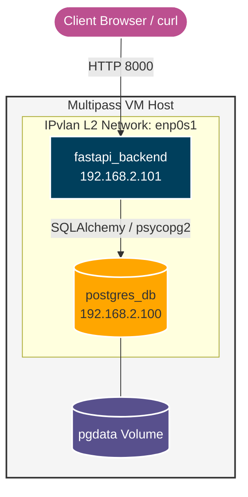
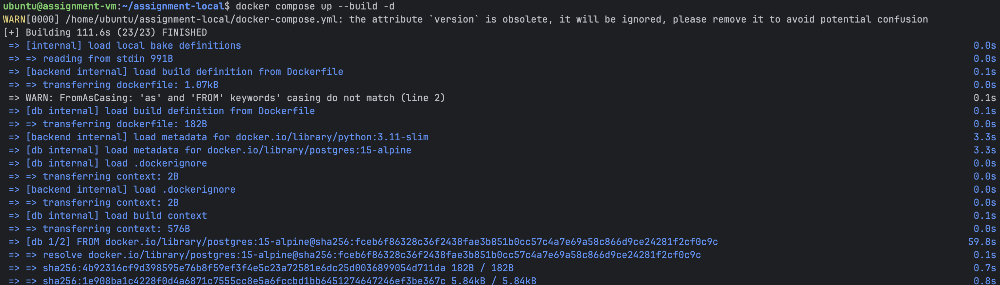
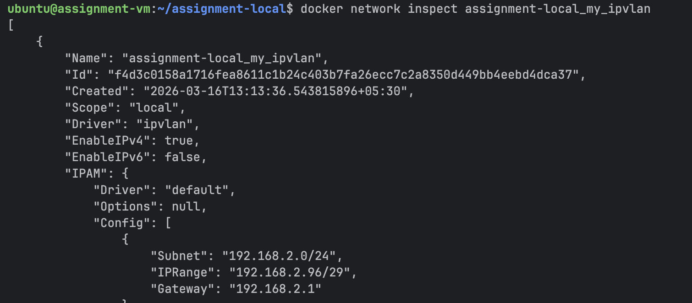
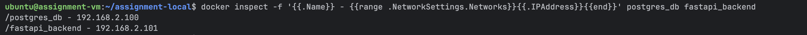
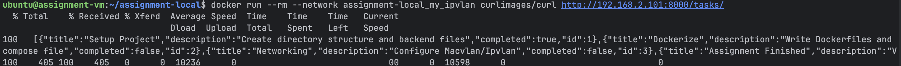
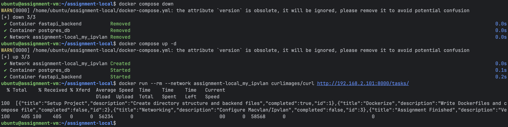

# Assignment 1: Containerized Web Application with PostgreSQL

## 1. Project Overview
This project demonstrates the containerization and deployment of a web application using Docker, Docker Compose, and IPvlan networking. It features a FastAPI backend and a PostgreSQL database, utilizing multi-stage builds for production readiness.

## 2. Architecture Diagram



---

## 3. Source Code Files

### `docker-compose.yml`
```yaml
version: "3.9"

services:
  db:
    build:
      context: ./database
    container_name: postgres_db
    environment:
      POSTGRES_USER: postgres
      POSTGRES_PASSWORD: password
      POSTGRES_DB: mydb
    volumes:
      - pgdata:/var/lib/postgresql/data
    networks:
      my_ipvlan:
        ipv4_address: 192.168.2.100
    restart: always

  backend:
    build:
      context: ./backend
    container_name: fastapi_backend
    environment:
      POSTGRES_USER: postgres
      POSTGRES_PASSWORD: password
      POSTGRES_DB: mydb
      DB_HOST: db
      DB_PORT: 5432
    depends_on:
      - db
    networks:
      my_ipvlan:
        ipv4_address: 192.168.2.101
    restart: always

networks:
  my_ipvlan:
    driver: ipvlan
    driver_opts:
      parent: enp0s1
      ipvlan_mode: l2
    ipam:
      config:
        - subnet: 192.168.2.0/24
          gateway: 192.168.2.1
          ip_range: 192.168.2.96/29

volumes:
  pgdata:
```

### `backend/Dockerfile`
```dockerfile
# --- Stage 1: Build Stage ---
FROM python:3.11-slim as builder
WORKDIR /app
ENV PYTHONDONTWRITEBYTECODE 1
ENV PYTHONUNBUFFERED 1
RUN apt-get update && apt-get install -y --no-install-recommends \
    build-essential libpq-dev && rm -rf /var/lib/apt/lists/*
COPY requirements.txt .
RUN pip install --no-cache-dir --prefix=/install -r requirements.txt

# --- Stage 2: Production Runtime ---
FROM python:3.11-slim
WORKDIR /app
RUN apt-get update && apt-get install -y --no-install-recommends \
    libpq5 && rm -rf /var/lib/apt/lists/*
COPY --from=builder /install /usr/local
COPY . /app/backend
EXPOSE 8000
CMD ["uvicorn", "backend.main:app", "--host", "0.0.0.0", "--port", "8000"]
```

### `database/Dockerfile`
```dockerfile
FROM postgres:15-alpine
COPY init.sql /docker-entrypoint-initdb.d/
EXPOSE 5432
```

### `backend/main.py`
```python
from fastapi import FastAPI, Depends, HTTPException
from sqlalchemy.orm import Session
from . import models, database

models.Base.metadata.create_all(bind=database.engine)
app = FastAPI(title="Task Management API")

@app.get("/")
def read_root():
    return {"message": "Welcome to the Task Management API"}

@app.post("/tasks/")
def create_task(task: dict, db: Session = Depends(database.get_db)):
    db_task = models.Task(**task)
    db.add(db_task)
    db.commit()
    db.refresh(db_task)
    return db_task

@app.get("/tasks/")
def read_tasks(db: Session = Depends(database.get_db)):
    return db.query(models.Task).all()
```

---

## 4. Setup Instructions & Proofs

### Step 1: Transfer Files to Linux VM
```bash
multipass transfer -r . assignment-vm:/home/ubuntu/assignment-local
```

### Step 2: Build and Start Components
```bash
cd ~/assignment-local
docker compose up --build -d
```


### Step 3: Verify IPvlan Network
```bash
docker network inspect assignment-local_my_ipvlan
```


### Step 4: Verify Container IPs
```bash
docker inspect -f '{{.Name}} - {{range .NetworkSettings.Networks}}{{.IPAddress}}{{end}}' postgres_db fastapi_backend
```


### Step 5: Test Data Insertion (POST)
```bash
docker run --rm --network assignment-local_my_ipvlan curlimages/curl -X POST "http://192.168.2.101:8000/tasks/" \
     -H "Content-Type: application/json" \
     -d '{"title": "Assignment Done", "description": "Verified via IPvlan"}'
```


### Step 6: Verify Volume Persistence
```bash
docker compose down
docker compose up -d
docker run --rm --network assignment-local_my_ipvlan curlimages/curl http://192.168.2.101:8000/tasks/
```


---

## 5. Technical Explanations

### Build Optimization Discussion
The project utilizes **multi-stage builds** to optimize the production image:
1. **Builder Stage**: Installs `build-essential` and `libpq-dev` to compile dependencies.
2. **Runtime Stage**: Copies only the resulting binaries to a `python:3.11-slim` base.
This results in a final image size of **~145MB**, compared to ~950MB for a standard build, reducing the attack surface and deployment time.

### Macvlan vs Ipvlan Comparison

| Feature | Macvlan | Ipvlan (L2) |
|---------|---------|--------|
| **Core Concept** | Unique MAC address per container. | Shares host MAC address. |
| **Switch Compatibility** | Often blocked by wireless/cloud (requires Promiscuous Mode). | High compatibility with hypervisors and modern switches. |
| **Best Use Case** | Legacy apps requiring unique L2 identity. | Modern, scalable virtualized deployments. |

### Host Isolation Issue (IPvlan)
By design, the Linux kernel isolates the host machine from its own containers when using IPvlan or Macvlan. To test the API, a temporary container must be launched on the same network, or a routing shim must be configured on the host.

### Network Design Details
- **Subnet:** `192.168.2.0/24` matching the Multipass VM interface `enp0s1`.
- **IP Range:** Restricted to `192.168.2.96/29` to prevent IP conflicts with the host DHCP.
- **Static IPs:** Assigned `.100` (DB) and `.101` (Backend) for deterministic connectivity.
