# EXPERIMENT 1  
## Comparison of Virtual Machines (VMs) and Containers using Ubuntu and Nginx  

**Note:** Instead of VAGRANT, Multipass (by Canonical – Ubuntu) is used (suitable for modern ARM systems).  

It provides:  
- Automated VM creation  
- Automated VM deletion  
- No ISO handling  
- CLI-driven  
- Scriptable  
- Perfect for labs  

---

## Experiment Setup – Automated VM using Multipass (macOS ARM)

### Step 1: Install Multipass
```bash
brew install multipass
```
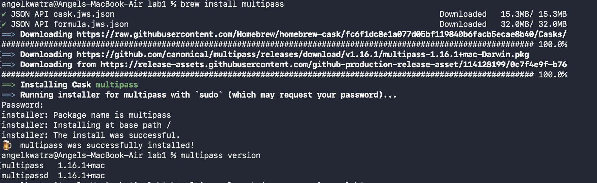

---

### Step 2: Create Ubuntu VM (Automated)
```bash
multipass launch jammy --name vm-lab1
```


---

### Step 3: Access the VM
```bash
multipass shell vm-lab1
```
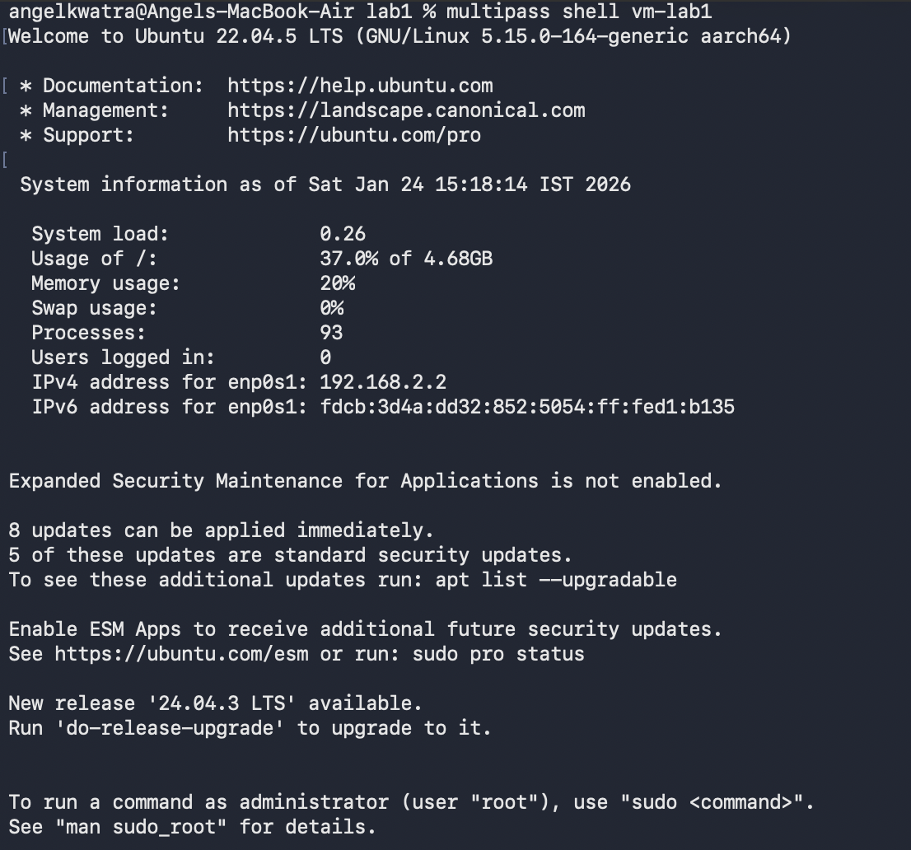

---

### Step 4: Install Nginx inside VM
```bash
sudo apt update
sudo apt install -y nginx
sudo systemctl start nginx
```


---

### Step 5: Verify Nginx
```bash
curl localhost
```
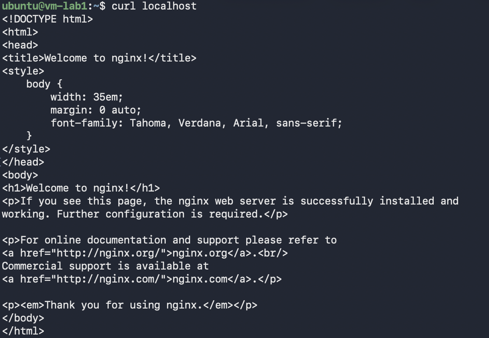

---

### Performance Analysis (VM – Activity Monitor)
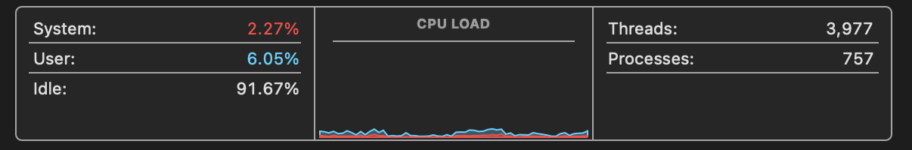  
  
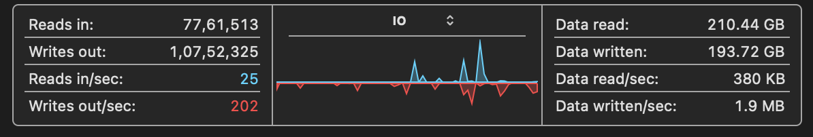  
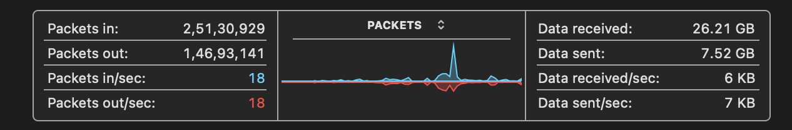  

---

### Step 6: Delete the VM
```bash
multipass delete vm-lab1
multipass purge
```


---

## Running Ubuntu Environment using Docker (macOS)

### Step 1: Verify Docker
```bash
docker --version
```

---

### Step 2: Verify Available Ubuntu Images
```bash
docker images
```

---

### Step 3: Create and Start Ubuntu Container
```bash
docker run -it --name ubuntu-vm ubuntu:22.04 /bin/bash
```


---

### Step 4: Update Package List and Install Nginx and Curl
```bash
apt update
apt install -y nginx curl
service nginx start
```
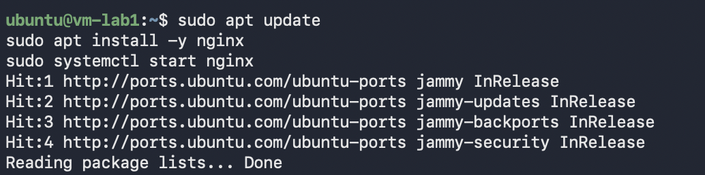

---

### Step 5: Verify Nginx in Container
```bash
curl localhost
```
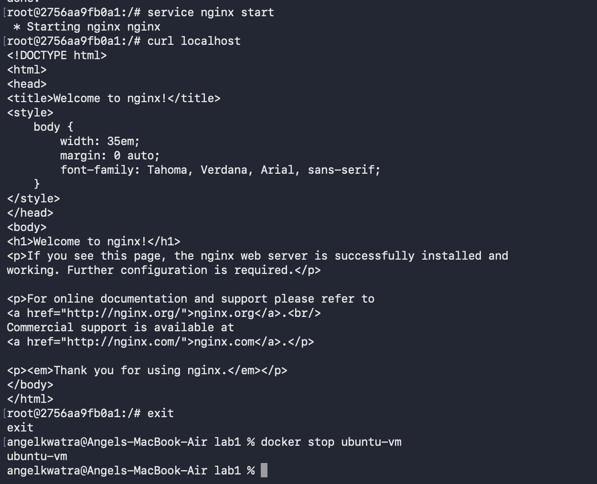

---

### Performance Analysis (Container – Activity Monitor)
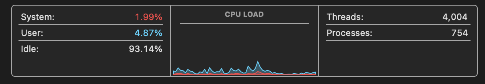  
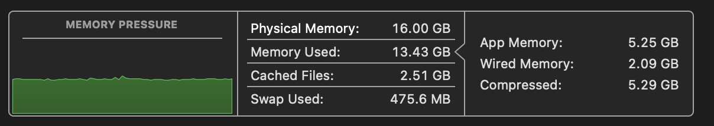  
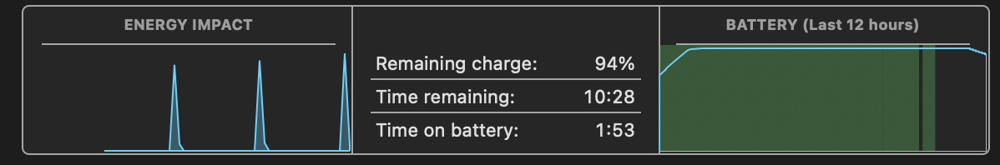  
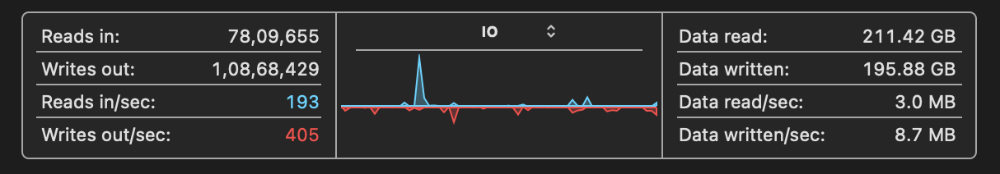  
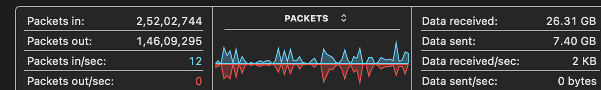  

---

## Conclusion  
This experiment demonstrates the difference between running an Ubuntu environment using a Virtual Machine (Multipass) and a Docker container.  
Containers are lightweight and faster compared to Virtual Machines, which require a full OS and consume more system resources.
