# Experiment 1 -- Comparison of Virtual Machines (VMs) and Containers using Ubuntu and Nginx

## Objective

- Set up an Ubuntu VM using Multipass and install Nginx
- Monitor VM resource usage (CPU, Memory, Network)
- Set up an Ubuntu container using Docker and install Nginx
- Monitor container resource usage
- Compare performance between VMs and Containers

---

## Environment Used

- Host OS: macOS (Apple Silicon)
- Container Platform: Docker Desktop
- VM Platform: Multipass (by Canonical)

---

## Experiment Execution with Screenshots

**Note:** Instead of VAGRANT, Multipass (by Canonical – Ubuntu) is used (suitable for modern ARM systems).

It provides:
- Automated VM creation
- Automated VM deletion
- No ISO handling
- CLI-driven
- Scriptable
- Perfect for labs

---

# 🔹 Part 1 -- Automated VM using Multipass (macOS ARM)

### Step 1: Install Multipass

```bash
brew install multipass
```

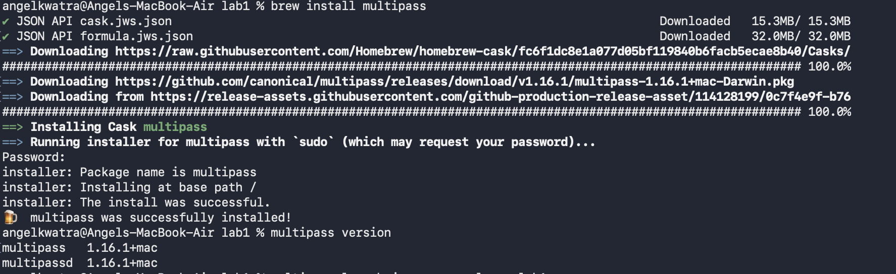

---

### Step 2: Create Ubuntu VM (Automated)

```bash
multipass launch jammy --name vm-lab1
```


---

### Step 3: Access the VM

```bash
multipass shell vm-lab1
```

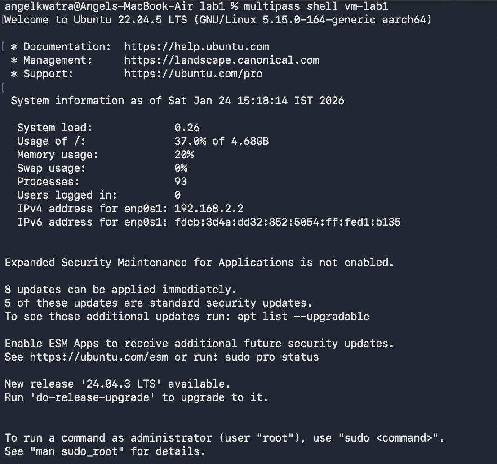

---

### Step 4: Install Nginx inside VM

```bash
sudo apt update
sudo apt install -y nginx
sudo systemctl start nginx
```

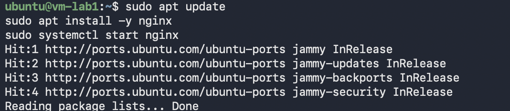

---

### Step 5: Verify Nginx

```bash
curl localhost
```

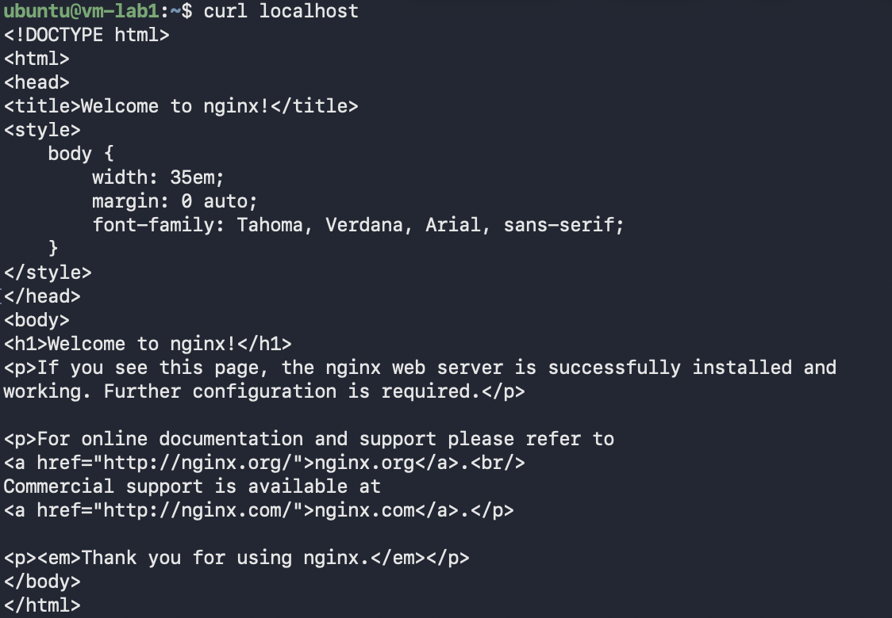

---

### Performance Analysis (VM – Activity Monitor)

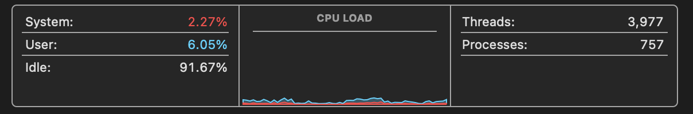

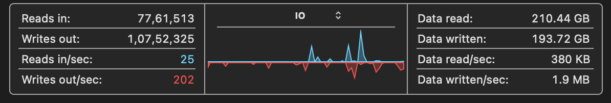
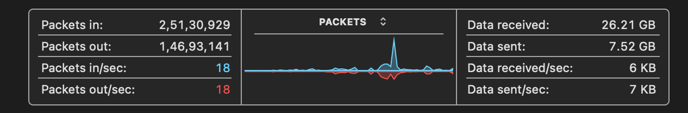

---

### Step 6: Delete the VM

```bash
multipass delete vm-lab1
multipass purge
```


---

# 🔹 Part 2 -- Running Ubuntu Environment using Docker (macOS)

### Step 7: Verify Docker

```bash
docker --version
```

---

### Step 8: Verify Available Ubuntu Images

```bash
docker images
```

---

### Step 9: Create and Start Ubuntu Container

```bash
docker run -it --name ubuntu-vm ubuntu:22.04 /bin/bash
```


---

### Step 10: Update Package List and Install Nginx and Curl

```bash
apt update
apt install -y nginx curl
service nginx start
```

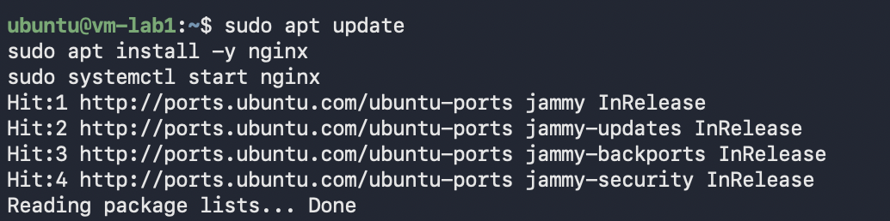

---

### Step 11: Verify Nginx in Container

```bash
curl localhost
```

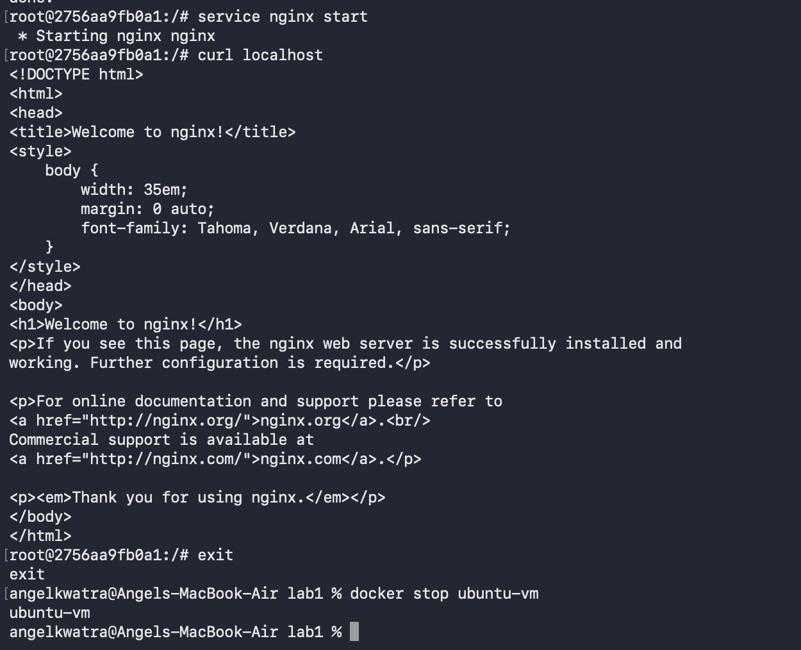

---

### Performance Analysis (Container – Activity Monitor)

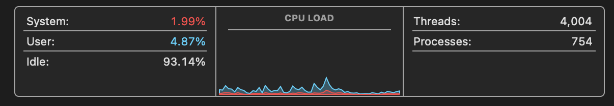

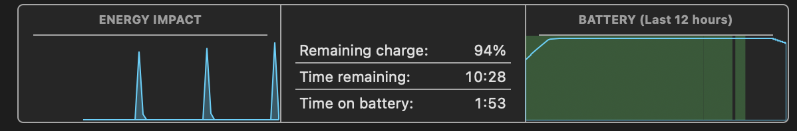
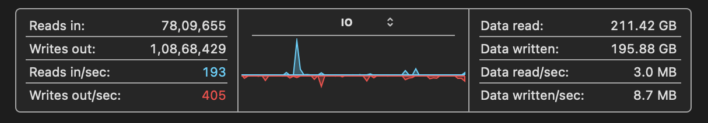
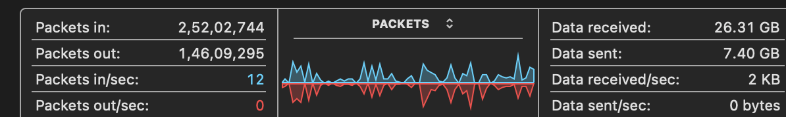

---

## Result

This experiment demonstrates the difference between running an Ubuntu environment using a Virtual Machine (Multipass) and a Docker container.
Containers are lightweight and faster compared to Virtual Machines, which require a full OS and consume more system resources.
