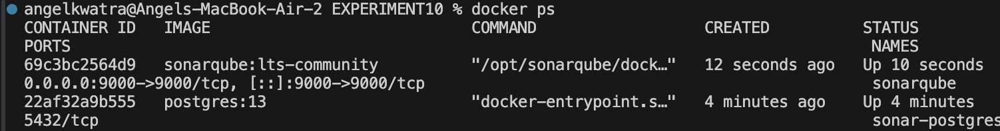
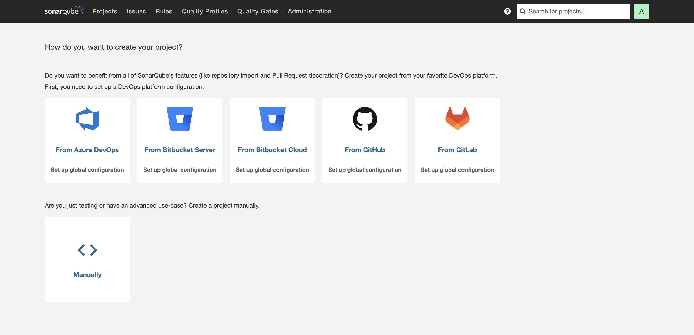
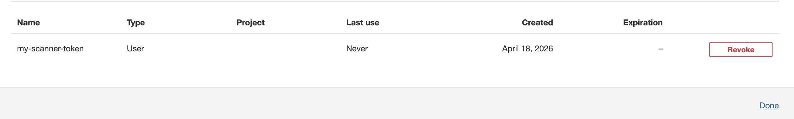
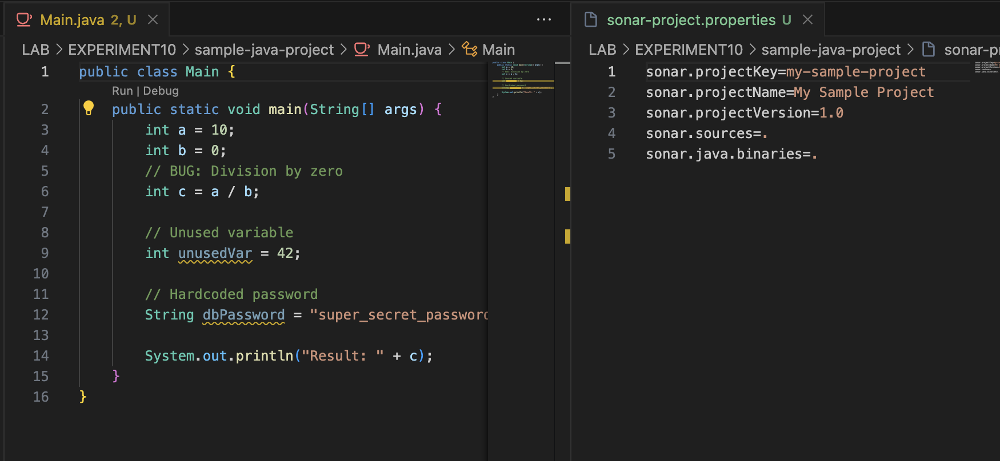
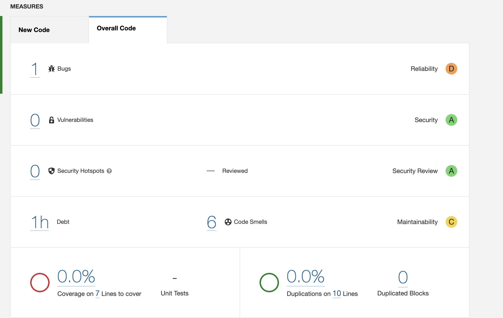
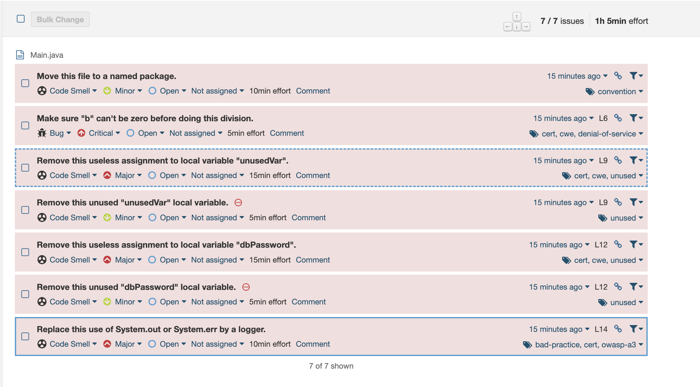
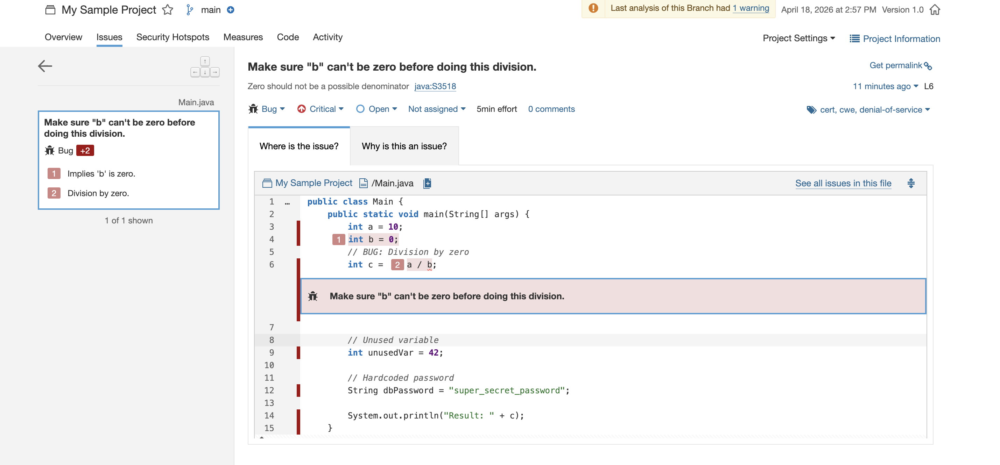

# Experiment 10: Constructing and Utilizing a Local Code Quality Analysis Environment using SonarQube and Docker

## Objective
To set up a local, containerized Code Quality Analysis environment using SonarQube and PostgreSQL. Create a sample project containing strategic vulnerabilities, execute a code scanner as a separate Docker container, and visualize the technical debt, bugs, and vulnerabilities within the SonarQube dashboard.

##  Core Architecture
- **SonarQube Server (Brain):** The centralized server that maintains analysis rules, processes reports, and runs the web UI. Uses PostgreSQL for structured storage.
- **SonarScanner (Worker):** Containerized tool that temporarily mounts the project source code, statically analyzes it, and sends the findings back to the SonarQube server over the network.

---

##  Step-by-Step Implementation

### Step 1: Spin up the Analysis Environment
To ensure the PostgreSQL database and the SonarQube server can communicate, a custom bridge network was created.

1. **Created a dedicated Docker network:**
   ```bash
   docker network create sonarnet
   ```

2. **Launched the PostgreSQL container:**
   ```bash
   docker run -d --name sonar-postgres \
     --network sonarnet \
     -e POSTGRES_USER=sonar \
     -e POSTGRES_PASSWORD=sonar \
     -e POSTGRES_DB=sonarqube \
     postgres:13
   ```

3. **Launched the SonarQube container:**
   ```bash
   docker run -d --name sonarqube \
     -p 9000:9000 \
     --network sonarnet \
     -e SONAR_JDBC_URL=jdbc:postgresql://sonar-postgres:5432/sonarqube \
     -e SONAR_JDBC_USERNAME=sonar \
     -e SONAR_JDBC_PASSWORD=sonar \
     sonarqube:lts-community
   ```

**Result:** Both containers orchestrated and dynamically communicating via `sonarnet`.


---

### Step 2: Dashboard Access and Setup
After the server booted, the UI was accessed at `http://localhost:9000`.

1. **Dashboard Login:** Logged in using the default administrator credentials and initialized a secure password.
   

2. **Token Generation:** Generated a user-level authentication token. This step is critical because the SonarScanner must explicitly authenticate itself against the server to submit analysis reports.
   

---

### Step 3: Preparing the Sample Project
A target `sample-java-project` was mapped with multiple intentional flaws.

1. **Code with Issues (`Main.java`):**
   - **Bug:** Division by zero (`int c = a / b;` where `b=0`)
   - **Code Smell:** Unused variable (`int unusedVar = 42;`)
   - **Vulnerability:** Hardcoded database password.
2. **Properties File:** Configured a `sonar-project.properties` meta file indicating the `sonar.projectKey=my-sample-project` and source routing.



---

### Step 4: Running the Sonar Scanner
Triggered the declarative, ephemeral scanner container. 

The scanner was passed the generated token and configured to look for the SonarQube server internally over the previously created `sonarnet`. By mounting `$PWD` onto `/usr/src`, the scanner successfully processed the malicious `Main.java` files.

```bash
docker run --rm \
    -v "$(pwd):/usr/src" \
    -v "$(pwd)/.sonar-cache:/opt/sonar-scanner/.sonar/cache" \
    --network sonarnet \
    sonarsource/sonar-scanner-cli \
    -Dsonar.host.url=http://sonarqube:9000 \
    -Dsonar.login=<GENERATED_TOKEN>
```

**Result:** The execution succeeded and sent the report back to the SonarQube Engine.


---

### Step 5: Visualizing Results
With the analysis parsed, the project metrics reflect the detected code quality metrics visually on the dashboard:

1. **Project Overview:** Displaying failed Quality Gate metrics. Bugs, vulnerabilities, and code smells were aggregated.
   

2. **Issue Drill-down:** Inspecting the file path line-by-line where SonarQube correctly identifies the division by zero, unused integer, and hardcoded secrets.
   
