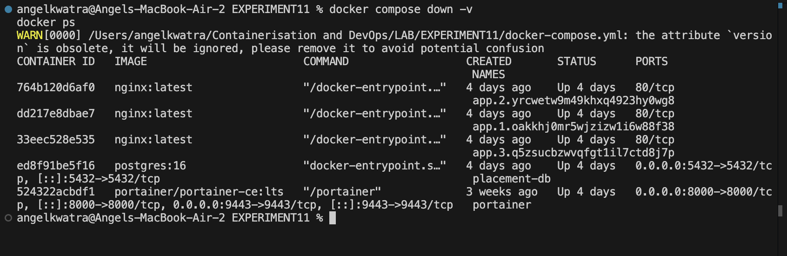
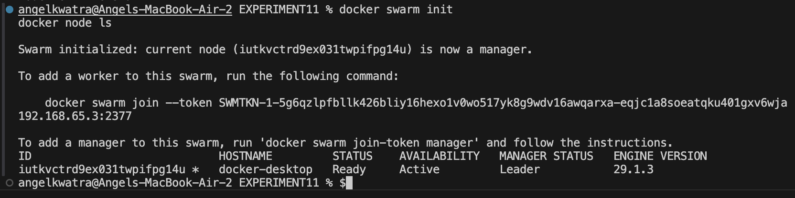
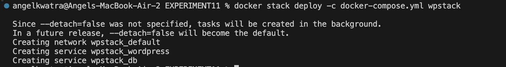
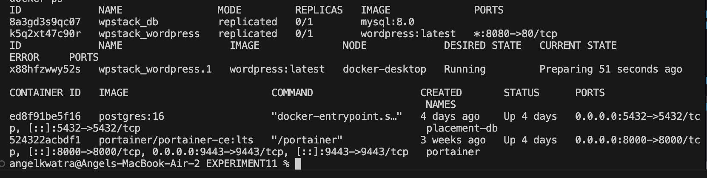
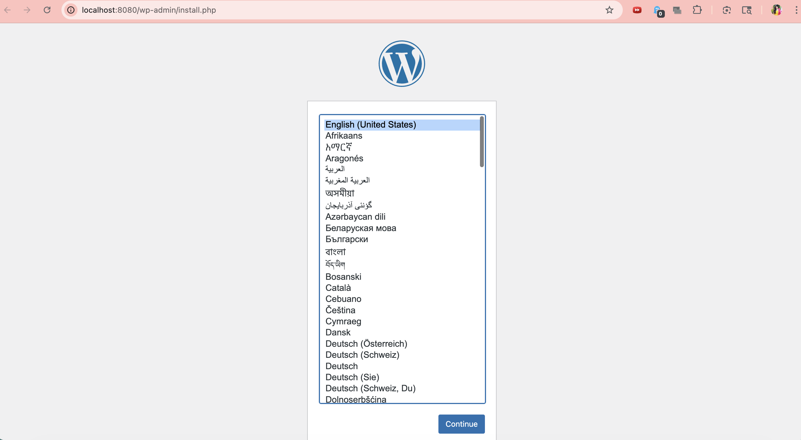
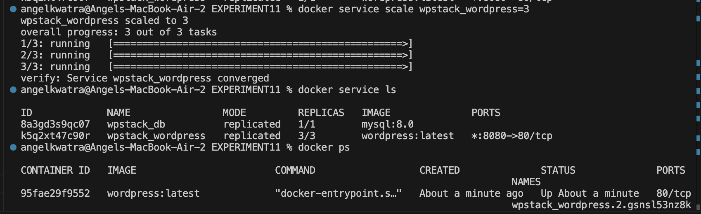
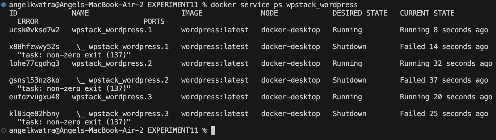
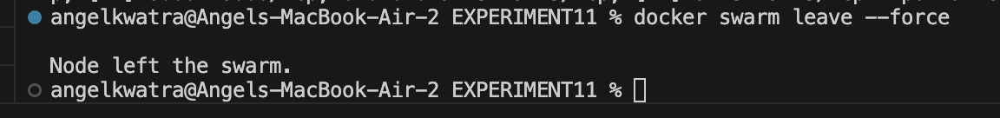

# EXPERIMENT 11 – DOCKER SWARM: ORCHESTRATION & SCALING

This document outlines the steps performed during Experiment 11, which focuses on learning Docker Swarm for container orchestration, scaling, and self-healing.

##  Concept Overview
**Orchestration** is the automatic management of containers. Key features include:
* **Scaling:** Increase or decrease the number of containers based on demand.
* **Self-healing:** Automatically restart failed containers.
* **Load balancing:** Distribute network traffic across containers.
* **Multi-host:** Run containers across multiple machines.

**Compose vs Swarm (Quick Difference)**
| Feature | Compose | Swarm |
| :--- | :--- | :--- |
| **Scope** | Single machine | Multi-node cluster |
| **Scaling** | Manual | Automatic |
| **Load balancing** | ❌ No | ✅ Yes |
| **Self-healing** | ❌ No | ✅ Yes |
| **Use case** | Dev/Test | Production |


### Step 1: Clean Previous Setup


1. Run the following commands:
```bash
docker compose down -v
docker ps
```

**Screenshot 1:** 


---

### Step 2: Initialize Docker Swarm
Transform your single Docker engine into a Swarm manager node.

1. Run the following commands:
```bash
docker swarm init
docker node ls
```
 *This makes your system a manager node in the swarm.*

**Screenshot 2:** Terminal showing the swarm initialization success message and the node list.


---

### Step 3: Deploy the Stack
Deploy the application using the `docker-compose.yml` file provided in this directory.

1. Run the following command:
```bash
docker stack deploy -c docker-compose.yml wpstack
```
 *This creates services (not containers directly) as defined in the compose file.*

**Screenshot 3:** Terminal showing the stack deployment creation messages.


---

### Step 4: Verify Deployment
Check the status of your services and the running containers.

1. Run the following commands:
```bash
docker service ls
docker service ps wpstack_wordpress
docker ps
```
 *This shows the Swarm services and the actual running containers backing them.*

**Screenshot 4:** Terminal showing the list of services and the `wpstack_wordpress` service details.


---

### Step 5: Access the Application


1. Open your browser and navigate to: [http://localhost:8080](http://localhost:8080)
 *The WordPress installation UI should load.*

**Screenshot 5:** Browser showing the WordPress setup screen.


---

### Step 6: Scale the Application


1. Run the following commands:
```bash
docker service scale wpstack_wordpress=3
docker service ls
docker ps
```
 *Now 3 WordPress containers run simultaneously. Swarm handles load balancing automatically.*

**Screenshot 6:** Terminal showing the scaling command and the updated list of 3 running containers.


---

### Step 7: Test Self-Healing


1. Find a running WordPress container ID and kill it:
```bash
docker ps | grep wordpress
docker kill <container-id>
```
2. Verify that Swarm automatically starts a new container to replace the killed one:
```bash
docker service ps wpstack_wordpress
```
 *You should see the history of the failed container and a new one spinning up.*

**Screenshot 7:** Terminal showing the `docker kill` command and the `docker service ps` output reflecting the self-healing process.


---

### Step 8: Remove Stack & Cleanup


1. Run the following commands:
```bash
docker stack rm wpstack
docker service ls
docker ps
docker swarm leave --force
```
 *This removes all services, containers, and network components created by the stack, and leaves the swarm.*

**Screenshot 8:** Terminal showing the removal of the stack and leaving the swarm.


---

