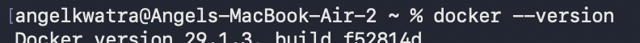
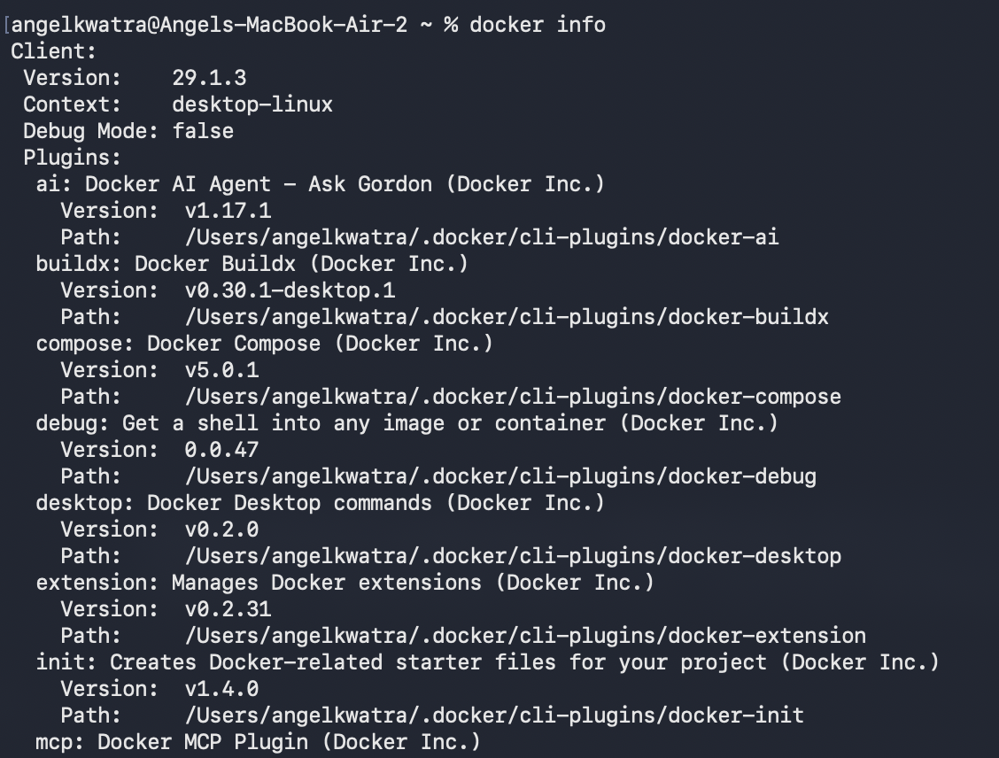
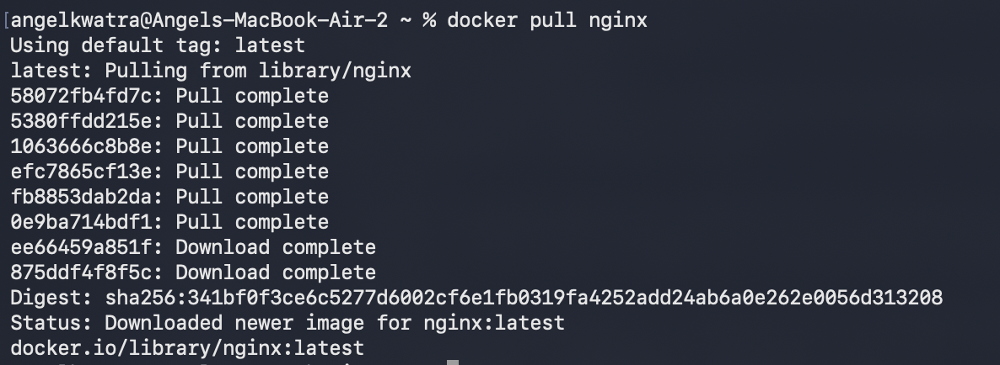
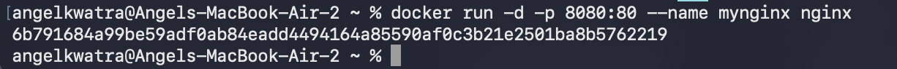
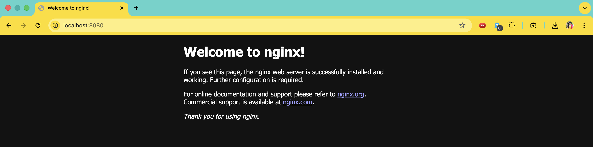
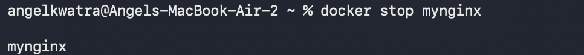
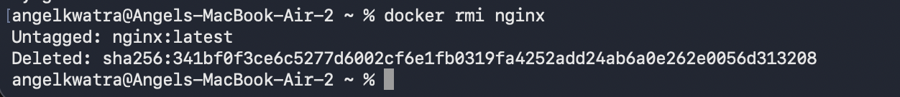

# Experiment 2 -- Docker Installation, Configuration, and Running Images

## Objective

- Verify Docker installation
- Inspect Docker configuration
- Pull and run Docker images
- Access containerized application
- Stop and remove containers and images

---

## Environment Used

- Host OS: macOS (Apple Silicon)
- Container Platform: Docker Desktop

---

## Experiment Execution with Screenshots

### 🔹 Step 1: Verify Docker Installation

```bash
docker --version
```



---

### 🔹 Step 2: Check Docker Configuration

```bash
docker info
```



---

### 🔹 Step 3: Pull Nginx Image

```bash
docker pull nginx
```



---

### 🔹 Step 4: Verify Downloaded Image

```bash
docker images
```


---

### 🔹 Step 5: Run Nginx Container

```bash
docker run -d -p 8080:80 --name mynginx nginx
```



---

### 🔹 Step 6: Access Application in Browser

Opened in browser:

http://localhost:8080



---

### 🔹 Step 7: Stop Container

```bash
docker stop mynginx
```



---

### 🔹 Step 8: Remove Container

```bash
docker rm mynginx
```


---

### 🔹 Step 9: Remove Image

```bash
docker rmi nginx
```



---

## Result

- Docker installation verified successfully
- Nginx image pulled from Docker Hub
- Container created and accessed via localhost
- Container stopped and removed
- Image removed from local system
