# Experiment 3 -- Deploying NGINX Using Different Base Images and Comparing Image Layers

## Objective

- Deploy NGINX using official image
- Build custom NGINX image using Ubuntu base
- Build custom NGINX image using Alpine base
- Compare image sizes and layers

---

## Environment Used

- Host OS: macOS (Apple Silicon)
- Container Platform: Docker Desktop

---

# 🔹 Part 1 -- Using Official NGINX Image

### Step 1: Pull Official Image

```bash
docker pull nginx:latest
```

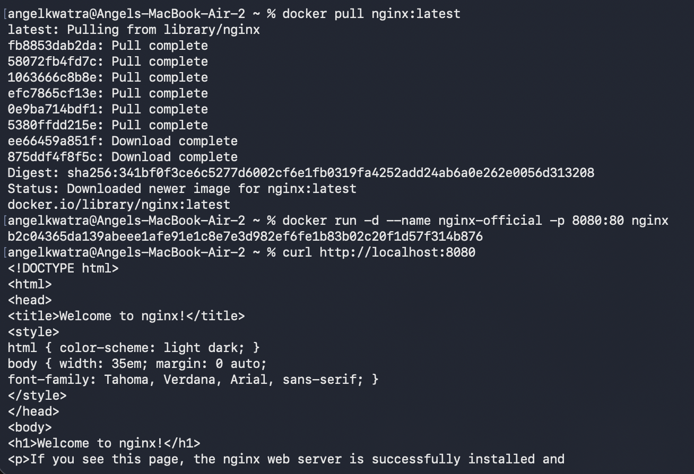

---

### Step 2: Run NGINX Container

```bash
docker run -d --name nginx-official -p 8080:80 nginx
```

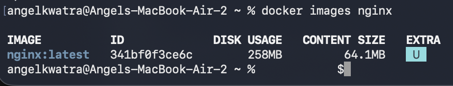

---

### Step 3: Verify Using curl

```bash
curl http://localhost:8080
```

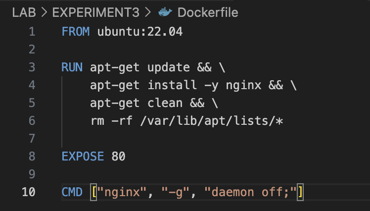

---

### Step 4: Verify Image

```bash
docker images nginx
```

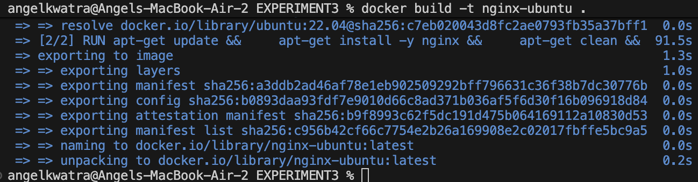

---

# 🔹 Part 2 -- Build NGINX Using Ubuntu Base

### Step 5: Create Dockerfile (Ubuntu)

```dockerfile
FROM ubuntu:22.04

RUN apt-get update && \
    apt-get install -y nginx && \
    apt-get clean && \
    rm -rf /var/lib/apt/lists/*

EXPOSE 80

CMD ["nginx", "-g", "daemon off;"]
```

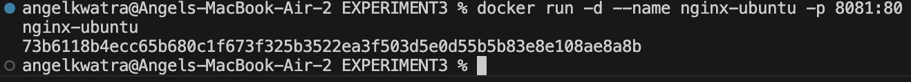

---

### Step 6: Build Image

```bash
docker build -t nginx-ubuntu .
```

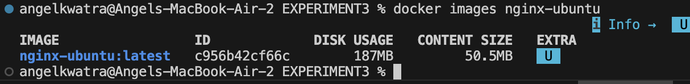

---

### Step 7: Run Ubuntu-based NGINX

```bash
docker run -d --name nginx-ubuntu -p 8081:80 nginx-ubuntu
```

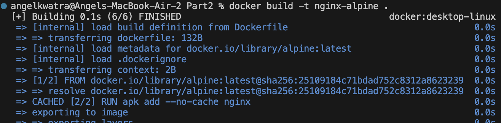

---

### Step 8: Verify Image Size

```bash
docker images nginx-ubuntu
```

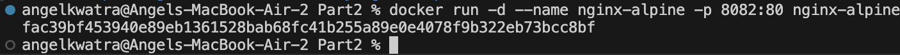

---

# 🔹 Part 3 -- Build NGINX Using Alpine Base

### Step 9: Dockerfile (Alpine)

```dockerfile
FROM alpine:latest

RUN apk add --no-cache nginx

EXPOSE 80

CMD ["nginx", "-g", "daemon off;"]
```

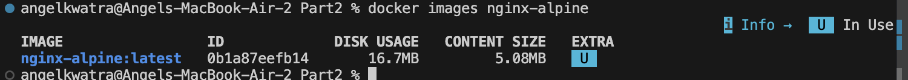

---

### Step 10: Build Alpine Image

```bash
docker build -t nginx-alpine .
```

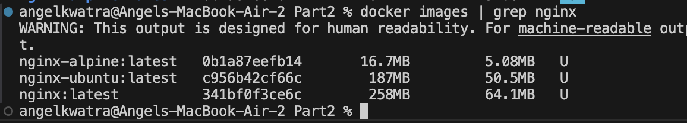

---

### Step 11: Run Alpine-based NGINX

```bash
docker run -d --name nginx-alpine -p 8082:80 nginx-alpine
```

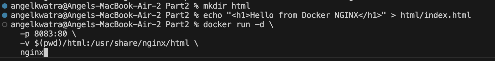

---

### Step 12: Compare Image Sizes

```bash
docker images | grep nginx
```

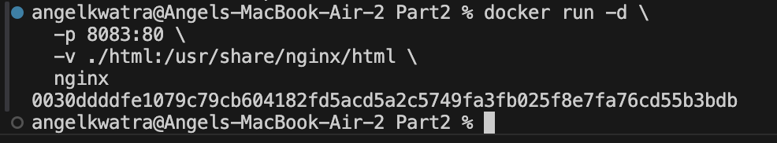

---

## Result

- Official NGINX image deployed successfully
- Custom Ubuntu-based NGINX image created
- Custom Alpine-based NGINX image created
- Compared image sizes and observed Alpine image is significantly smaller
