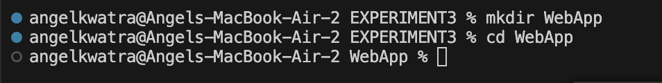
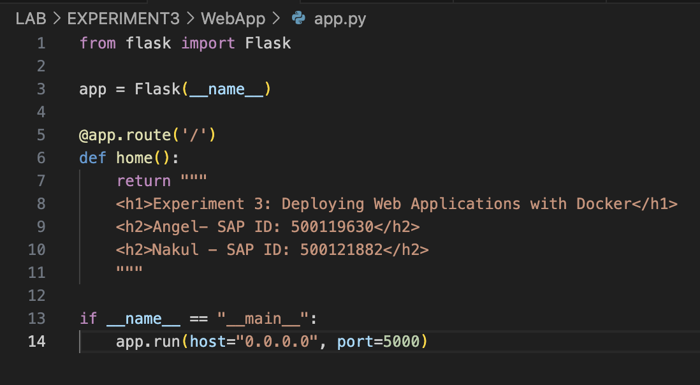
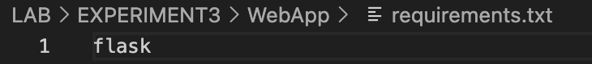
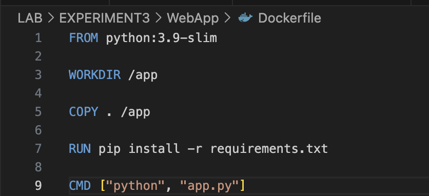
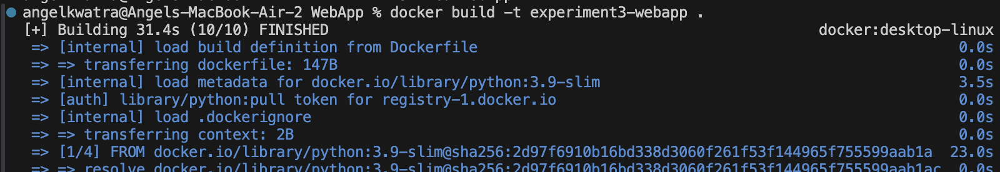
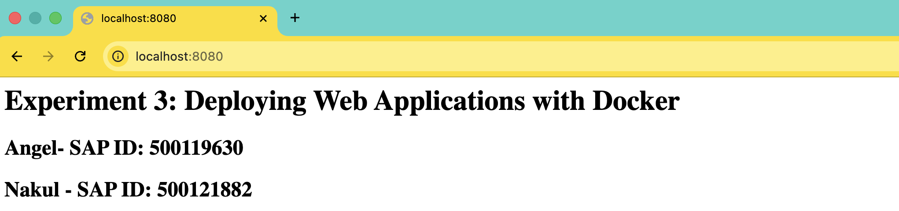

# Experiment 3 -- Containerizing a Python Flask Web Application

## Objective

- Create a simple Flask web application
- Write a Dockerfile for the application
- Build Docker image
- Run container and map ports
- Access application via browser

---

## Environment Used

- Host OS: macOS (Apple Silicon)
- Container Platform: Docker Desktop
- Language: Python (Flask)

---

## Experiment Execution with Screenshots

### 🔹 Step 1: Project Structure

Flask app files created.



---

### 🔹 Step 2: Write Flask Application (app.py)

Basic Flask web app created.



---

### 🔹 Step 3: Create requirements.txt

Flask dependency added.



---

### 🔹 Step 4: Write Dockerfile

Dockerfile created for Flask app.



---

### 🔹 Step 5: Build Docker Image

```bash
docker build -t flask-app .
```



---

### 🔹 Step 6: Verify Image

```bash
docker images
```


---

### 🔹 Step 7: Run Container with Port Mapping

```bash
docker run -d -p 5000:5000 flask-app
```


---

### 🔹 Step 8: Access Application in Browser

Opened in browser:

http://localhost:5000



---

## Result

- Flask web application containerized successfully
- Docker image built using Dockerfile
- Application accessed through localhost using port mapping
- Container and image lifecycle managed successfully
