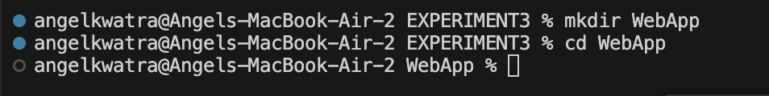
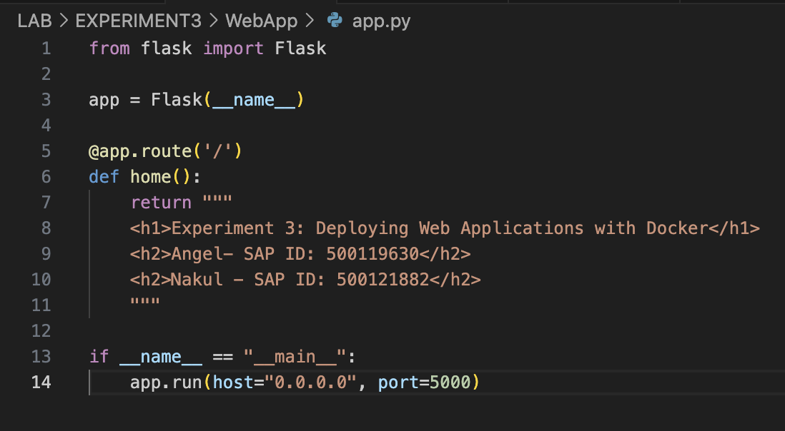
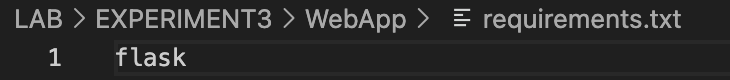
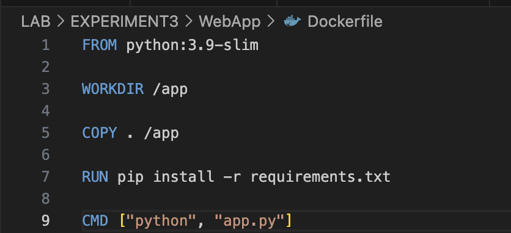
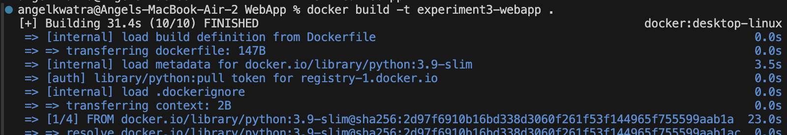
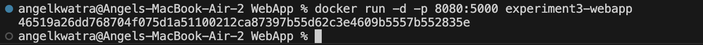
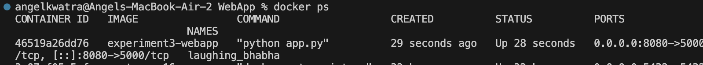
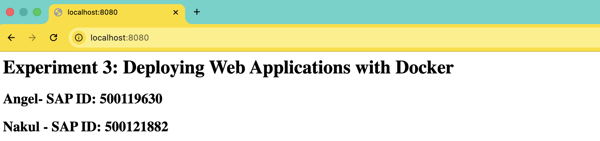

# Experiment 3 -- Containerizing a Python Flask Web Application

## Objective

- Create a simple Flask web application
- Write a Dockerfile for the application
- Build Docker image
- Run container and map ports
- Access application via browser

---

## Environment Used

- Host OS: macOS (Apple Silicon)
- Container Platform: Docker Desktop
- Language: Python (Flask)

---

## Experiment Execution with Screenshots

### 🔹 Step 1: Create Project Directory

```bash
mkdir WebApp
cd WebApp
```



---

### 🔹 Step 2: Write Flask Application (app.py)

```python
from flask import Flask

app = Flask(__name__)

@app.route('/')
def home():
    return """
        <h1>Experiment 3: Deploying Web Applications with Docker</h1>
        <h2>Angel- SAP ID: 500119630</h2>
        <h2>Nakul - SAP ID: 500121882</h2>
    """

if __name__ == "__main__":
    app.run(host="0.0.0.0", port=5000)
```



---

### 🔹 Step 3: Create requirements.txt

```text
flask
```



---

### 🔹 Step 4: Write Dockerfile

```dockerfile
FROM python:3.9-slim

WORKDIR /app

COPY . /app

RUN pip install -r requirements.txt

CMD ["python", "app.py"]
```



---

### 🔹 Step 5: Build Docker Image

```bash
docker build -t experiment3-webapp .
```



---

### 🔹 Step 6: Run Container with Port Mapping

```bash
docker run -d -p 8080:5000 experiment3-webapp
```



---

### 🔹 Step 7: Verify Running Container

```bash
docker ps
```



---

### 🔹 Step 8: Access Application in Browser

Opened in browser:

http://localhost:8080



---

## Result

- Flask web application containerized successfully
- Docker image built using Dockerfile
- Application accessed through localhost using port mapping
- Container and image lifecycle managed successfully
