# Experiment 4 -- Docker Essentials

## Objective

- Create a Dockerfile for a Flask application
- Use `.dockerignore` to exclude unnecessary files
- Build Docker images
- Run containers
- Perform multi-stage builds
- Tag and publish images to Docker Hub

---

## Environment Used

- Host OS: macOS (Apple Silicon)
- Container Platform: Docker Desktop
- Language: Python (Flask)

---

## Experiment Execution with Screenshots

### 🔹 Part 1: Create Flask Application

### Step 1: Create Project Directory

First, we create a project directory named `my-flask-app`.

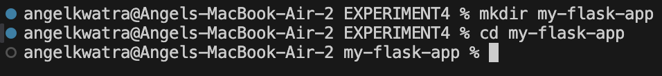

---

### Step 2: Create `app.py`

We create a file named `app.py` with the following content:

```python
from flask import Flask

app = Flask(__name__)

@app.route('/')
def hello():
    return "Hello from Docker!"

@app.route('/health')
def health():
    return "OK"

if __name__ == '__main__':
    app.run(host='0.0.0.0', port=5000)
```

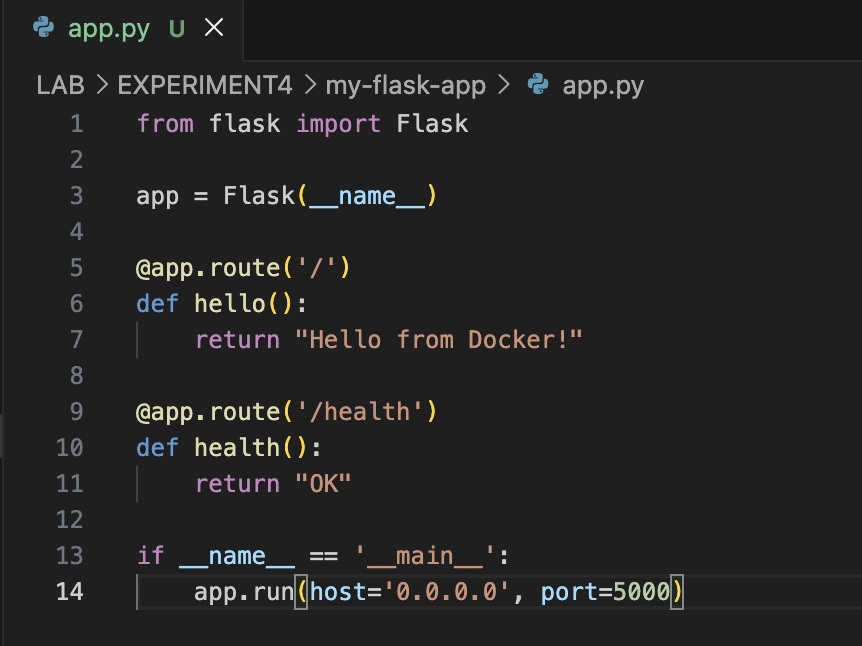

---

### Step 3: Create `requirements.txt`

Specify the dependencies:

```text
Flask==2.3.3
```

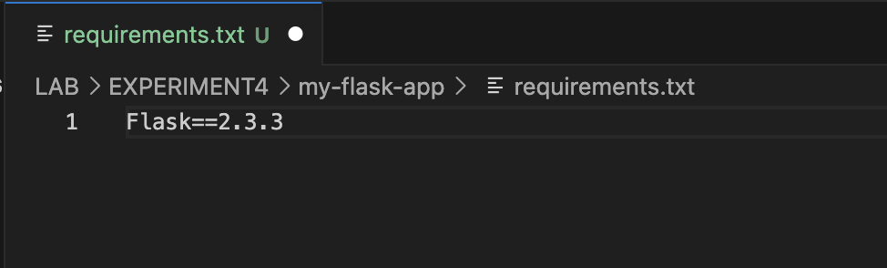

---

### 🔹 Part 2: Create Dockerfile

The `Dockerfile` defines how to package the Flask application into a container image:

```dockerfile
FROM python:3.9-slim

WORKDIR /app

COPY requirements.txt .

RUN pip install --no-cache-dir -r requirements.txt

COPY app.py .

EXPOSE 5000

CMD ["python", "app.py"]
```

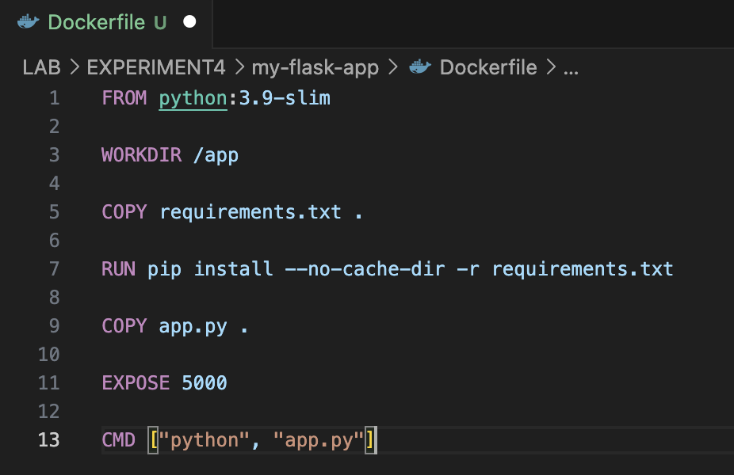

---

### 🔹 Part 3: Create `.dockerignore`

This file is used to exclude unnecessary files from being sent to the Docker daemon during build:

```text
__pycache__/
*.pyc
*.pyo
*.pyd
.env
.venv
env/
venv/
.vscode/
.idea/
.git/
.gitignore
.DS_Store
Thumbs.db
*.log
logs/
tests/
test_*.py
```

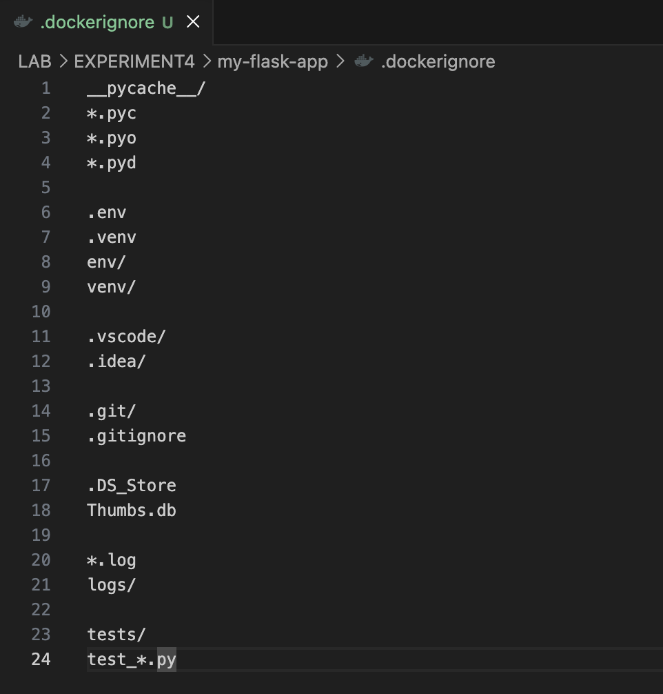

---

### 🔹 Part 4: Build Docker Image

Build the Docker image using the following command:

```bash
docker build -t my-flask-app .
```

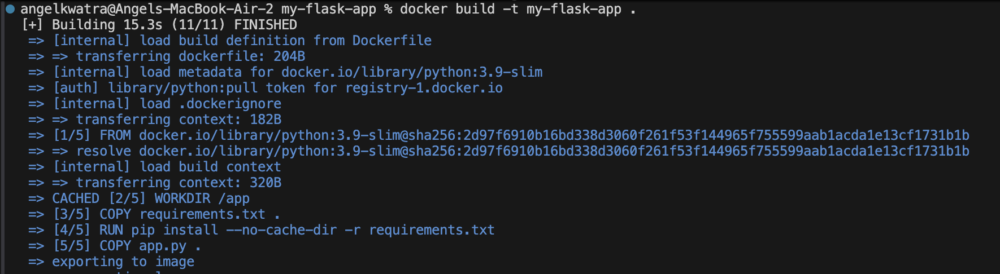

Verify the image:

```bash
docker images
```

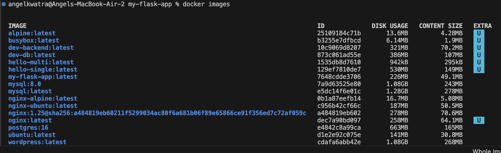

---

### 🔹 Part 5: Run Container

Run the container in detached mode, mapping port 5000:

```bash
docker run -d -p 5000:5000 --name flask-container my-flask-app
```

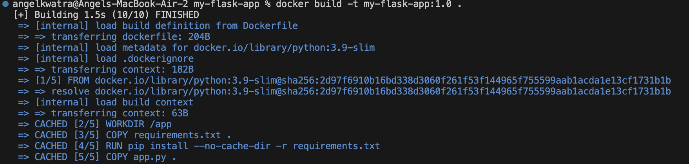

### Verification

Check the status of the running container:

```bash
docker ps
```


Test the application in the browser:

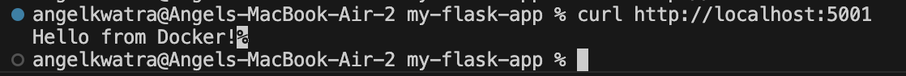

Test the health endpoint:

```bash
curl http://localhost:5000/health
```

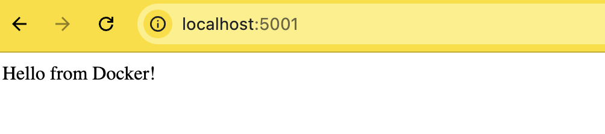

### Manage Container

Commands to manage the lifecycle of the container:
- `docker stop flask-container`
- `docker start flask-container`
- `docker rm -f flask-container`

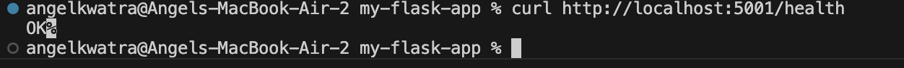

---

### 🔹 Part 6: Multi-stage Build

We use a multi-stage `Dockerfile.multistage` to create a more efficient and secure final image:

```dockerfile
# Stage 1 - Builder
FROM python:3.9-slim AS builder

WORKDIR /app

COPY requirements.txt .

RUN python -m venv /opt/venv
ENV PATH="/opt/venv/bin:$PATH"

RUN pip install --no-cache-dir -r requirements.txt

# Stage 2 - Final Image
FROM python:3.9-slim

WORKDIR /app

COPY --from=builder /opt/venv /opt/venv
ENV PATH="/opt/venv/bin:$PATH"

COPY app.py .

RUN useradd -m -u 1000 appuser
USER appuser

EXPOSE 5000

CMD ["python", "app.py"]
```

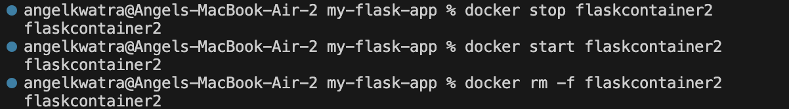

Build the multi-stage image:

```bash
docker build -f Dockerfile.multistage -t flask-multistage .
```

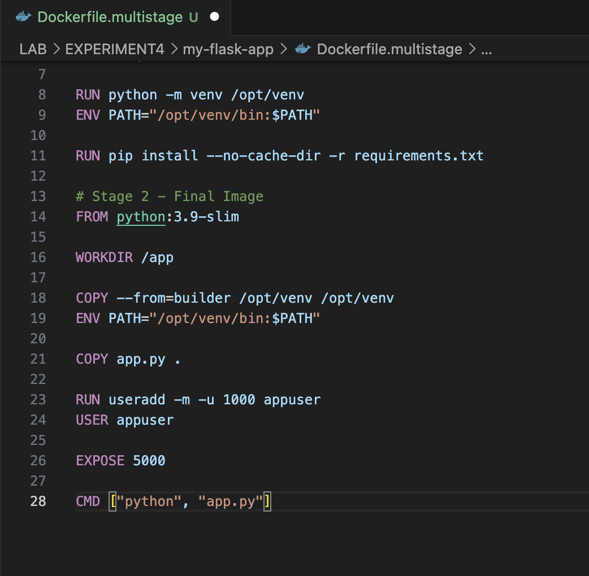

Compare the sizes of the standard and multi-stage images:

```bash
docker images
```

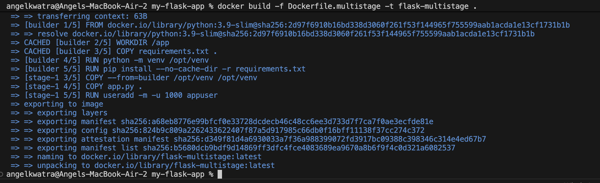

---

## Result

In this experiment, we successfully containerized a Flask application using Docker, optimized it with a multi-stage build, and verified its functionality.

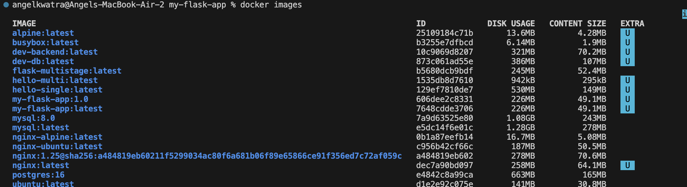
