# Experiment 5 – Docker Volumes, Environment Variables, Monitoring & Networks

## Objective

- Understand Docker data persistence using Volumes
- Configure containers using Environment Variables
- Monitor container resources and logs
- Create and manage Docker Networks
- Build a real-world multi-container application

---

## Environment Used

- Host OS: macOS (Apple Silicon)
- Container Platform: Docker Desktop

---

## Part 1: Docker Volumes – Persistent Data Storage

### 🔹 Lab 1: Understanding Data Persistence

**Problem:** Container data is ephemeral – files created inside a container are lost when it's removed.

```bash
docker run -it --name test-container ubuntu /bin/bash
# Inside container:
echo "Hello World" > /data/message.txt
cat /data/message.txt
exit
```

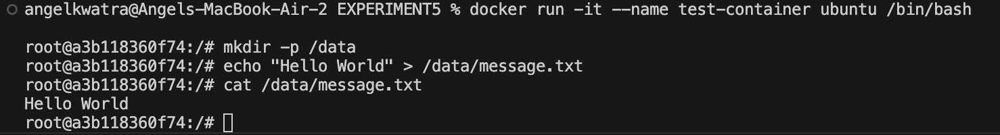

```bash
# Remove and recreate the container – data is lost!
docker rm test-container
docker run -it --name test-container ubuntu /bin/bash
cat /data/message.txt
# ERROR: No such file or directory
```

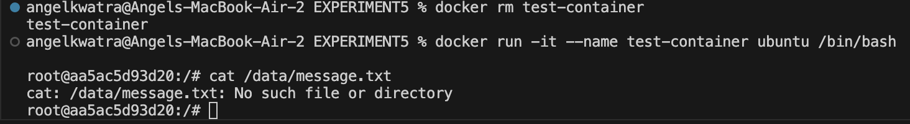

---

### 🔹 Lab 2: Volume Types

#### 1. Anonymous Volumes

```bash
docker run -d -v /app/data --name web1 nginx
docker volume ls
docker inspect web1 | grep -A 10 Mounts
```


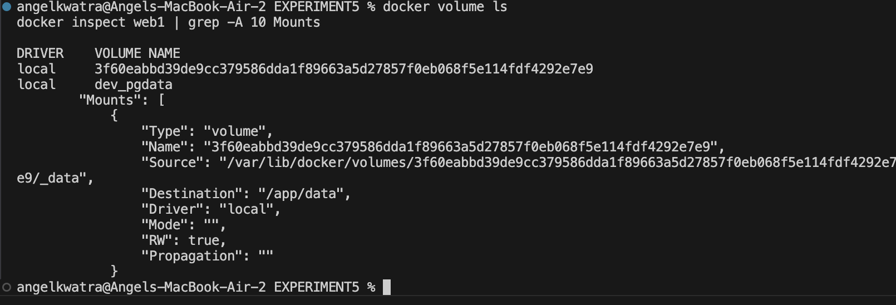

---

#### 2. Named Volumes

```bash
docker volume create mydata
docker run -d -v mydata:/app/data --name web2 nginx
docker volume ls
docker volume inspect mydata
```

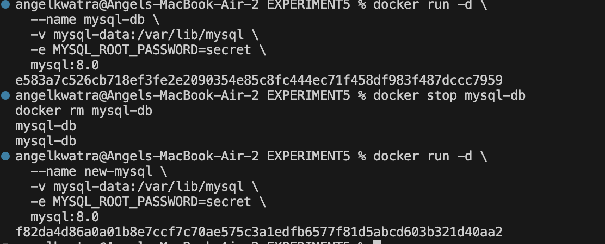

---

#### 3. Bind Mounts (Host Directory Mapping)

```bash
mkdir -p ~/myapp-data
echo "Hello from host!" > ~/myapp-data/host-file.txt
docker run -d -v ~/myapp-data:/app/data --name web3 nginx
docker exec web3 cat /app/data/host-file.txt
```

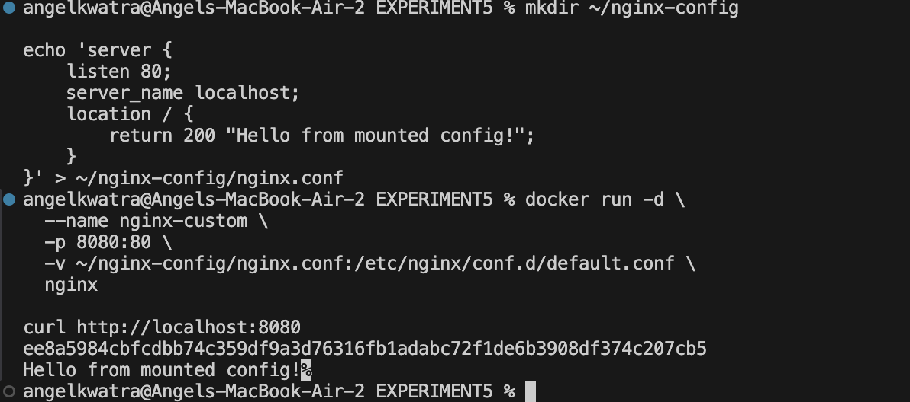

---

### 🔹 Lab 3: Practical Volume Usage

#### MySQL with Persistent Storage

```bash
docker volume create mysql-data
docker run -d --name mysql-server \
  -e MYSQL_ROOT_PASSWORD=rootpass \
  -v mysql-data:/var/lib/mysql \
  mysql:8
docker ps
```

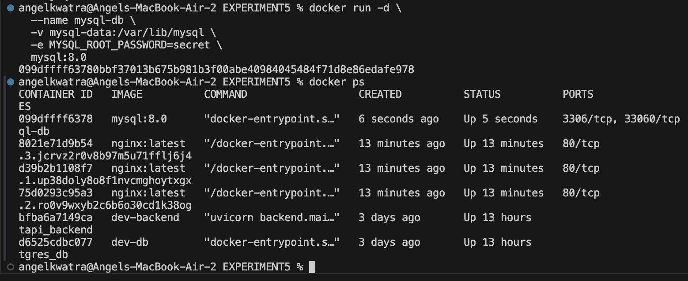

```bash
# Remove and recreate with same volume – data persists!
docker stop mysql-server && docker rm mysql-server
docker run -d --name mysql-server-new \
  -e MYSQL_ROOT_PASSWORD=rootpass \
  -v mysql-data:/var/lib/mysql \
  mysql:8
docker ps
```

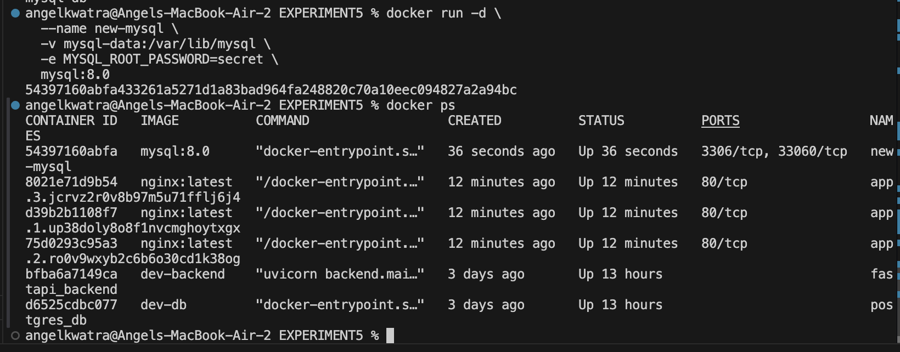

---

#### Nginx with Custom Configuration (Bind Mount)

```bash
mkdir -p ~/nginx-config
cat > ~/nginx-config/nginx.conf << 'EOF'
server {
    listen 80;
    server_name localhost;
    location / {
        return 200 "Hello from mounted config!";
    }
}
EOF
docker run -d --name nginx-custom \
  -p 8080:80 \
  -v ~/nginx-config/nginx.conf:/etc/nginx/conf.d/default.conf \
  nginx
curl http://localhost:8080
```

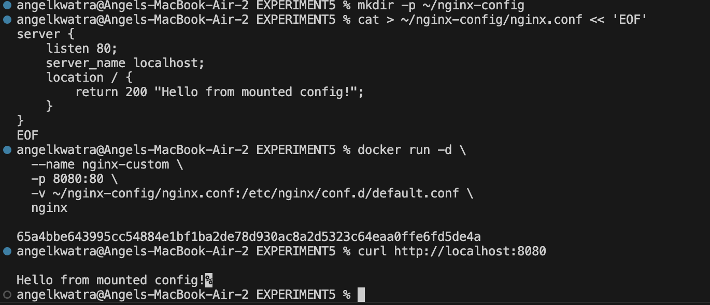

---

### 🔹 Lab 4: Volume Management

```bash
docker volume ls
docker volume create app-volume
docker volume inspect app-volume
```

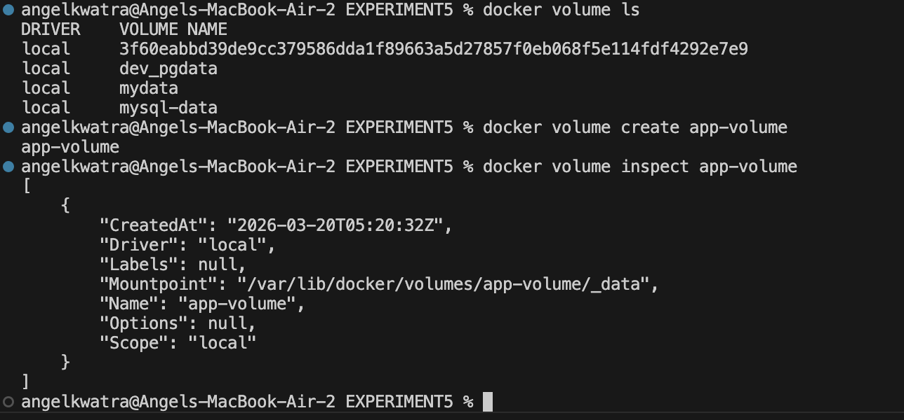

---

#### Cleanup Unused Volumes

```bash
docker volume rm app-volume mydata mysql-data
docker volume prune -f
```

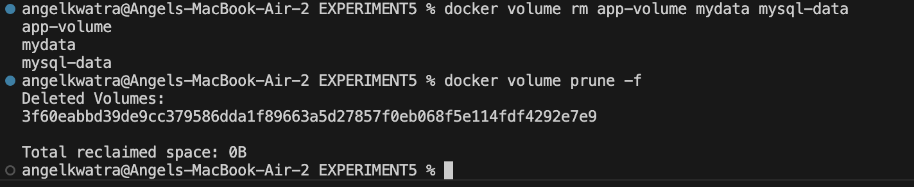

---

## Part 2: Environment Variables

### 🔹 Lab 5: Setting Variables with `-e` Flag

```bash
docker run -d --name env-test \
  -e MY_VAR="Hello Docker" \
  -e DEBUG="true" \
  ubuntu sleep 3600

docker exec env-test env | grep -E "MY_VAR|DEBUG"
docker exec env-test printenv MY_VAR
```

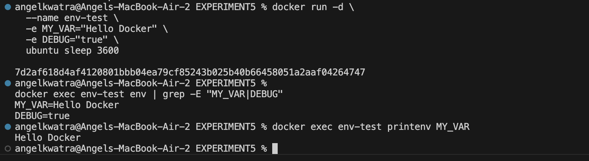

---

### 🔹 Lab 6: Using `.env` Files

```bash
cat > /tmp/myapp.env << 'EOF'
DATABASE_HOST=localhost
DATABASE_PORT=5432
API_KEY=secret123
EOF

docker run -d --name env-file-test \
  --env-file /tmp/myapp.env \
  ubuntu sleep 3600

docker exec env-file-test env | grep -E "DATABASE|API"
```

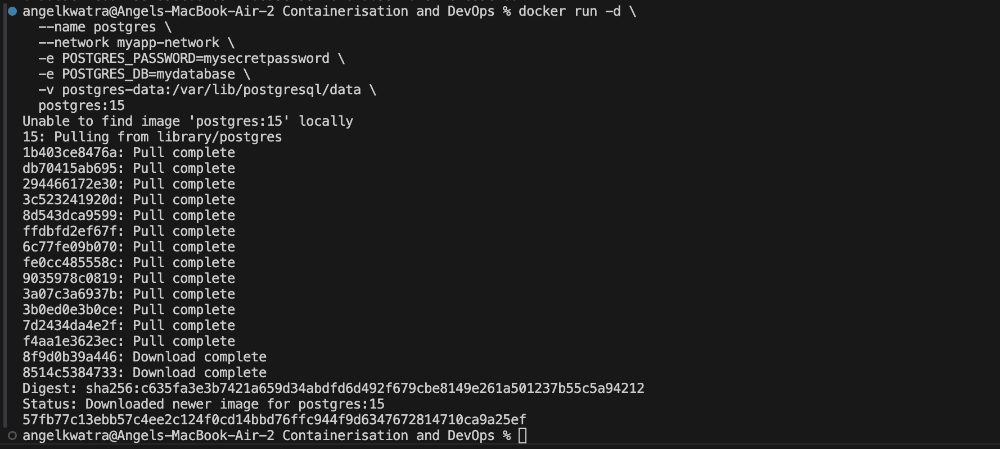

---

### 🔹 Lab 7: Flask App with Environment Variables

Created a Flask application that reads environment variables:

**Project structure:**

```bash
ls -la flask-env-app/
```

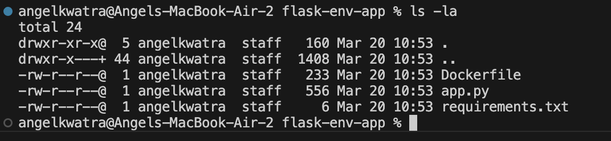

**app.py:**
```python
from flask import Flask, jsonify
import os

app = Flask(__name__)

@app.route('/')
def home():
    return "Flask app is running!"

@app.route('/config')
def config():
    return jsonify({
        'db_host': os.getenv('DATABASE_HOST', 'not set'),
        'debug': os.getenv('DEBUG', 'not set'),
        'has_api_key': bool(os.getenv('API_KEY'))
    })

if __name__ == '__main__':
    port = int(os.getenv('PORT', 5000))
    app.run(host='0.0.0.0', port=port)
```

**Dockerfile:**
```dockerfile
FROM python:3.9-slim
WORKDIR /app
COPY requirements.txt .
RUN pip install -r requirements.txt
COPY . .
CMD ["python", "app.py"]
```

```bash
docker build -t flask-app .
docker run -d --name flask-app \
  -p 5001:5000 \
  -e DATABASE_HOST="prod-db.example.com" \
  -e DEBUG="true" \
  -e API_KEY="my-secret-key" \
  flask-app
```

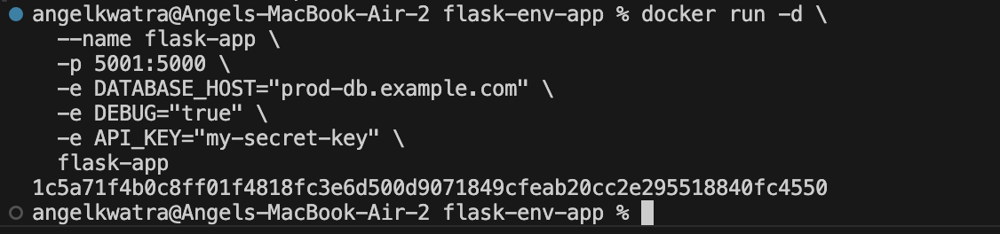

```bash
curl http://localhost:5001/
curl http://localhost:5001/config
```

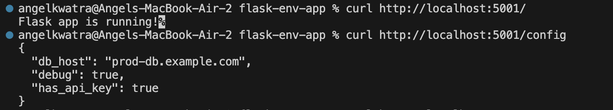

```bash
docker exec flask-app env | grep -E "DATABASE|DEBUG|API|PORT"
```

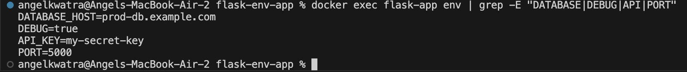

---

## Part 3: Docker Monitoring

### 🔹 Lab 8: Container Resource Statistics

```bash
docker run -d --name monitor-nginx nginx
docker run -d --name monitor-redis redis:7-alpine
docker run -d --name monitor-ubuntu ubuntu sleep 3600

docker stats --no-stream
```

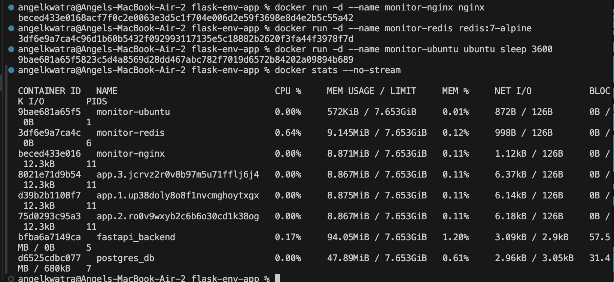

---

#### Formatted Stats Output

```bash
docker stats --no-stream --format "table {{.Name}}\t{{.CPUPerc}}\t{{.MemUsage}}"
```

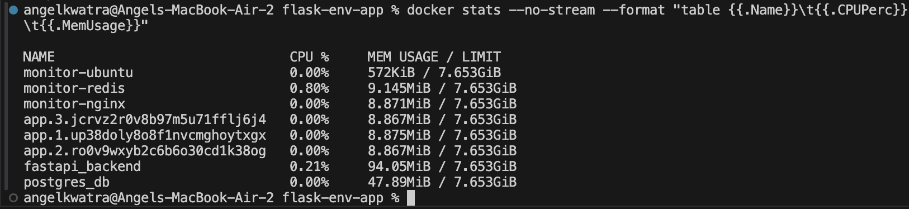

---

### 🔹 Lab 9: Process Inspection

```bash
docker top monitor-nginx
```

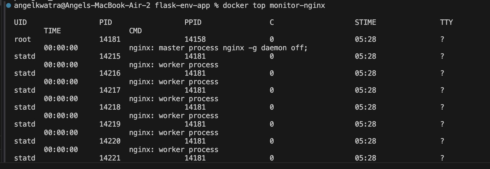

---

### 🔹 Lab 10: Container Logs

```bash
docker logs monitor-nginx
```

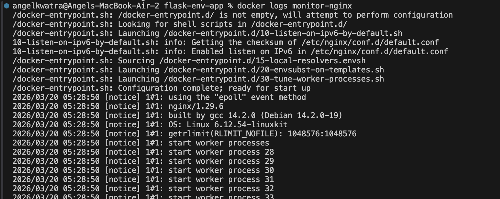

---

### 🔹 Lab 11: Docker Events

In one terminal, stopped and started a container:

```bash
docker stop monitor-ubuntu
docker start monitor-ubuntu
```

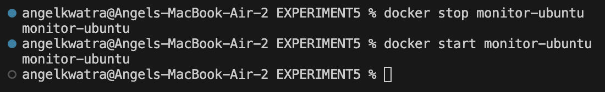

In another terminal, monitored events in real-time:

```bash
docker events --filter 'type=container'
```

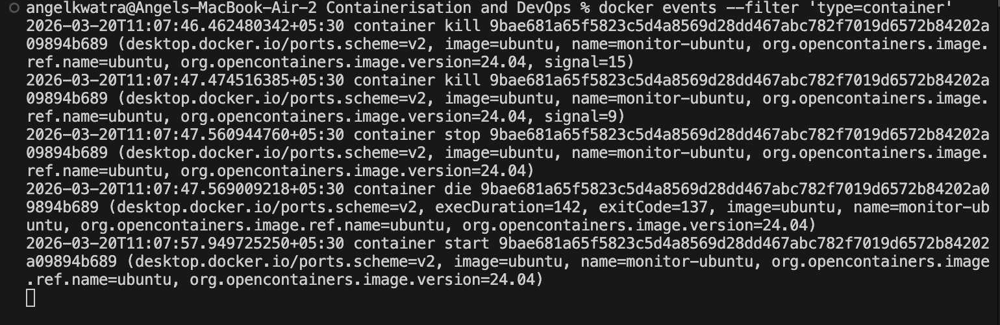

---

### 🔹 Lab 12: System Disk Usage

```bash
docker system df
```

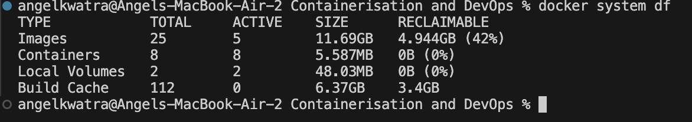

---

## Part 4: Docker Networks

### 🔹 Lab 13: List Networks

```bash
docker network ls
```

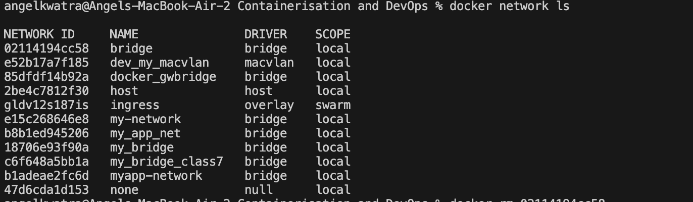

---

### 🔹 Lab 14: Custom Bridge Network

```bash
docker network create my-network
docker run -d --name net-web1 --network my-network nginx
docker run -d --name net-web2 --network my-network nginx

# Container-to-container communication using DNS names
docker exec net-web1 curl -s http://net-web2
```

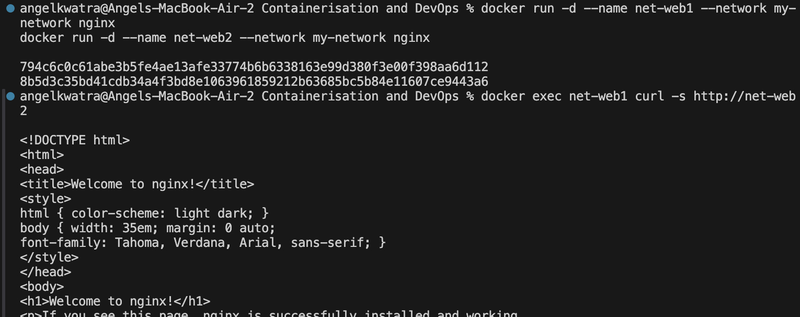

---

#### Inspect Network

```bash
docker network inspect my-network
```

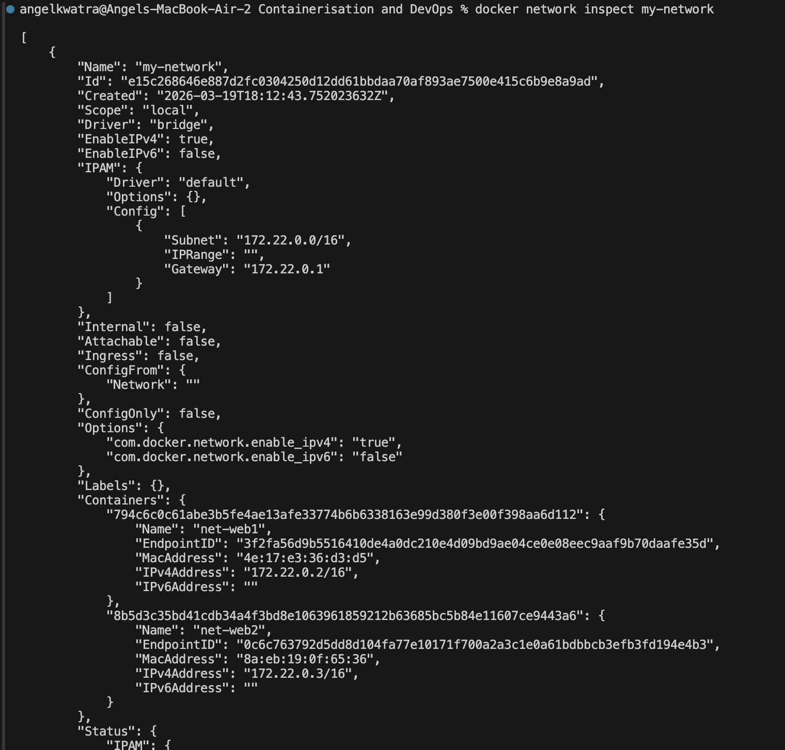

---

### 🔹 Lab 15: Host Network

```bash
docker run -d --name host-app --network host nginx
curl -s http://localhost | head -5
```

> **Note:** On macOS, host networking works differently than on Linux. The container is accessible via localhost.

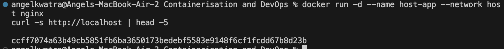

---

### 🔹 Lab 16: None Network (Isolated)

```bash
docker run -d --name isolated-app --network none alpine sleep 3600
docker exec isolated-app ifconfig 2>/dev/null || docker exec isolated-app ip addr
```

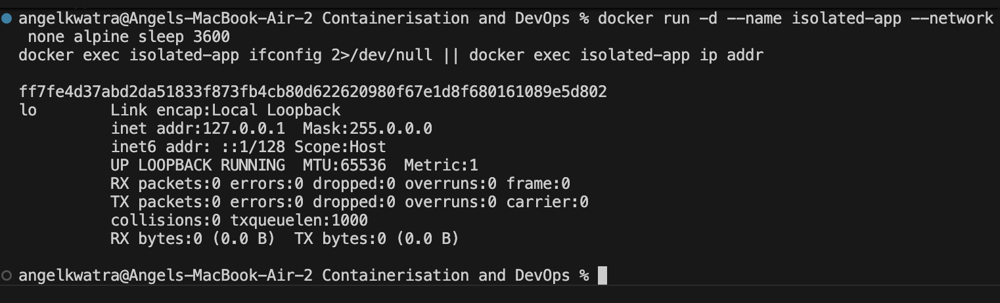

---

### 🔹 Lab 17: Connect/Disconnect Containers

```bash
docker network create app-network
docker run -d --name net-test alpine sleep 3600
docker network connect app-network net-test
docker inspect net-test | grep -A 5 Networks
docker network disconnect app-network net-test
```

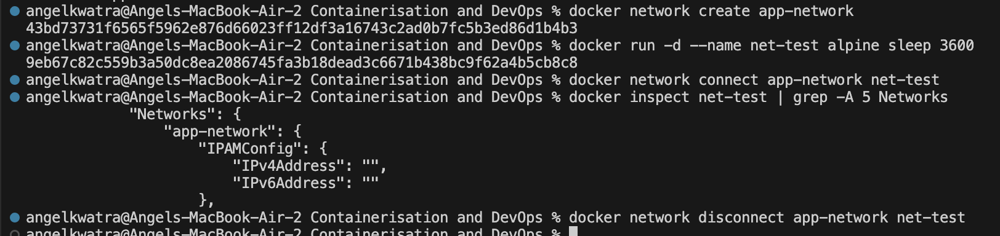

---

### 🔹 Lab 18: Port Mapping

```bash
docker run -d --name port1 -p 8081:80 nginx
docker run -d --name port2 -p 80 nginx
docker port port1
docker port port2
```

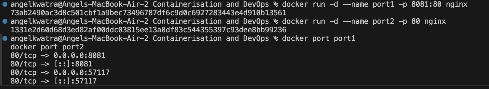

---

## Part 5: Real-World Multi-Container Application

### 🔹 Lab 19: PostgreSQL + Redis Setup

```bash
docker network create myapp-network

docker run -d \
  --name postgres \
  --network myapp-network \
  -e POSTGRES_PASSWORD=mysecretpassword \
  -v postgres-data:/var/lib/postgresql/data \
  postgres:15

docker run -d \
  --name redis \
  --network myapp-network \
  -v redis-data:/data \
  redis:7-alpine

docker ps
```

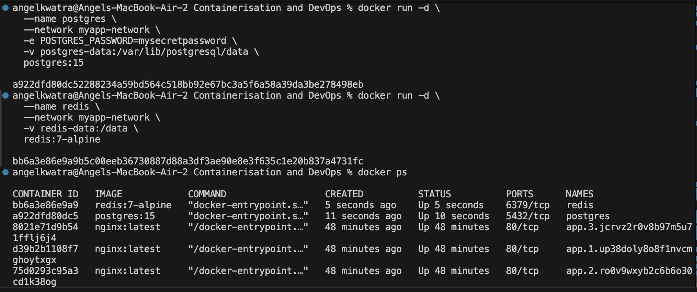

---

### 🔹 Lab 20: Monitor Multi-Container Setup

```bash
docker stats --no-stream postgres redis
docker logs postgres | tail -5
```

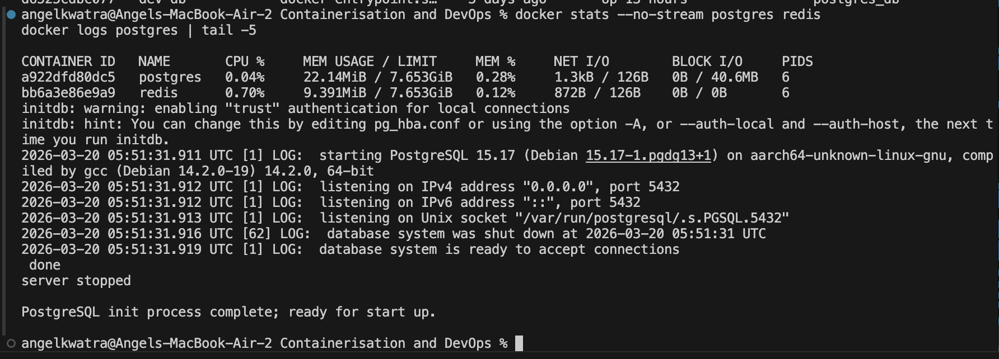

---

### 🔹 Lab 21: Verify Network Connectivity

```bash
docker exec redis ping -c 2 postgres
```

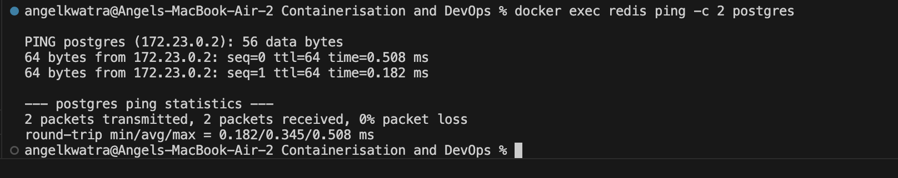

---

## Result

- Understood the difference between anonymous, named, and bind mount volumes
- Demonstrated data persistence using volumes with MySQL and Nginx
- Successfully passed environment variables using `-e` flag and `.env` files
- Built and tested a Flask app that reads environment variables
- Monitored containers using `docker stats`, `docker top`, `docker logs`, and `docker events`
- Created and managed bridge, host, and none networks
- Verified container-to-container communication using DNS names
- Deployed a multi-container setup with PostgreSQL and Redis
- Explored port mapping and network connect/disconnect operations
