# Experiment 6 – Mastering Docker Compose

## Objective

- Understand the transition from imperative `docker run` commands to declarative configuration.
- Write and structure `docker-compose.yml` files for single and multi-container applications.
- Manage container lifecycles safely using Docker Compose.
- Configure environment variables natively within Compose.
- Establish inter-container communication using Compose-defined networks.
- Incorporate volume mounting and resource constraints (CPU/Memory).
- Integrate custom Dockerfile builds directly within Compose workflows.

---

## Environment Used

- Host OS: macOS (Apple Silicon)
- Container Platform: Docker Desktop

Checking Docker and Docker Compose versions:
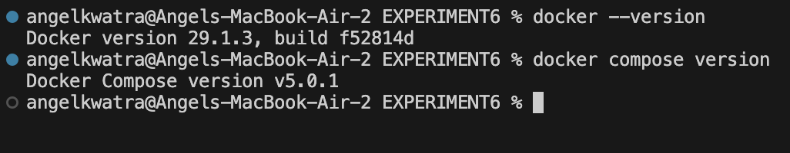

Directory structure for the experiment:


---

## Part 1: Imperative vs Declarative Setup (Nginx)

### 🔹 Using Imperative `docker run`

**Problem:** Running containers with long CLI commands can be error-prone and hard to version control.

```bash
docker run -d --name lab-nginx -p 8081:80 nginx:alpine
docker ps
```

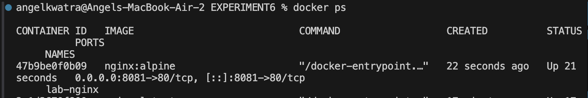

Accessing the application from the browser:


Cleaning up imperative containers:
```bash
docker stop lab-nginx
docker rm lab-nginx
```
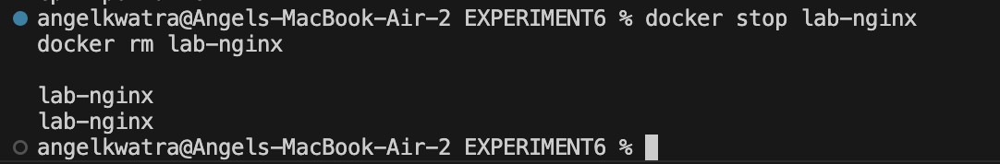

---

### 🔹 Using Declarative `docker compose`

We converted the imperative command into a declarative `docker-compose.yml` file (`task1-compose/docker-compose.yml`).

```yaml
version: '3.8'

services:
  nginx:
    image: nginx:alpine
    container_name: lab-nginx
    ports:
      - "8081:80"
```

Running the setup declaratively:
```bash
cd task1-compose
docker compose up -d
```

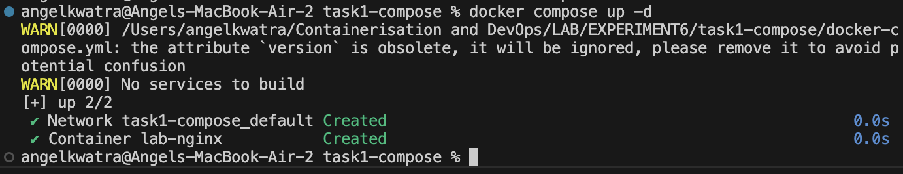

Verifying the running services:
```bash
docker compose ps
```

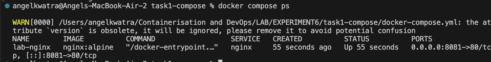

Accessing the application recursively yields the same result with an easier management process:


Tearing down the configuration seamlessly:
```bash
docker compose down
```

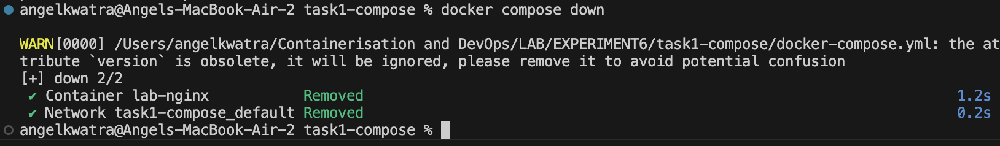

---

## Part 2: Multi-Container Orchestration (WordPress & MySQL)

### 🔹 Using Imperative approach

Setting up WordPress and MySQL manually requires manual network creation and multiple complex commands.

```bash
docker network create wp-net

docker run -d --name mysql --network wp-net \
  -e MYSQL_ROOT_PASSWORD=somewordpress \
  -e MYSQL_DATABASE=wordpress \
  -e MYSQL_USER=wordpress \
  -e MYSQL_PASSWORD=wordpress \
  mysql:5.7

docker run -d --name wordpress --network wp-net \
  -p 8082:80 \
  -e WORDPRESS_DB_HOST=mysql:3306 \
  -e WORDPRESS_DB_USER=wordpress \
  -e WORDPRESS_DB_PASSWORD=wordpress \
  -e WORDPRESS_DB_NAME=wordpress \
  wordpress:latest

docker ps
```

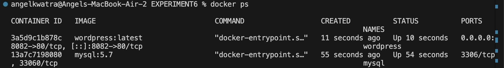

Testing WordPress accessibility:


Cleaning up imperative multi-container stack:
```bash
docker stop mysql wordpress
docker rm mysql wordpress
docker network rm wp-net
```

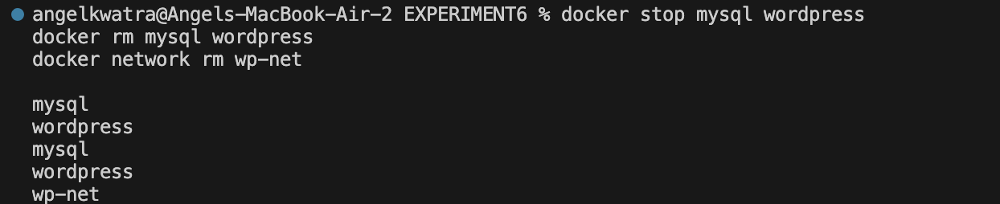

---

### 🔹 Using Declarative `docker compose`

We encapsulated the multi-container configuration in `task2-compose/docker-compose.yml`.

```bash
cd ../task2-compose
docker compose up -d
```

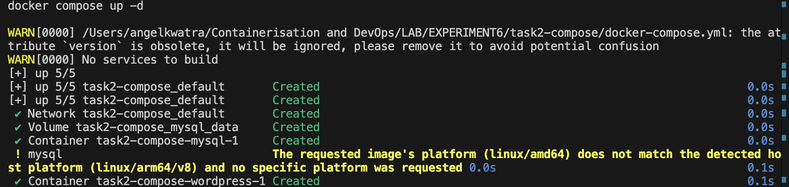

Verifying services:
```bash
docker compose ps
```

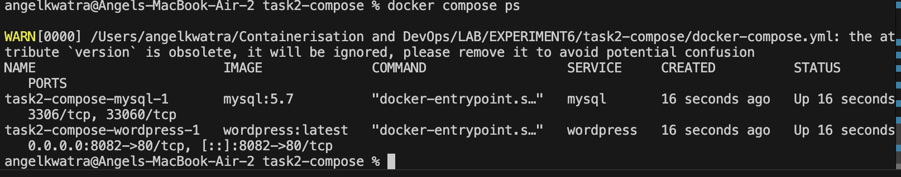

Testing accessibility showing exactly the same result via cleaner infrastructure code:

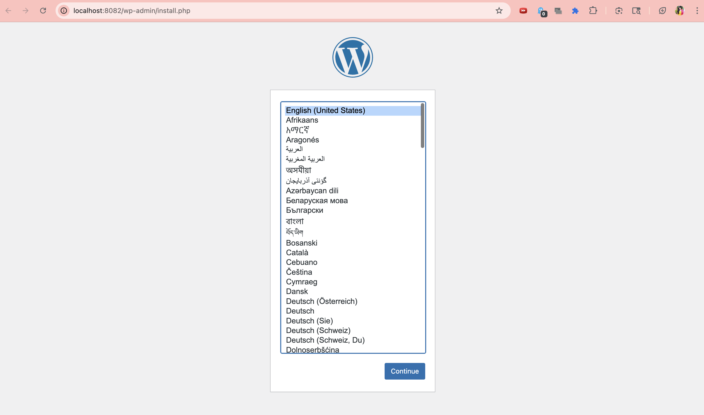

Tearing down the stack and volumes:
```bash
docker compose down -v
```


---

## Part 3: Environment Variables & External Configurations

### 🔹 Simple App with Environment Variables (Problem 1)

We structured a `docker-compose.yml` demonstrating how to pass environment variables explicitly or through `.env` files.

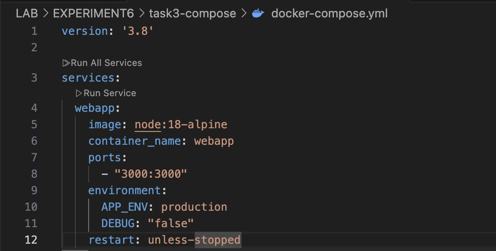

---

### 🔹 Python Backend + PostgreSQL (Problem 2)

Configuring a complete Python Backend and Postgres using custom networking and multiple environment bindings.

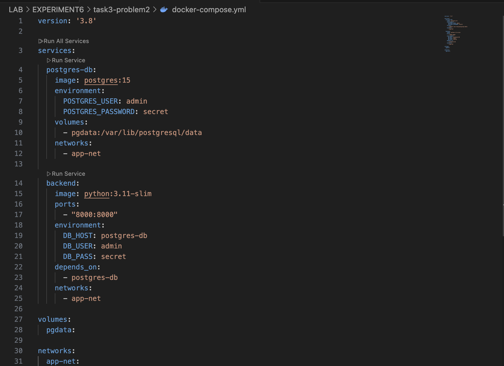

---

## Part 4: Resource Constraints

### 🔹 Limiting CPU and Memory Allocation

We applied CPU and Memory restrictions to an Nginx container using compose deployment configuration.

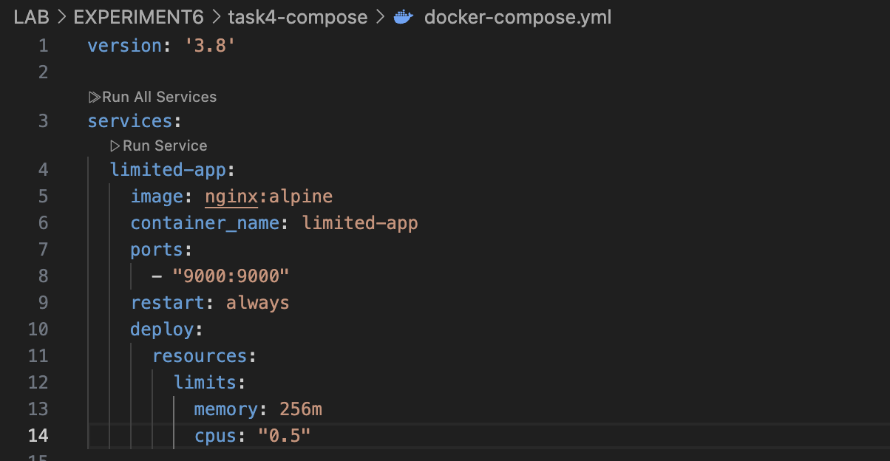

---

## Part 5: Custom Image Builds

### 🔹 Building Dockerfiles natively in Compose

Instead of running `docker build` separately, we linked our `Dockerfile` within the `docker-compose.yml`.

Files included (`app.js`, `Dockerfile`, `docker-compose.yml`):


Building and starting the custom Node.js application:
```bash
cd ../task5
docker compose up -d --build
```
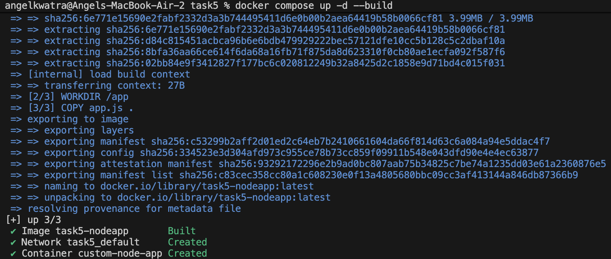

Verifying the service is running:
```bash
docker compose ps
```
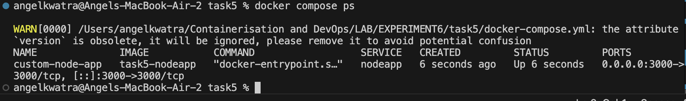

Verifying the custom Node application running on localhost:


---

## Part 6: Complex Orchestration & Scaling (Experiment 6B)

### 🔹 Running complex orchestrated stacks

```bash
cd ../exp6b
docker compose up -d
```

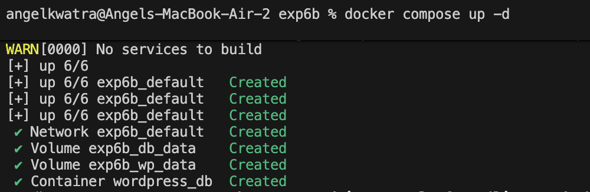

Checking statuses of the complex multi-container setup:
```bash
docker compose ps
```

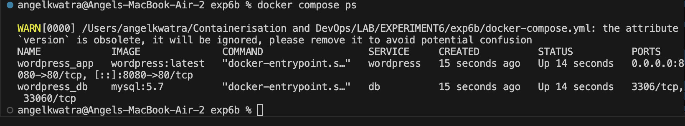

Verifying accessibility:


### 🔹 Handling replication and scaling

Trying to scale bound services without proper port-management throws errors:
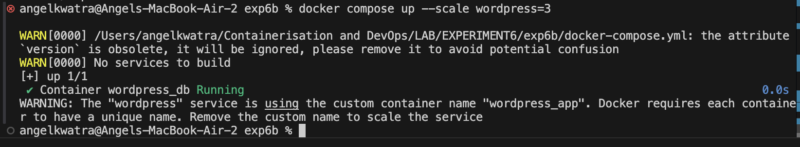

### 🔹 Final Cleanup

Tearing down all configurations, services, built images, and lingering volumes neatly:
```bash
docker compose down -v --rmi all
```

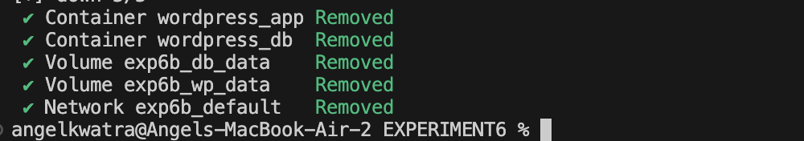

---

## Result

- Transitioned successfully from imperative Docker command execution to declarative Compose configurations.
- Simplified application tracking, initiation, and teardown drastically.
- Created robust configurations handling environment variables, interdependent container sequences (DB + Backend), and volumes.
- Ensured applications stay within operational boundaries using resource constraint properties.
- Streamlined CI/CD mimicking approaches by natively building required images during Docker Compose process instantiation.
- Investigated scaling behaviors and understood configuration limits in Docker Compose.
