# Experiment 7: Complete CI/CD Pipeline using Jenkins, GitHub, and Docker Hub

## Objective
To design and implement a fully automated Continuous Integration and Continuous Deployment (CI/CD) pipeline from scratch. The pipeline uses **GitHub** for version control, **Jenkins** for automation, and **Docker Hub** for container registry management.

---

## Stage 1 & 2: Project Setup & Version Control
First, the project structure was created, consisting of a simple Python Flask application, its dependencies, a Dockerfile to containerize it, and a declarative Jenkinsfile to define the pipeline logic.

All the code was pushed to the `main` branch of the GitHub repository.

### `flask-app/app.py`
```python
from flask import Flask
app = Flask(__name__)

@app.route('/')
def hello():
    return "Hello CI/CD! This is my automated pipeline!"

if __name__ == '__main__':
    app.run(host='0.0.0.0', port=80)
```

### `flask-app/requirements.txt`
```text
Flask==2.3.2
Werkzeug==2.3.4
```

### `flask-app/Dockerfile`
```dockerfile
FROM python:3.9-slim
WORKDIR /app
COPY requirements.txt .
RUN pip install --no-cache-dir -r requirements.txt
COPY . .
EXPOSE 80
CMD ["python", "app.py"]
```

### `flask-app/Jenkinsfile`
```groovy
pipeline {
    agent any
    environment {
        DOCKER_HUB_CRED = 'dockerhub-cred' 
        IMAGE_NAME = 'angelkwatra/flask-cicd-app'
        IMAGE_TAG = "${env.BUILD_NUMBER}"
    }
    stages {
        stage('Clone Repository') {
            steps {
                checkout scm
            }
        }
        stage('Build Docker Image') {
            steps {
                script { dockImage = docker.build("${IMAGE_NAME}:${IMAGE_TAG}", "LAB/EXPERIMENT7/flask-app") }
            }
        }
        stage('Push to Docker Hub') {
            steps {
                script {
                    docker.withRegistry('https://index.docker.io/v1/', DOCKER_HUB_CRED) {
                        dockImage.push()
                        dockImage.push('latest')
                    }
                }
            }
        }
    }
}
```

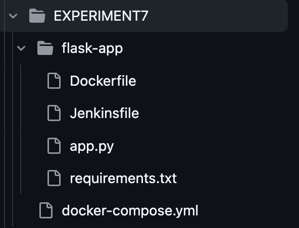

---

## Stage 3: Setting Up Jenkins Locally
A local Jenkins server was launched utilizing `docker-compose.yml`. This allowed Jenkins to run in isolation while safely accessing the host machine's Docker engine.

### `docker-compose.yml`
```yaml
services:
  jenkins:
    image: jenkins/jenkins:lts-jdk17
    container_name: jenkins-server
    privileged: true
    user: root
    ports:
      - 8080:8080
      - 50000:50000
    volumes:
      - ./jenkins_home:/var/jenkins_home
      - /var/run/docker.sock:/var/run/docker.sock
    restart: on-failure
```

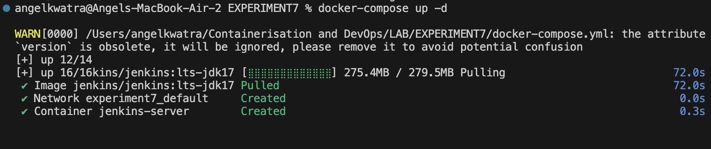

Once up, the initial administrator password was retrieved from the container logs to unlock the dashboard.

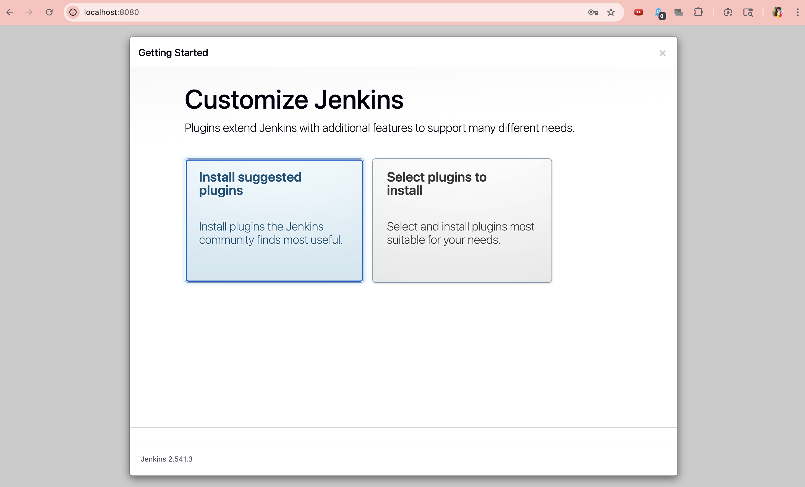

Next, the necessary plugins were installed, specifically the **Docker Pipeline** and **Docker** plugins, to allow Jenkins to build and manipulate Docker images.

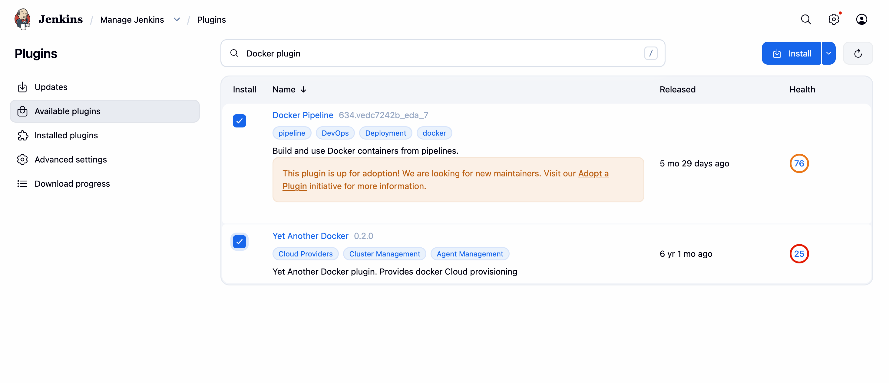

---

## Stage 4: Configuring the Jenkins Pipeline

### 1. Adding Docker Hub Credentials
To securely push images to Docker Hub during the pipeline, an access token was generated in Docker Hub and configured as global credentials (`dockerhub-cred`) inside the Jenkins credentials manager.

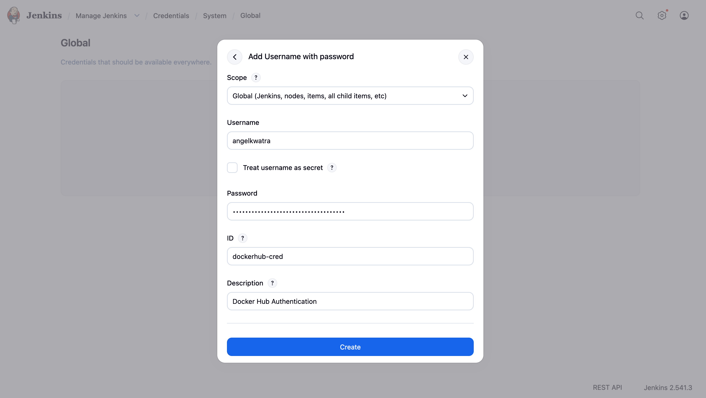

### 2. Creating the Job
A new Jenkins "Pipeline" job was created (`Flask-CI-CD`). It was configured to automatically pull the `Jenkinsfile` directly from the connected GitHub Repository via Source Code Management (SCM).

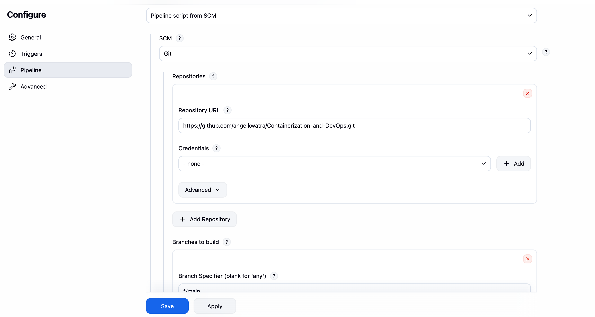

---

## Stage 5: Configuring GitHub Webhook Automation
To enable "Continuous" execution, the pipeline needs to trigger automatically whenever an engineer updates the source code.

An **ngrok** tunnel was established to expose the local Jenkins port (`8080`) to the internet. A **Webhook** was then configured inside the GitHub repository pointing to this ngrok URL (`/github-webhook/`), intercepting any `push` events.

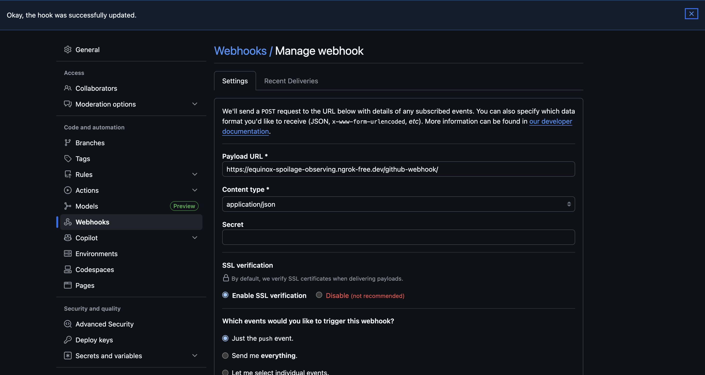

---

## Stage 6: Running & Verifying the Pipeline
With the automation connected, a minor update was made to `app.py` directly in the IDE to test the workflow. A `git push` was executed, which immediately prompted GitHub to ping the ngrok webhook. 

 Jenkins successfully caught the payload, triggered the `Flask-CI-CD` job, and executed the four stages defined in the `Jenkinsfile`:
1. **Clone Repository**: Fetching the latest commit.
2. **Build Docker Image**: Building the `Dockerfile`.
3. **Login To Docker Hub**: Securely injecting the token.
4. **Push**: Pushing the final image online.

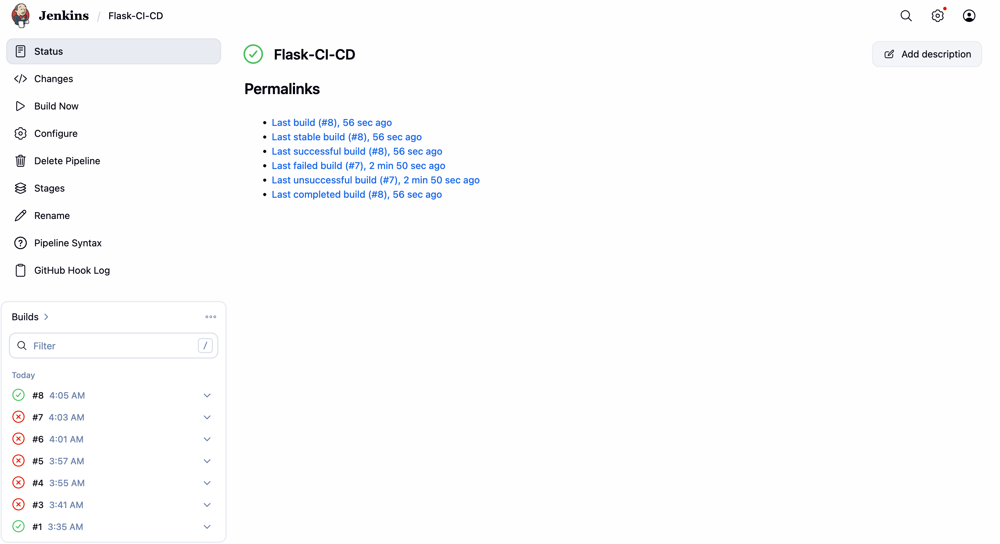

The freshly built image instantly appeared online inside the public Docker Hub registry, tagged as `latest`.

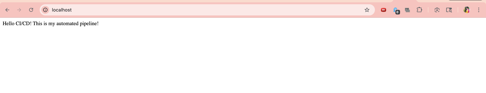

---

## Stage 7: Deployment & Testing Validation

To validate that the deployed code functions perfectly in the real world, the newly built image was pulled down from Docker Hub.

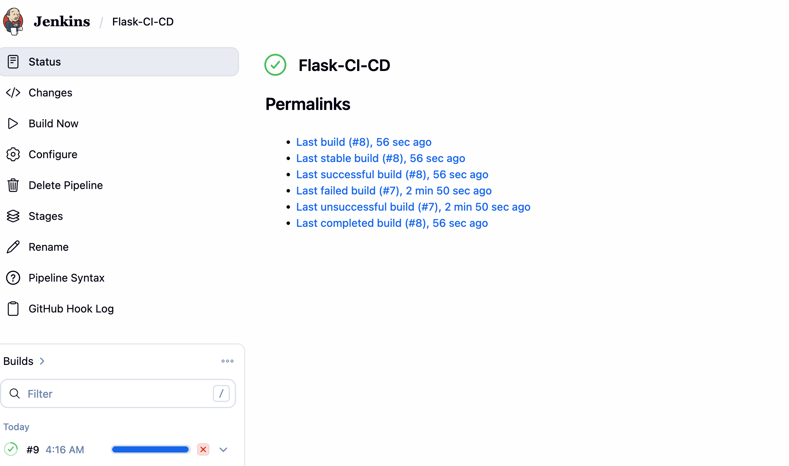

The updated image was run on local port `8081`. 

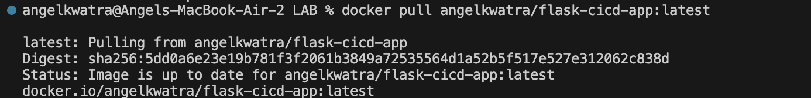
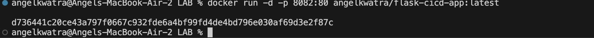

Connecting to the container manually via the browser displayed the application serving the newest automated change (`"now i am testing it."`).

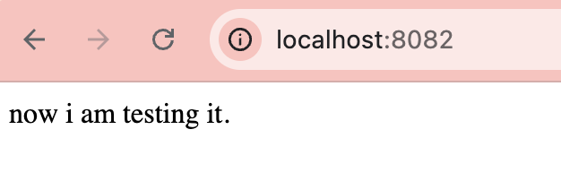
