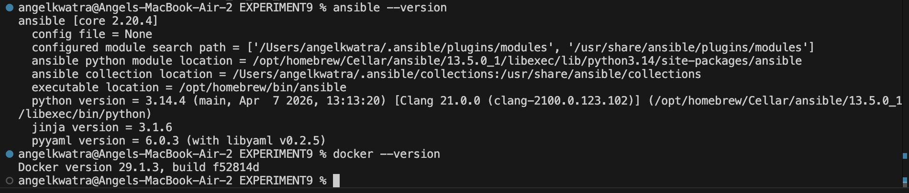
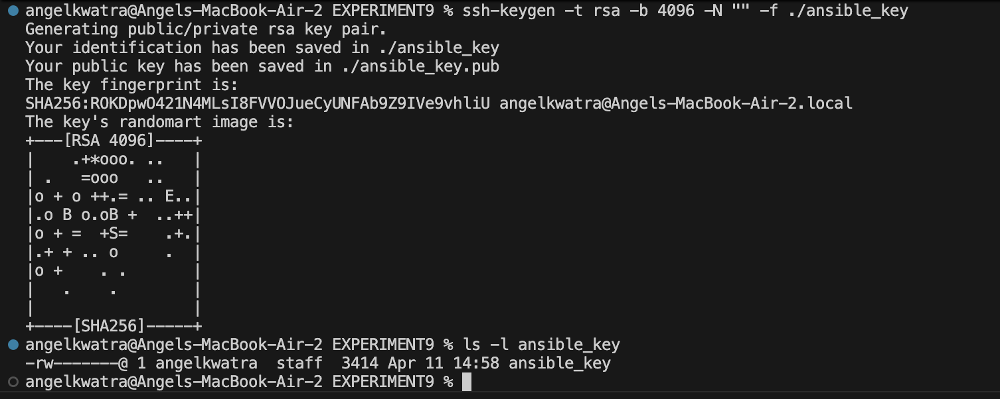
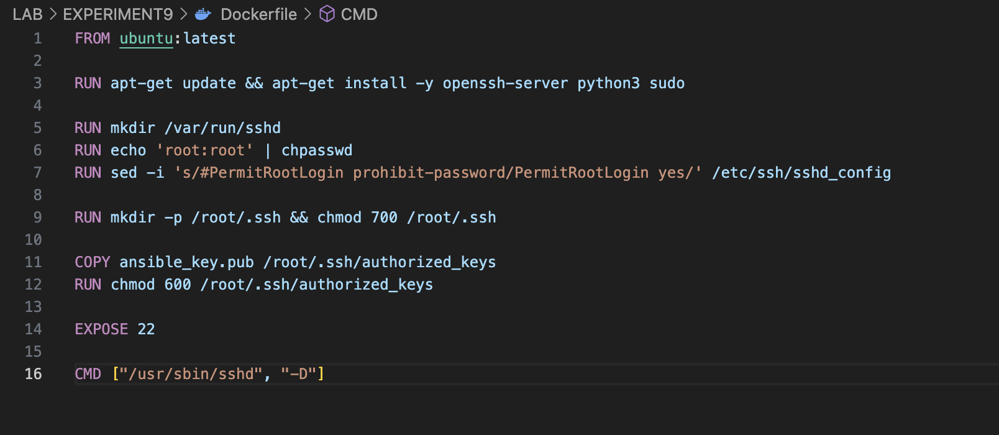
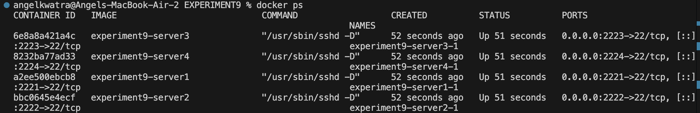
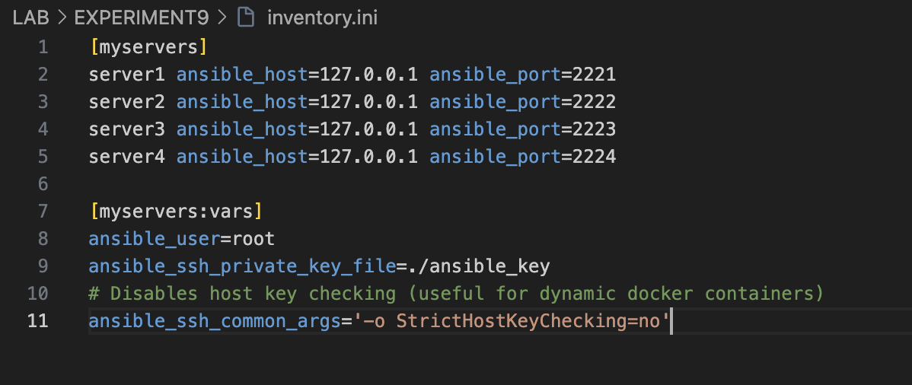
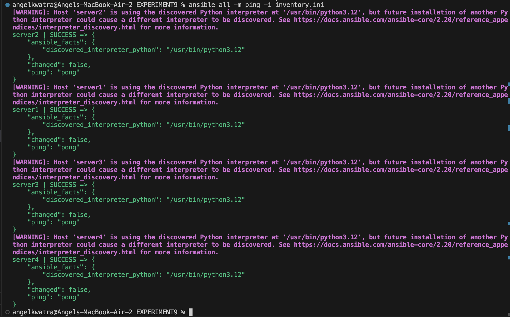
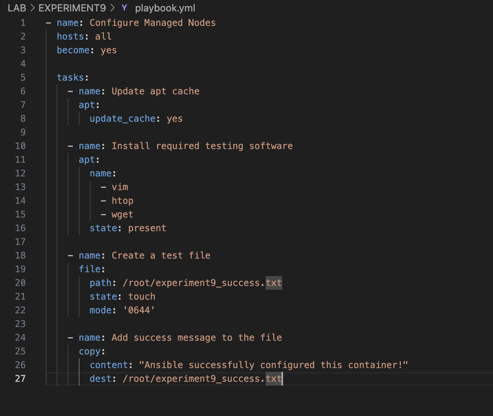
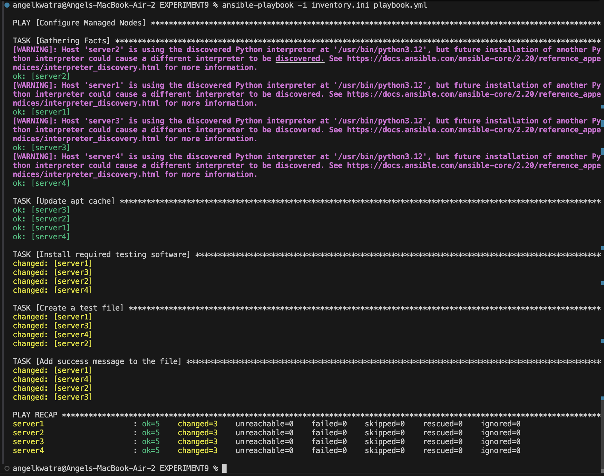
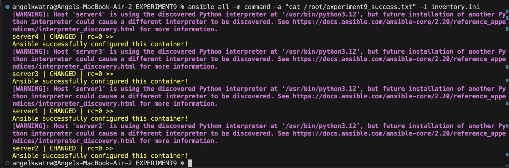
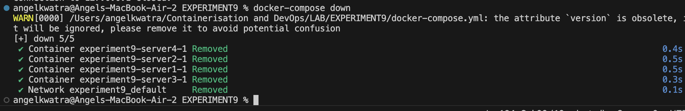

# EXPERIMENT 9 – ANSIBLE

This document outlines the steps performed during Experiment 9, which focused on setting up an Ansible control node and managing a fleet of Docker-based servers using Ansible playbooks.

### Prerequisites Setup (Control Node)
We created a new directory for the experiment in our lab folder and navigated into it:
```bash
mkdir -p "~/Containerisation and DevOps/LAB/EXPERIMENT9"
cd "~/Containerisation and DevOps/LAB/EXPERIMENT9"
```

---

### Step 1: Installed Required Tools
We installed Ansible on our macOS (acting as the Control Node). Docker Desktop was already installed from previous experiments.

1. We ran the installation command: `brew install ansible`
2. Verified the installations: `ansible --version` and `docker --version`



---

### Step 2: Generated SSH Keys
Since Ansible uses SSH to communicate with Managed Nodes, we generated a key pair explicitly for this experiment so it could authenticate without passwords.

1. We ran: `ssh-keygen -t rsa -b 4096 -N "" -f ./ansible_key`
*(This created `ansible_key` (private) and `ansible_key.pub` (public) in the current directory.)*
2. Verified creation by running: `ls -l ansible_key*`



---

### Step 3: Created Docker-Based Servers
We created a custom Docker image containing Ubuntu, Python (required by Ansible), and an OpenSSH server configured to accept our generated public key.

1. We created a `Dockerfile` and added the following content:
```dockerfile
FROM ubuntu:latest

# Install required packages
RUN apt-get update && apt-get install -y openssh-server python3 sudo

# Set up SSH directory and user permissions
RUN mkdir /var/run/sshd
RUN echo 'root:root' | chpasswd
RUN sed -i 's/#PermitRootLogin prohibit-password/PermitRootLogin yes/' /etc/ssh/sshd_config

# Create ssh directory for root
RUN mkdir -p /root/.ssh && chmod 700 /root/.ssh

# Copy our generated public key
COPY ansible_key.pub /root/.ssh/authorized_keys
RUN chmod 600 /root/.ssh/authorized_keys

# Expose SSH port
EXPOSE 22

# Start SSH daemon
CMD ["/usr/sbin/sshd", "-D"]
```



---

### Step 4: Launched Multiple Servers
To simulate 4 servers effectively, we utilized Docker Compose.

1. We defined a `docker-compose.yml` file:
```yaml
version: '3.8'

services:
  server1:
    build: .
    ports:
      - "2221:22"
  server2:
    build: .
    ports:
      - "2222:22"
  server3:
    build: .
    ports:
      - "2223:22"
  server4:
    build: .
    ports:
      - "2224:22"
```
2. We built and ran the containers in detached mode: `docker-compose up -d --build`
3. Verified the running containers: `docker ps`



---

### Step 5: Created Inventory File
We created an inventory file to instruct Ansible on the IP addresses, mapped ports, and the specific SSH key to use for connections.

1. We created the `inventory.ini` file:
```ini
[myservers]
server1 ansible_host=127.0.0.1 ansible_port=2221
server2 ansible_host=127.0.0.1 ansible_port=2222
server3 ansible_host=127.0.0.1 ansible_port=2223
server4 ansible_host=127.0.0.1 ansible_port=2224

[myservers:vars]
ansible_user=root
ansible_ssh_private_key_file=./ansible_key
# Disables host key checking (useful for dynamic docker containers)
ansible_ssh_common_args='-o StrictHostKeyChecking=no'
```



---

### Step 6: Tested Connectivity
We verified that Ansible could SSH into all 4 Docker containers and execute python using the `ping` module.

1. We ran: `ansible all -m ping -i inventory.ini`



---

### Step 7: Created Playbook
We wrote a YAML playbook to define our desired state for all the managed nodes.

1. We created the `playbook.yml` file:
```yaml
---
- name: Configure Managed Nodes
  hosts: all
  become: yes # Run as root (sudo)
  
  tasks:
    - name: Update apt cache
      apt:
        update_cache: yes
        
    - name: Install required testing software
      apt:
        name: 
          - vim
          - htop
          - wget
        state: present
        
    - name: Create a test file
      file:
        path: /root/experiment9_success.txt
        state: touch
        mode: '0644'
        
    - name: Add success message to the file
      copy:
        content: "Ansible successfully configured this container!"
        dest: /root/experiment9_success.txt
```



---

### Step 8: Executed Playbook
We executed the playbook to configure all 4 nodes simultaneously.

1. We ran: `ansible-playbook -i inventory.ini playbook.yml`



---

### Step 9: Verified Results
To confirm the playbook successfully applied changes, we used an ad-hoc command to read the generated file directly from all managed servers.

1. We ran: `ansible all -m command -a "cat /root/experiment9_success.txt" -i inventory.ini`



*(We also performed a bonus manual verification test via `ssh -i ./ansible_key -p 2221 root@127.0.0.1`)*

---

### Step 10: Cleanup
Finally, we tore down the environment to free up resources.

1. We stopped and removed the containers using: `docker-compose down`


