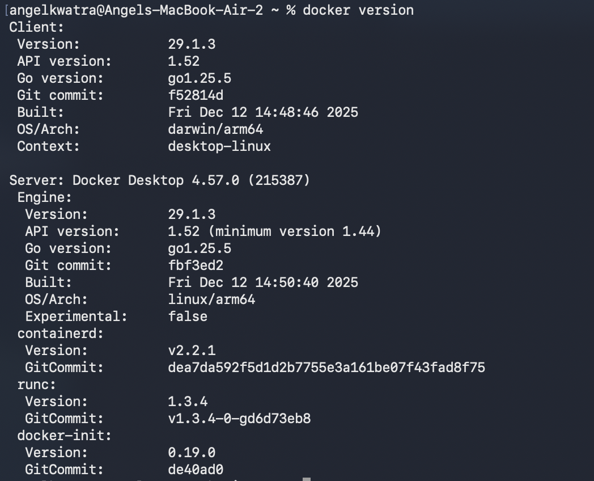
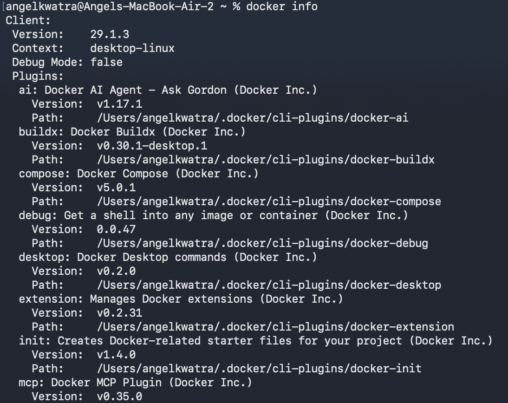
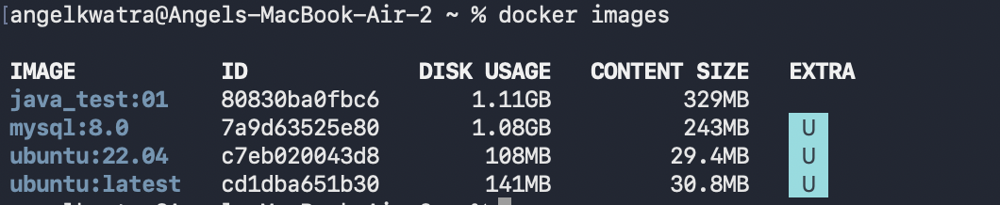
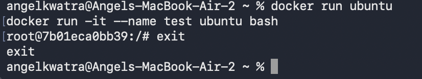
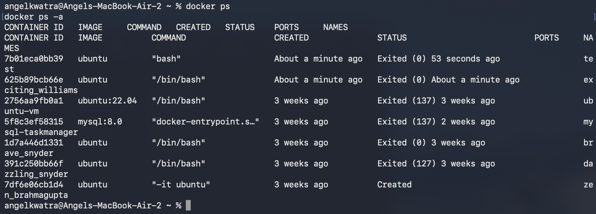

# Class 1 -- Docker Basics (Hands-on)

## Objective

-   Execute basic Docker commands
-   Work with Docker images and containers
-   Observe container lifecycle

------------------------------------------------------------------------


## Experiment Execution with Screenshots

### 🔹 Step 1: Check Docker Version

**Command executed:**

``` bash
docker version
```



------------------------------------------------------------------------

### 🔹 Step 2: Inspect Docker Information

**Command executed:**

``` bash
docker info
```



------------------------------------------------------------------------

### 🔹 Step 3: View Local Docker Images

**Command executed:**

``` bash
docker images
```

Images available: - java_test:01 - mysql:8.0 - ubuntu:22.04 -
ubuntu:latest



------------------------------------------------------------------------

### 🔹 Step 4: Run Ubuntu Container

**Commands executed:**

``` bash
docker run ubuntu
docker run -it --name test ubuntu bash
exit
```



------------------------------------------------------------------------

### 🔹 Step 5: Check Container Status

**Commands executed:**

``` bash
docker ps
docker ps -a
```



------------------------------------------------------------------------

## Result

-   Verified Docker installation
-   Listed available Docker images
-   Created and executed Ubuntu container
-   Exited container
-   Checked running and stopped containers
