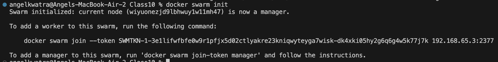
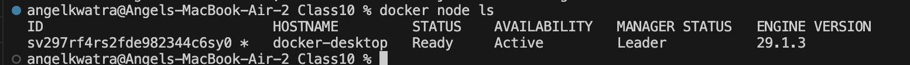
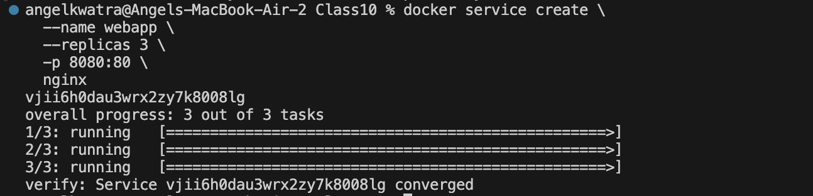
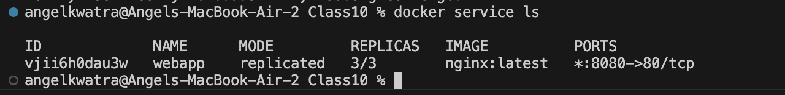
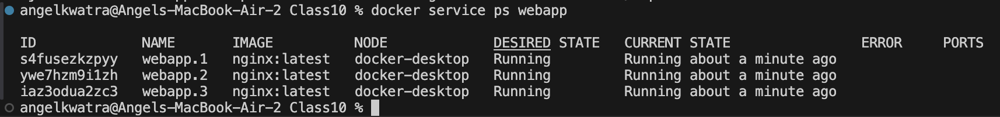
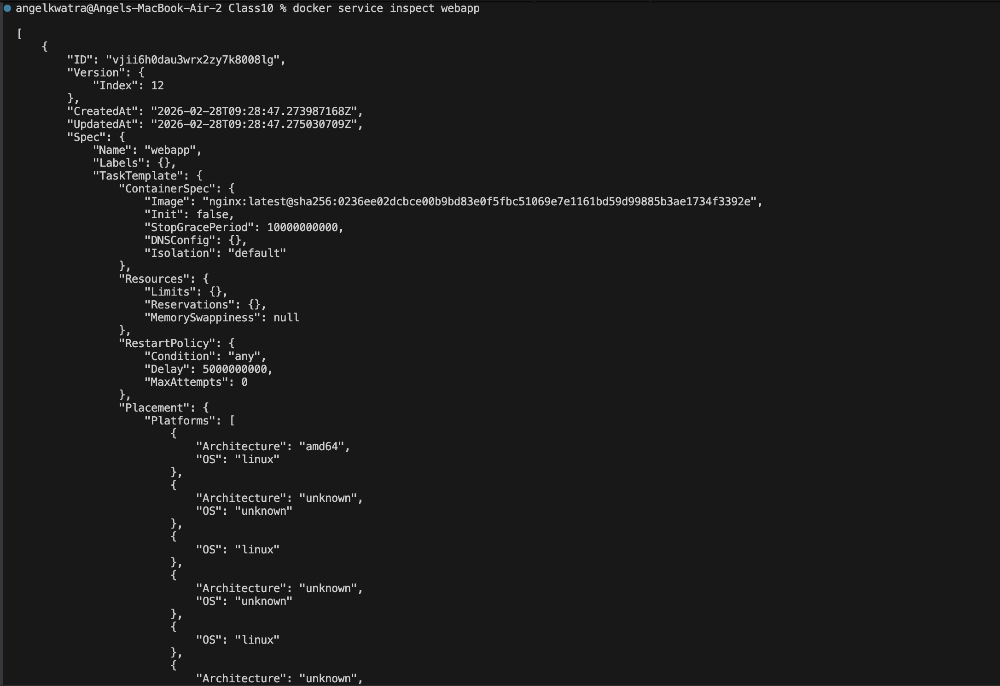
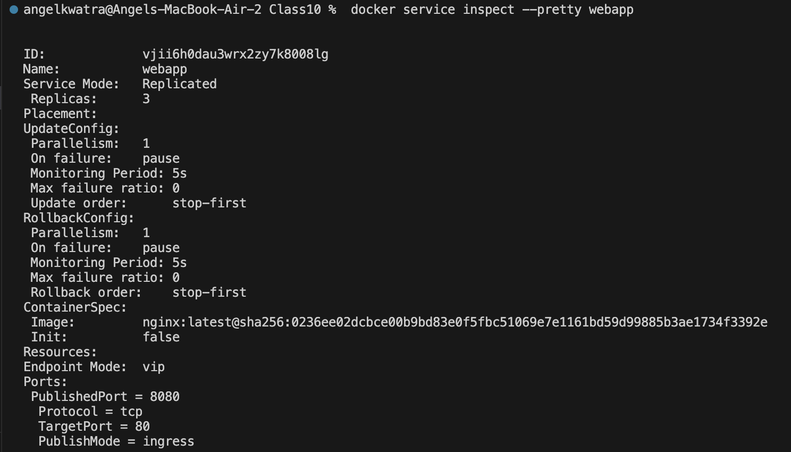
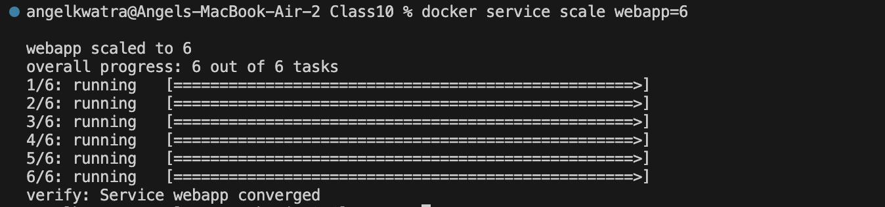
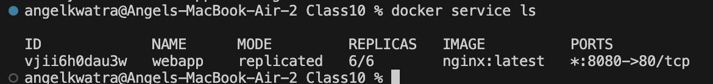
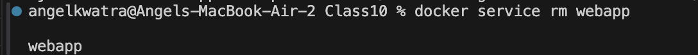

# Class 10 -- Docker Swarm Basics

## Objective

- Overview additional application operations using Docker Swarm.
- Understand how to initialize a Swarm cluster and manage services.
- Learn how to create, inspect, scale, and remove a distributed service.

---

## Environment Used

- **OS**: macOS (Apple Silicon)
- **Tool**: Docker Desktop
- **Shell**: zsh

---

## Experiment Execution with Screenshots

### 🔹 Step 1: Initializing Docker Swarm
To use Swarm mode, the Docker engine first needs to be initialized as a Swarm leader (manager). 

**Command executed:**
```bash
docker swarm init
```


---
### 🔹 Step 2: Listing Swarm Nodes
Verify that the current node is active and set as the Leader.

**Command executed:**
```bash
docker node ls
```


---
### 🔹 Step 3: Creating a Swarm Service
Create a new service named `webapp`, use the `nginx` image, specify 3 replicas, and publish port `8080:80`.

**Command executed:**
```bash
docker service create \
  --name webapp \
  --replicas 3 \
  -p 8080:80 \
  nginx
```


---
### 🔹 Step 4: Listing Swarm Services
View all active Swarm services and check their replica count and published ports.

**Command executed:**
```bash
docker service ls
```


---
### 🔹 Step 5: Viewing Service Tasks
List all tasks (containers) that are currently running for the `webapp` service to verify all 3 replicas are active.

**Command executed:**
```bash
docker service ps webapp
```


---
### 🔹 Step 6: Inspecting the Service (JSON)
Inspect the newly created service to get a detailed JSON output of its configuration and state.

**Command executed:**
```bash
docker service inspect webapp
```


---
### 🔹 Step 7: Inspecting the Service (Pretty)
Use the `--pretty` flag to output the service configuration in a more readable format.

**Command executed:**
```bash
docker service inspect --pretty webapp
```


---
### 🔹 Step 8: Scaling the Service
Scale the running `webapp` service up to 6 replicas. Swarm takes care of deploying the new instances.

**Command executed:**
```bash
docker service scale webapp=6
```


---
### 🔹 Step 9: Verifying the Scaled Service
List the services again to confirm that 6 out of 6 replicas are now running.

**Command executed:**
```bash
docker service ls
```


---
### 🔹 Step 10: Removing the Service
Clean up the environment by removing the `webapp` service.

**Command executed:**
```bash
docker service rm webapp
```


---

## Result

- Covered additional system usages within Docker.
- Initialized a Docker Swarm and examined node status.
- Successfully created, scaled, and removed a replicated NGINX web service under Docker Swarm.
