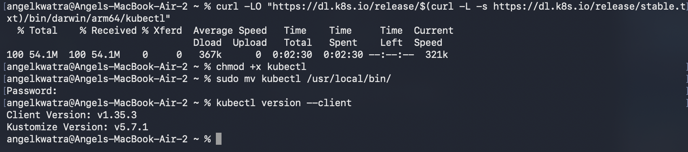
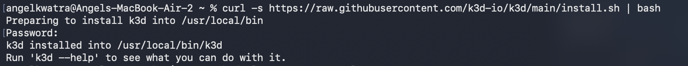
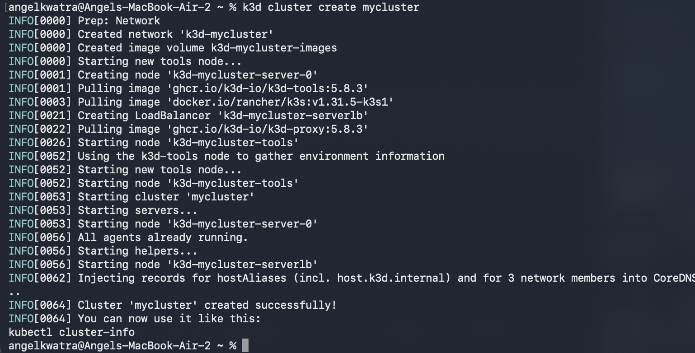
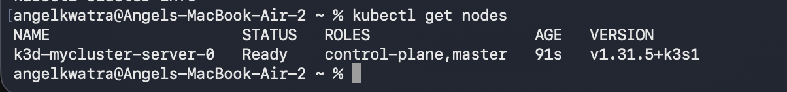
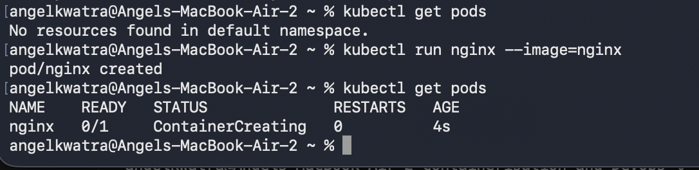
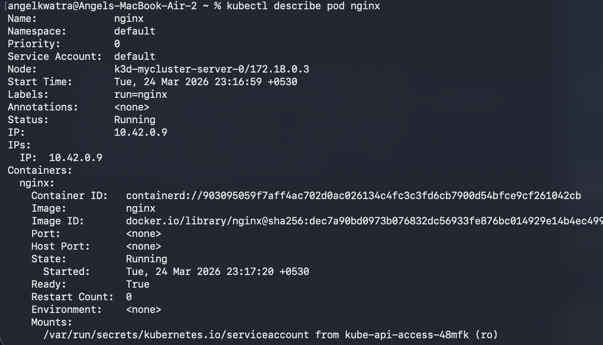
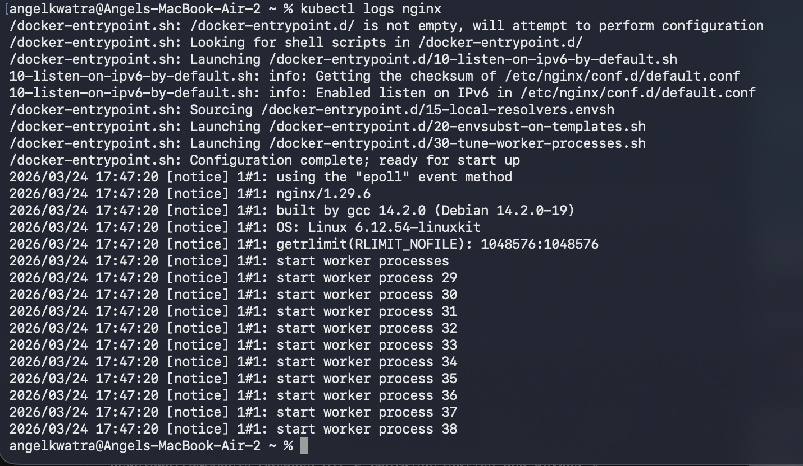
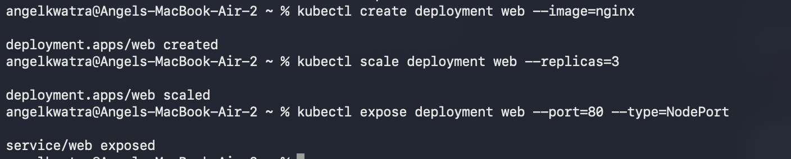
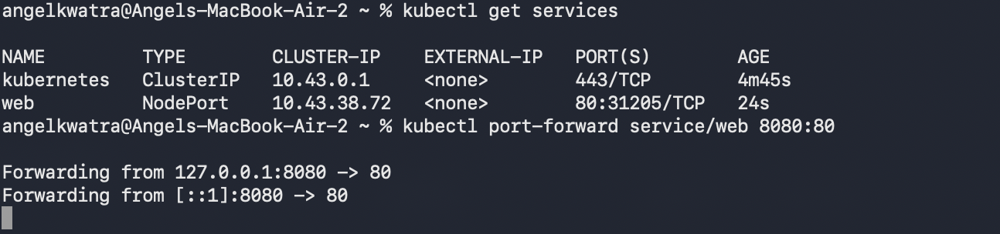
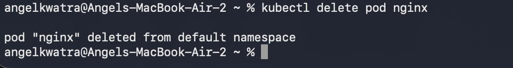

# Class 11 -- Kubernetes Cluster Setup and Basics (k3d)

## Objective

- **Kubernetes Setup**: Install and set up `kubectl` and a local Kubernetes cluster using `k3d`.
- **Basic Pod Operations**: Learn how to run, inspect, and view logs of a standalone Pod.
- **Deployments & Services**: Deploy applications via Deployments, scale them, and expose them internally and externally.
- **Port Forwarding**: Access internal services from the host machine using port-forwarding.

---

## Environment Used

- **OS**: macOS (Apple Silicon)
- **Tools**: Docker Desktop, k3d, kubectl
- **Shell**: zsh

---

## Experiment Execution with Screenshots

### 🔹 Step 1: Installing kubectl
Download and install the Kubernetes command-line tool `kubectl` for macOS (arm64), make it executable, and move it to the system path. Verify the installation.

**Command executed:**
```bash
curl -LO "https://dl.k8s.io/release/$(curl -L -s https://dl.k8s.io/release/stable.txt)/bin/darwin/arm64/kubectl"
chmod +x kubectl
sudo mv kubectl /usr/local/bin/
kubectl version --client
```


---
### 🔹 Step 2: Installing k3d
Install `k3d` (a lightweight wrapper to run k3s inside Docker containers) using the official installation script.

**Command executed:**
```bash
curl -s https://raw.githubusercontent.com/k3d-io/k3d/main/install.sh | bash
```


---
### 🔹 Step 3: Creating a Local Cluster
Use `k3d` to create a lightweight, local Kubernetes cluster named `mycluster`.

**Command executed:**
```bash
k3d cluster create mycluster
```


---
### 🔹 Step 4: Verifying Cluster Nodes
Check the status of the nodes within the newly created Kubernetes cluster to ensure the control-plane is ready.

**Command executed:**
```bash
kubectl get nodes
```


---
### 🔹 Step 5: Running a Standalone Pod
Run a simple NGINX pod in the cluster and verify that it is in the `ContainerCreating` or `Running` state.

**Command executed:**
```bash
kubectl get pods
kubectl run nginx --image=nginx
kubectl get pods
```


---
### 🔹 Step 6: Inspecting Pod Details
Describe the `nginx` pod to inspect its configuration, current state, IP address, and events.

**Command executed:**
```bash
kubectl describe pod nginx
```


---
### 🔹 Step 7: Viewing Pod Logs
View the standard output logs generated by the `nginx` container running inside the pod.

**Command executed:**
```bash
kubectl logs nginx
```


---
### 🔹 Step 8: Creating, Scaling, and Exposing a Deployment
Create an NGINX deployment named `web`, scale it up to 3 replicas, and expose it via a NodePort service on port 80.

**Command executed:**
```bash
kubectl create deployment web --image=nginx
kubectl scale deployment web --replicas=3
kubectl expose deployment web --port=80 --type=NodePort
```


---
### 🔹 Step 9: Verifying Services and Port Forwarding
List the active services in the cluster to see the newly created `web` NodePort service. Then, map local port `8080` to the service's port `80` to access the application from the host machine.

**Command executed:**
```bash
kubectl get services
kubectl port-forward service/web 8080:80
```


---
### 🔹 Step 10: Deleting a Pod
Clean up the environment by deleting the standalone `nginx` pod created earlier.

**Command executed:**
```bash
kubectl delete pod nginx
```


---

## Result

- Installed Kubernetes tools (`kubectl` and `k3d`) locally on macOS.
- Bootstrapped a local Kubernetes cluster using Docker containers as nodes.
- Mastered basic `kubectl` commands by effectively deploying, scaling, observing, and exposing workloads and services within a Kubernetes cluster.
