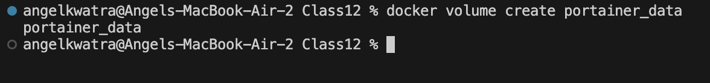
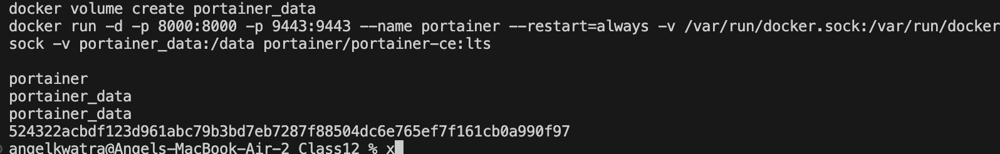
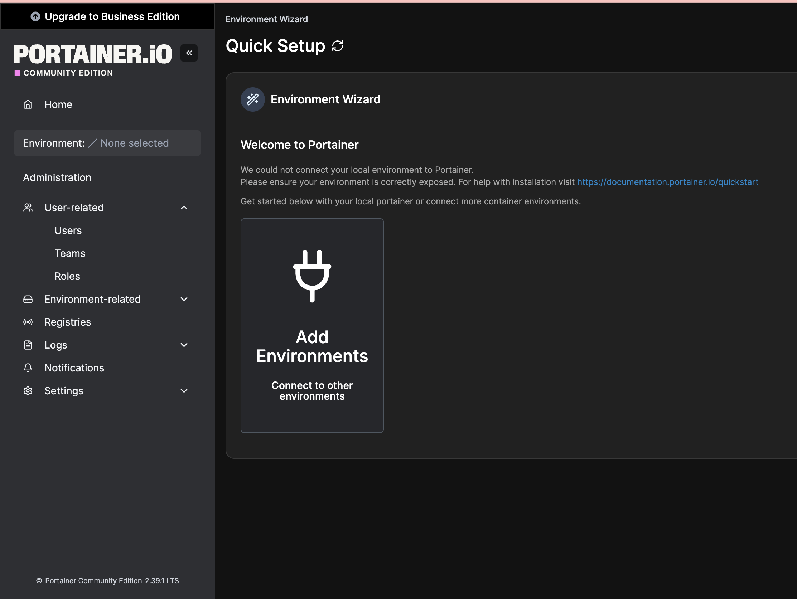
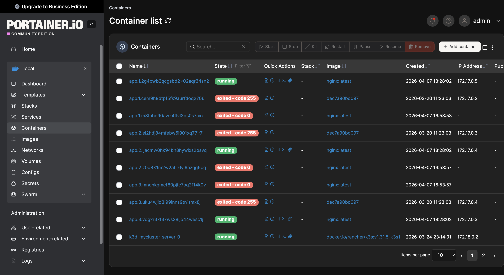

# Class 12: Container Management with Portainer

## Objective
To understand and implement web-based container management interfaces using Portainer.

---

## Theory and Concepts

While the Docker Command Line Interface (CLI) is extremely powerful, managing many containers, images, and networks can become visually overwhelming. 

**Portainer** is a lightweight management UI that allows you to easily manage your different Docker environments (Docker hosts or Swarm clusters). 

### Key Takeaways:
- **Web Interface:** Everything we were able to do via the CLI (creating, stopping, deleting containers, viewing logs) we can now do via a graphical web interface.
- **Remote Observation:** Primary use case is to manage and observe containers remotely without needing direct shell access to the host machine.
- **Daemon Access:** Every container management tool requires access to the Docker engine. We achieve this by directly mapping the `docker.sock` file from the host into the container (`-v /var/run/docker.sock:/var/run/docker.sock`). This makes the container aware of what is happening on the host.
- **API Communication:** Portainer communicates with the Docker daemon via its API.
- **Enhanced Capabilities:** Portainer enhances the view of pre-existing services and provides additional functionalities (like visual stack deployment and easy container duplication).

---

## Steps and Execution

### 1. Preparing the Environment
Before running Portainer, we created a persistent volume to store Portainer's internal database (user credentials, environment configurations, etc.).

```bash
docker volume create portainer_data
```

### 2. Installing the Portainer Server
We downloaded and initialized the Portainer container. The command maps two ports (8000 and 9443 for HTTPS web access), links the `docker.sock` to give it admin privileges over the host's Docker engine, and attaches the persistent volume we created.

```bash
docker run -d -p 8000:8000 -p 9443:9443 --name portainer \
  --restart=always \
  -v /var/run/docker.sock:/var/run/docker.sock \
  -v portainer_data:/data \
  portainer/portainer-ce:lts
```



### 3. Verifying the Service
We checked the running containers to ensure Portainer was operating correctly and listening on the designated ports.

```bash
docker ps
```



### 4. Initializing Portainer via Web UI
We accessed the graphical interface by navigating to `https://localhost:9443`. Because Portainer enforces strict security, it requires the initialization of an local Admin user within the first 5 minutes of the container starting. 

*(Note for future reference: The Portainer Admin password is set to `Angel06062004`)*



### 5. Managing the Local Environment
After entering the environment, we connected Portainer to our local Docker engine. Let's look at the Dashboard, which successfully pulls stats from the Docker Socket (showing running containers, images, volumes, and networks)!



---

## Results
- Successfully installed and configured a GUI management tool for Docker.
- Understood the security implications and requirements of exposing `/var/run/docker.sock`.
- Navigated the local Docker infrastructure through the Portainer interface.
