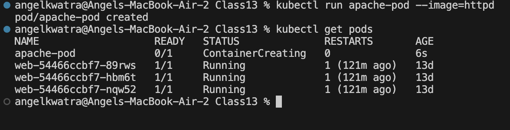
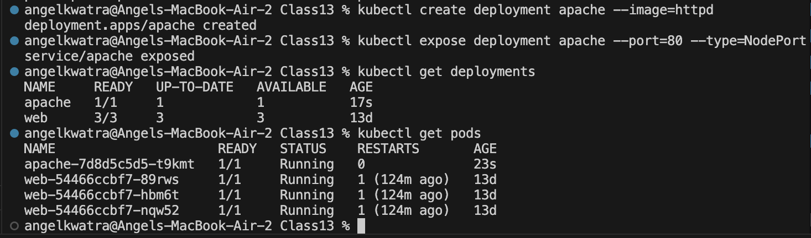
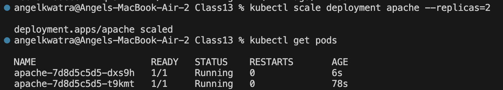
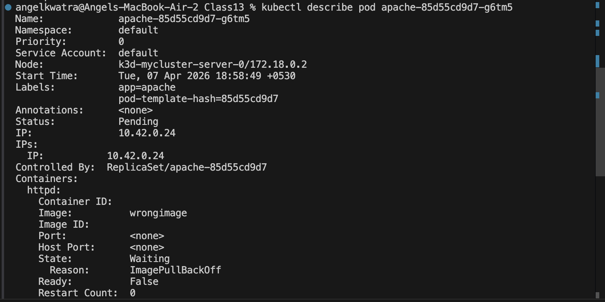
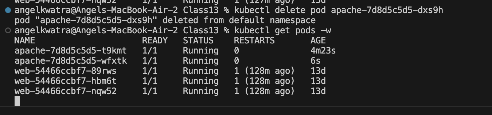
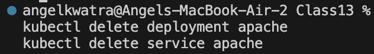

# Kubernetes: Run and Manage a "Hello Web App" (Apache httpd)

## Objective
Deploy and manage a simple Apache-based web server to understand the core concepts of Kubernetes: Pods, Deployments, Port Forwarding, Scaling, Debugging, and Self-Healing.

---

## Task 1: Deploy a Simple Web Application in a Pod

**Command Executed:**
```bash
kubectl run apache-pod --image=httpd
kubectl get pods
```

**Observation:**
The pod is created but it operates as a temporary entity.



**Accessing the Application:**
```bash
kubectl port-forward pod/apache-pod 8081:80
```
*Navigating to `http://localhost:8081` displays "It works!"*


**Checking Pod Lifespan:**
```bash
kubectl delete pod apache-pod
```
> **Insight**: A deleted Pod disappears permanently. There is no self-healing in basic Pods.

---

## Task 2: Convert to a Deployment

Deployments provide self-healing and replication features for applications.

**Creating & Exposing the Deployment:**
```bash
kubectl create deployment apache --image=httpd
kubectl expose deployment apache --port=80 --type=NodePort
```

**Accessing via Port Forward:**
```bash
kubectl port-forward service/apache 8082:80
```



---

## Task 3: Scale the Deployment

Scaling distributes the load and ensures high availability.

**Command Executed:**
```bash
kubectl scale deployment apache --replicas=2
kubectl get pods
```



> **Observation**: Multiple pods run the same app simultaneously. Traffic gets load-distributed across these replicas.

---

## Task 4: Debugging Scenario

Simulating a failure by replacing the image with an incorrect one.

**Command Executed (Break & Diagnose):**
```bash
kubectl set image deployment/apache httpd=wrongimage
kubectl get pods
kubectl describe pod <pod-name-with-error>
```



**The Fix:**
```bash
kubectl set image deployment/apache httpd=httpd
```

---

## Task 5: Explore Inside the Container & Self-Healing

1. **Executing into the container:**
```bash
kubectl exec -it <pod-name> -- /bin/bash
ls /usr/local/apache2/htdocs
exit
```

2. **Self-Healing Test:**
```bash
kubectl delete pod <one-pod-name>
kubectl get pods -w
```





---

## Cleanup
```bash
kubectl delete deployment apache
kubectl delete service apache
```

---

## Key Insights Gained

- **Pod vs Deployment**: Pods are temporary with no recovery. Deployments provide self-healing and are production-ready.
- **Port Forwarding**: Ideal for debugging, but not for production due to its interactive/blocking network tunnel nature.
- **Service**: Provides a stable network access point necessary for real applications.
- **Scaling**: Adding replicas ensures better availability and handles load distribution.
