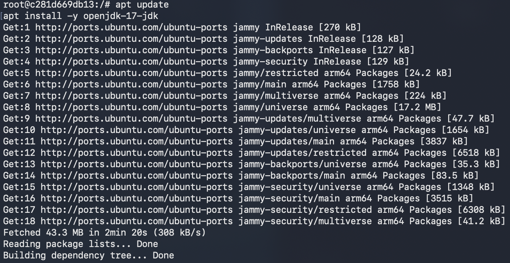
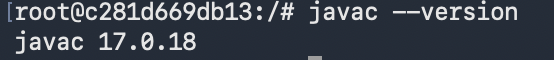
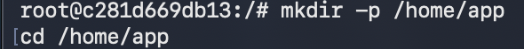
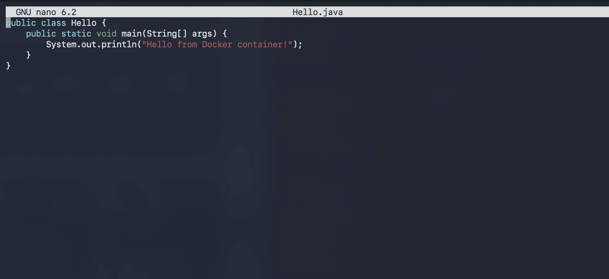
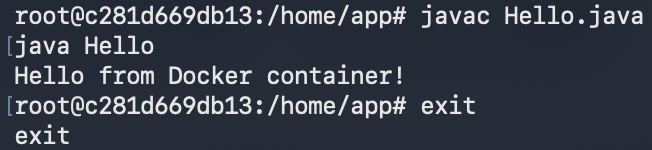
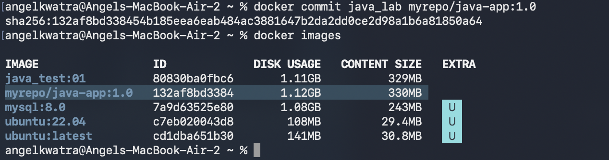
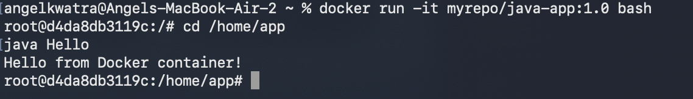

# Class 2 -- Preserving Changes Inside a Docker Container

## Objective

-   Install Java inside Ubuntu container
-   Create and run a Java application
-   Preserve container changes using `docker commit`

------------------------------------------------------------------------

## Environment Used

-   Host OS: macOS (Apple Silicon)
-   Container Platform: Docker Desktop
-   Base Image: ubuntu:22.04

------------------------------------------------------------------------

## Experiment Execution with Screenshots

### 🔹 Step 1: Run Ubuntu Container

``` bash
docker run -it --name java_lab ubuntu:22.04 bash
```


------------------------------------------------------------------------

### 🔹 Step 2: Update Package List & Install Java

``` bash
apt update
apt install -y openjdk-17-jdk
```



------------------------------------------------------------------------

### 🔹 Step 3: Verify Java Installation

``` bash
javac --version
```



------------------------------------------------------------------------

### 🔹 Step 4: Create Application Directory

``` bash
mkdir -p /home/app
cd /home/app
```



------------------------------------------------------------------------

### 🔹 Step 5: Create Java File

``` bash
nano Hello.java
```

Java Code:

``` java
public class Hello {
    public static void main(String[] args) {
        System.out.println("Hello from Docker container!");
    }
}
```


------------------------------------------------------------------------

### 🔹 Step 6: Compile and Run Application

``` bash
javac Hello.java
java Hello
```



------------------------------------------------------------------------

### 🔹 Step 7: Commit Container to New Image

``` bash
docker commit java_lab myrepo/java-app:1.0
```



------------------------------------------------------------------------

### 🔹 Step 8: Verify New Image

``` bash
docker images
```



------------------------------------------------------------------------

### 🔹 Step 9: Run Container from New Image

``` bash
docker run -it myrepo/java-app:1.0 bash
cd /home/app
java Hello
```



------------------------------------------------------------------------

## Result

-   Installed OpenJDK 17 inside Ubuntu container
-   Created and executed Java application
-   Preserved container changes using `docker commit`
-   Successfully ran the Java application from the new custom image
