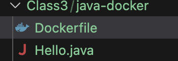
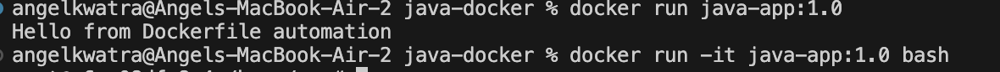

# Class 3 -- Dockerfile Automation (Java App)

## Objective

- Create Dockerfile for Java application
- Automate Java installation and compilation
- Build and run custom Docker image

---

## Environment Used

- Host OS: macOS (Apple Silicon)
- Container Platform: Docker Desktop
- Base Image: ubuntu:22.04

---

## Experiment Execution with Screenshots

### 🔹 Step 1: Create Project Structure

Files created:
- Dockerfile
- Hello.java



---

### 🔹 Step 2: Write Dockerfile

```dockerfile
FROM ubuntu:22.04
RUN apt update && apt install -y openjdk-17-jdk
WORKDIR /home/app
COPY Hello.java .
RUN javac Hello.java
CMD ["java", "Hello"]
```


---

### 🔹 Step 3: Create Java Application

```java
public class Hello {
    public static void main(String[] args) {
        System.out.println("Hello from Dockerfile automation");
    }
}
```


---

### 🔹 Step 4: Build Docker Image

```bash
docker build -t java-app:1.0 .
```


---

### 🔹 Step 5: Verify Image

```bash
docker images
```


---

### 🔹 Step 6: Run Container

```bash
docker run java-app:1.0
docker run -it java-app:1.0 bash
```



---

## Result

- Automated Java setup using Dockerfile
- Built custom image (java-app:1.0)
- Successfully executed Java application from container
