# Class 4 -- Interacting with the Docker Engine API

## Objective

-   Understand how to interact directly with the Docker Daemon bypassing the Docker CLI.
-   Learn to execute commands against the Docker Engine API using `curl` and the Unix socket (`/var/run/docker.sock`).
-   Perform container lifecycle operations (create, start, stop, restart, inspect) via HTTP API requests.

------------------------------------------------------------------------

## Environment Used

-   Host OS: macOS (Apple Silicon)
-   Container Platform: Docker Desktop
-   Access to the Docker socket at `/var/run/docker.sock`

------------------------------------------------------------------------

## Experiment Execution with Screenshots

### 🔹 Step 1: Retrieve Image Information

**Command executed:**

``` bash
curl --unix-socket /var/run/docker.sock http://localhost/v1.44/images/json
```

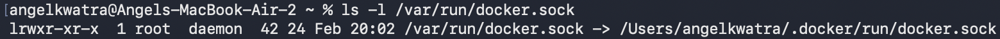

------------------------------------------------------------------------

### 🔹 Step 2: Retrieve All Containers

**Command executed:**

``` bash
curl --unix-socket /var/run/docker.sock http://localhost/v1.44/containers/json?all=true
```

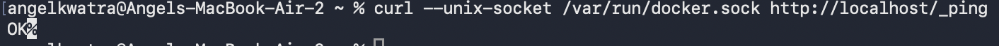

------------------------------------------------------------------------

### 🔹 Step 3: Create a Container (POST Request - Part 1)

**Command executed:**

``` bash
curl --unix-socket /var/run/docker.sock \
-H "Content-Type: application/json" \
-d '{"Image": "nginx:latest", "ExposedPorts": {"80/tcp": {}}, "HostConfig": {"PortBindings": {"80/tcp": [{"HostPort": "8080"}]}}}' \
-X POST http://localhost/v1.44/containers/create?name=mynginx
```

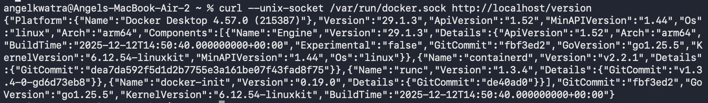

------------------------------------------------------------------------

### 🔹 Step 4: Create a Container (POST Request - Part 2)

**Viewing the multi-line curl command completion:**

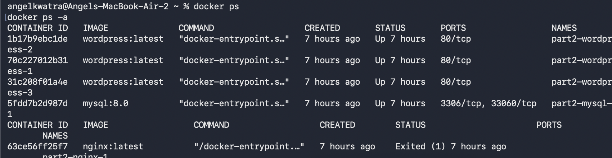

------------------------------------------------------------------------

### 🔹 Step 5: Container Creation Output

**Returned JSON response from the Daemon:**

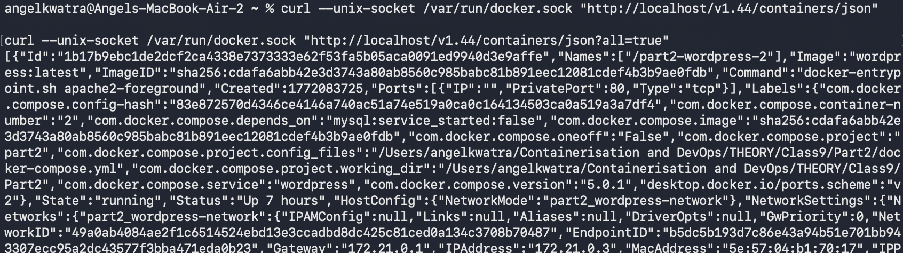

------------------------------------------------------------------------

### 🔹 Step 6: Start the Container

**Command executed:**

``` bash
curl --unix-socket /var/run/docker.sock -X POST http://localhost/v1.44/containers/mynginx/start
```

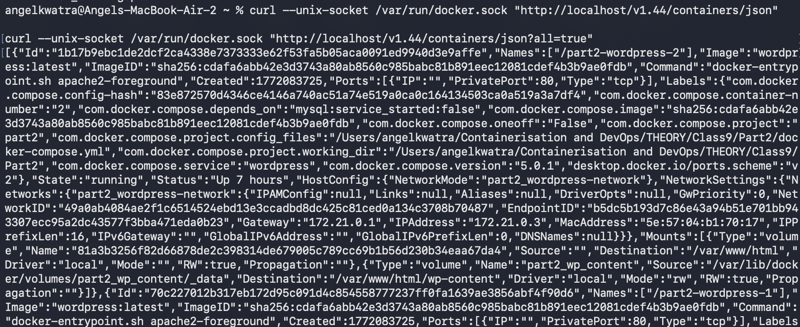

------------------------------------------------------------------------

### 🔹 Step 7: Start Container Result

**Viewing the empty successful output from the daemon.**

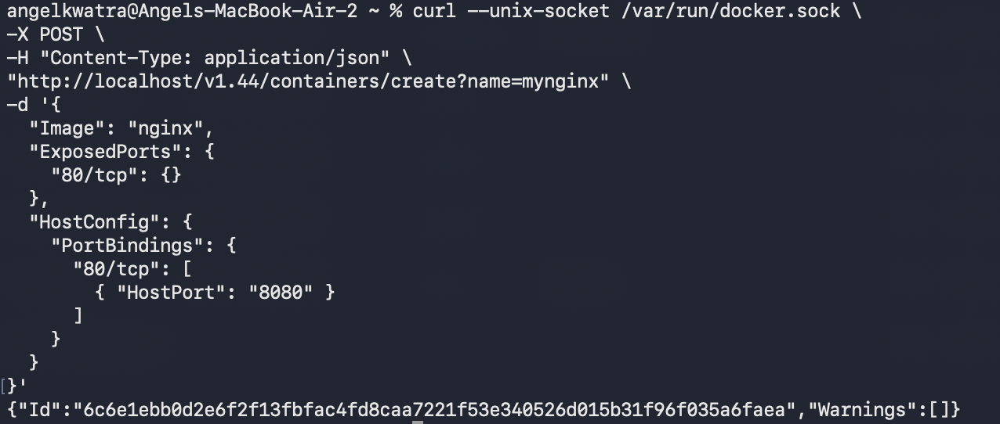

------------------------------------------------------------------------

### 🔹 Step 8: Inspect the Container (Running State)

**Command executed:**

``` bash
curl --unix-socket /var/run/docker.sock http://localhost/v1.44/containers/mynginx/json
```

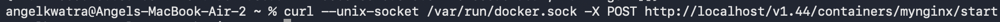

------------------------------------------------------------------------

### 🔹 Step 9: Stop the Container

**Command executed:**

``` bash
curl --unix-socket /var/run/docker.sock -X POST http://localhost/v1.44/containers/mynginx/stop
```


------------------------------------------------------------------------

### 🔹 Step 10: Inspect the Container (Stopped State)

**Command executed:**

``` bash
curl --unix-socket /var/run/docker.sock http://localhost/v1.44/containers/mynginx/json
```

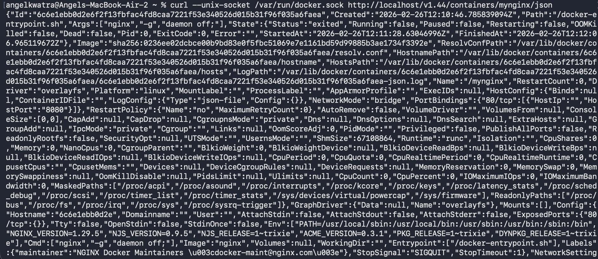

------------------------------------------------------------------------

### 🔹 Step 11: Restart the Container

**Command executed:**

``` bash
curl --unix-socket /var/run/docker.sock \
-X POST \
http://localhost/v1.44/containers/mynginx/restart
```

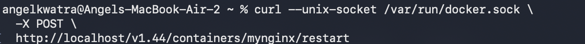

------------------------------------------------------------------------

### 🔹 Step 12: Verify the Restarted State

**Command executed:**

``` bash
curl --unix-socket /var/run/docker.sock http://localhost/v1.44/containers/mynginx/json
```

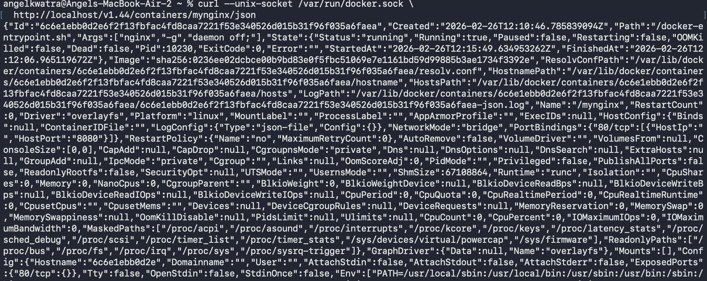

------------------------------------------------------------------------

## Result

-   Successfully interacted with the Docker Daemon directly via its socket, proving that the `docker` CLI simply wraps these HTTP API calls.
-   Completed full container lifecycle operations natively with `curl` API bindings.
