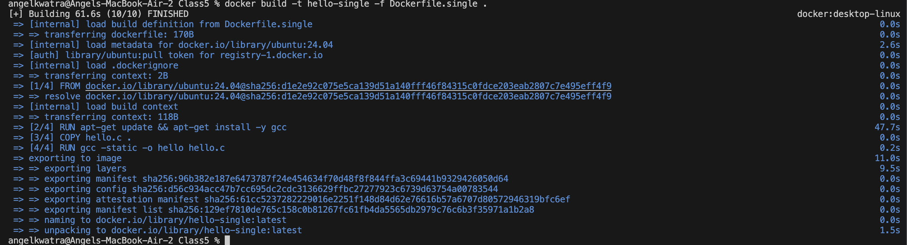
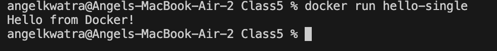
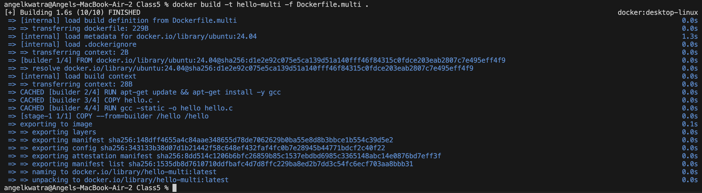
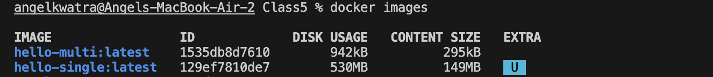
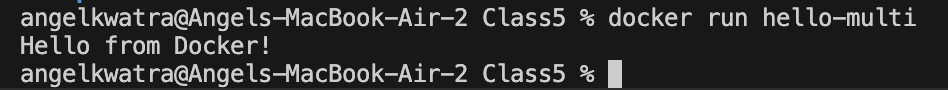

# Class 5 -- Multi-Stage Builds in Docker

## Objective

-   Learn how to use multi-stage builds in Docker.
-   Understand the benefits of keeping the final image lightweight by using intermediate stages.
-   Build a C program as a demonstration, comparing single-stage vs multi-stage image sizes.

------------------------------------------------------------------------

## Environment Used

-   Host OS: macOS (Apple Silicon)
-   Container Platform: Docker Desktop

------------------------------------------------------------------------

## Project Files Setup

Before running the commands, the following files should be present in the directory:

### 📄 `hello.c`
```c
#include <stdio.h>

int main() {
    printf("Hello from Docker!\n");
    return 0;
}
```

### 📄 `Dockerfile.single` (Single-Stage Build)
```dockerfile
FROM ubuntu:24.04
RUN apt-get update && apt-get install -y gcc
COPY hello.c .
RUN gcc -static -o hello hello.c
CMD ["./hello"]
```

### 📄 `Dockerfile.multi` (Multi-Stage Build)
```dockerfile
FROM ubuntu:24.04 AS builder
RUN apt-get update && apt-get install -y gcc
COPY hello.c .
RUN gcc -static -o hello hello.c

FROM scratch
COPY --from=builder /hello /hello
CMD ["/hello"]
```

------------------------------------------------------------------------

## Experiment Execution with Screenshots

### 🔹 Step 1: Build the Single-Stage Image

**Command executed:**

``` bash
docker build -t hello-single -f Dockerfile.single .
```



------------------------------------------------------------------------

### 🔹 Step 2: Verify the Single-Stage Image Size

**Command executed:**

``` bash
docker images
```


*Notice the size is approx 149MB because it includes the entire Ubuntu base image and GCC compiler.*

------------------------------------------------------------------------

### 🔹 Step 3: Run the Single-Stage Container

**Command executed:**

``` bash
docker run hello-single
```



------------------------------------------------------------------------

### 🔹 Step 4: Build the Multi-Stage Image

**Command executed:**

``` bash
docker build -t hello-multi -f Dockerfile.multi .
```



------------------------------------------------------------------------

### 🔹 Step 5: Verify & Compare Image Sizes

**Command executed:**

``` bash
docker images
```



*Notice the `hello-multi` image is drastically smaller (approx 295kB) compared to `hello-single` (149MB) because it only contains the statically compiled C binary inside a scratch (empty) image.*

------------------------------------------------------------------------

### 🔹 Step 6: Run the Multi-Stage Container

**Command executed:**

``` bash
docker run hello-multi
```



------------------------------------------------------------------------

## Result

-   Successfully compiled a C program using a compilation stage.
-   Produced a drastically smaller output image using the Multi-stage build approach (leveraging the `scratch` base image).
