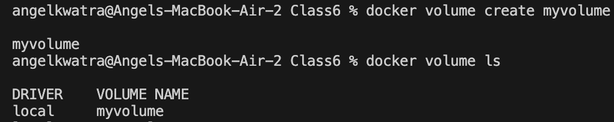
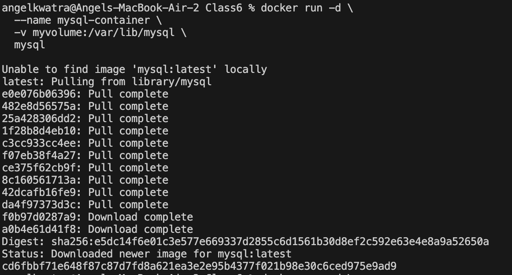
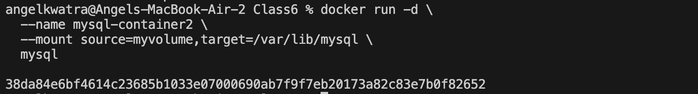
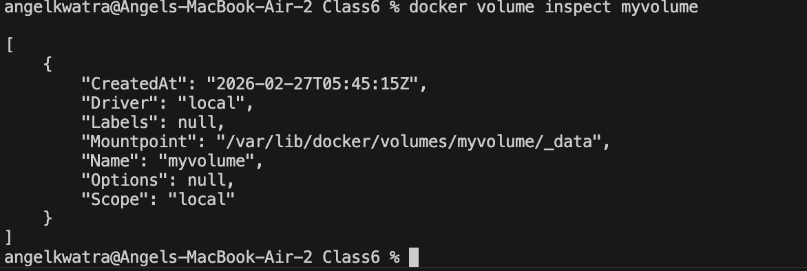
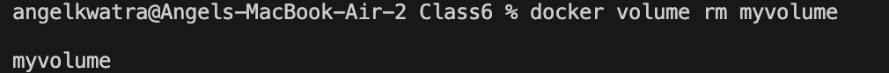
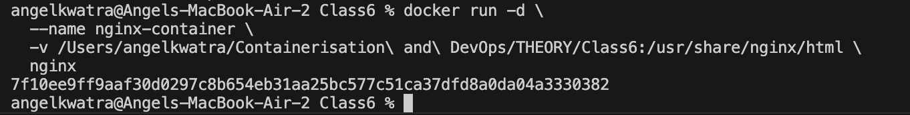
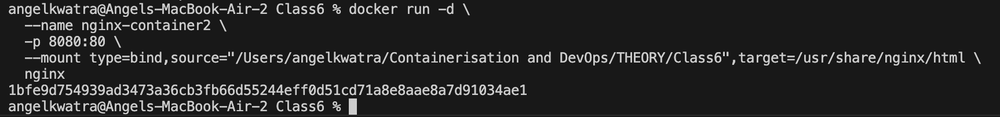
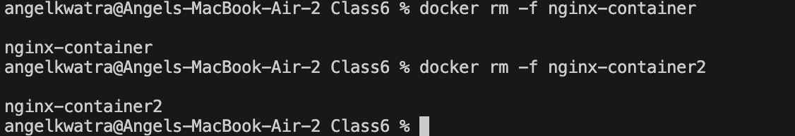

# Class 6 -- Docker Volumes and Bind Mounts

## Objective

- Learn how to create and manage Docker Volumes.
- Understand how to mount volumes into containers using `-v` and `--mount`.
- Learn how to use Bind Mounts to share files between the host machine and containers.
- Practice cleaning up volumes and containers.

---

## Environment Used

- Host OS: macOS (Apple Silicon)
- Container Platform: Docker Desktop

---

## Experiment Execution with Screenshots

### 🔹 Step 1: Create a Docker Volume

**Command executed:**

```bash
docker volume create myvolume
docker volume ls
```



---

### 🔹 Step 2: Run a Container with a Volume (using `-v`)

**Command executed:**

```bash
docker run -d \
  --name mysql-container \
  -v myvolume:/var/lib/mysql \
  mysql
```



*This pulls the `mysql` image and runs it, mounting `myvolume` to `/var/lib/mysql` inside the container.*

---

### 🔹 Step 3: Run a Container with a Volume (using `--mount`)

**Command executed:**

```bash
docker run -d \
  --name mysql-container2 \
  --mount source=myvolume,target=/var/lib/mysql \
  mysql
```



*This runs another `mysql` container, attaching the same volume using the `--mount` syntax.*

---

### 🔹 Step 4: Inspect the Volume

**Command executed:**

```bash
docker volume inspect myvolume
```



*This shows the detailed information about `myvolume`, including its mountpoint on the host.*

---

### 🔹 Step 5: Remove the Volume

**Command executed:**

```bash
docker volume rm myvolume
```



*(Note: The volume can only be removed if it's not currently being used by any container. If it is in use, you'll get an error.)*

---

### 🔹 Step 6: Run a Container with a Bind Mount (using `-v`)

**Command executed:**

```bash
docker run -d \
  --name nginx-container \
  -v /Users/angelkwatra/Containerisation\ and\ DevOps/THEORY/Class6:/usr/share/nginx/html \
  nginx
```



*This mounts the local `Class6` directory into the `nginx` container's HTML directory, effectively serving local files via the container.*

---

### 🔹 Step 7: Run a Container with a Bind Mount (using `--mount`)

**Command executed:**

```bash
docker run -d \
  --name nginx-container2 \
  -p 8080:80 \
  --mount type=bind,source="/Users/angelkwatra/Containerisation and DevOps/THEORY/Class6",target=/usr/share/nginx/html \
  nginx
```



*This demonstrates the `--mount` syntax for bind mounts, and also publishes port `8080` to the host's port `80`.*

---

### 🔹 Step 8: Clean up Containers

**Command executed:**

```bash
docker rm -f nginx-container
docker rm -f nginx-container2
```



*This comprehensively removes the newly created `nginx` containers.*

---

## Result

- Successfully created, inspected, and removed Docker Volumes.
- Mounted volumes to containers using both `-v` and `--mount` flags.
- Successfully set up Bind Mounts to map a host directory into a container using both `-v` and `--mount` syntax.
- Cleaned up running containers.
