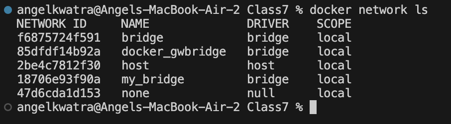
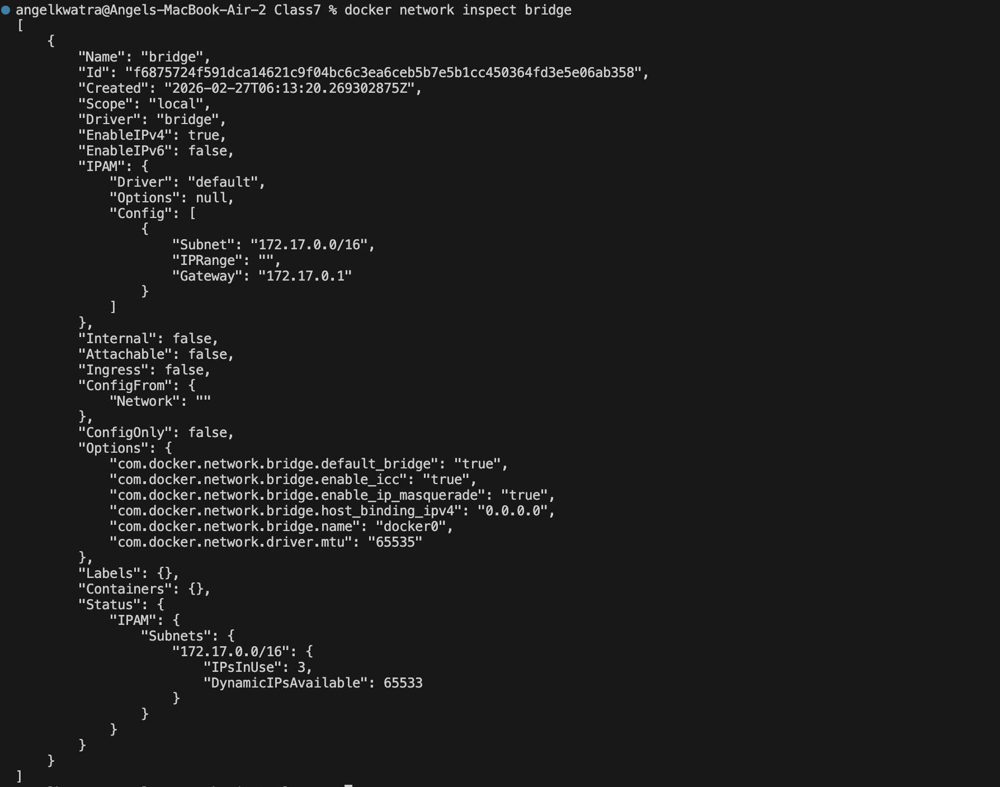
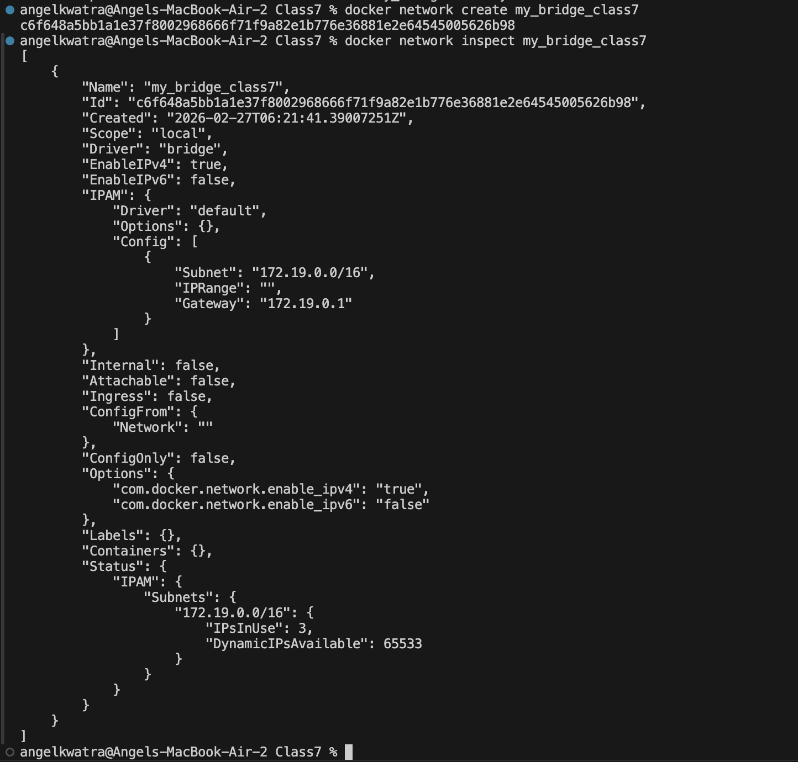
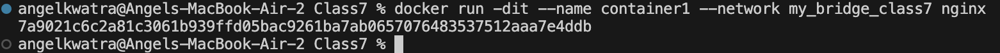
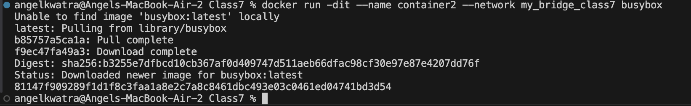
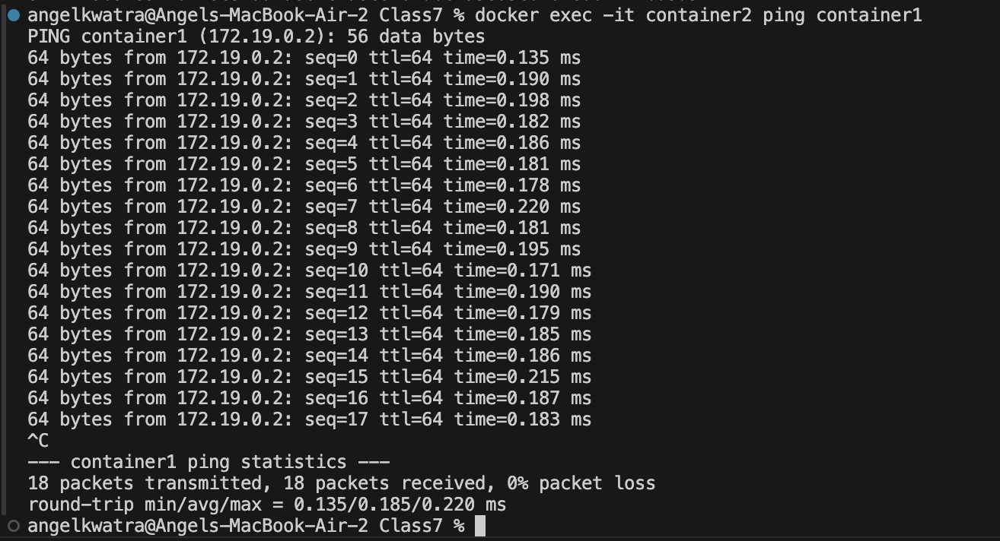
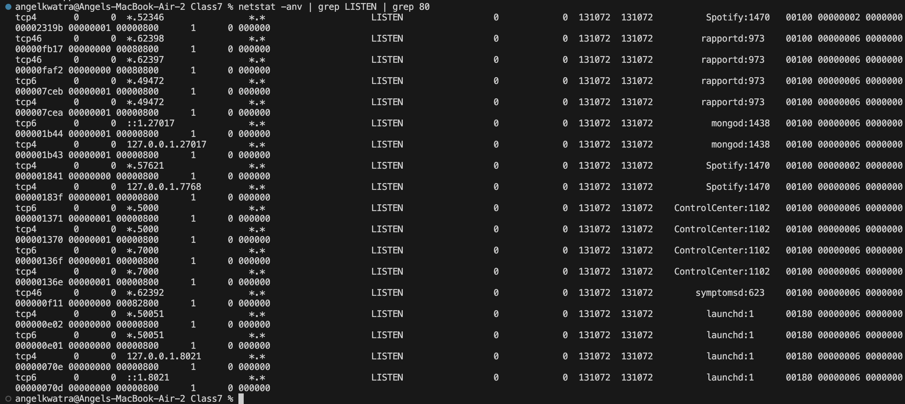

# Class 7 -- Docker Networks

## Objective

- Understand various network types in Docker (bridge, host, none).
- Create customized user-defined bridge networks.
- Learn how to connect containers to a specific network.
- Validate local container deployments and inter-container communication via visual steps.

---

## Environment Used

- Host OS: macOS (Apple Silicon)
- Container Platform: Docker Desktop

---

## Experiment Execution with Screenshots

### 🔹 Step 1: List Docker Networks

**Command executed:**

```bash
docker network ls
```



*This lists the default Docker networks: `bridge`, `host`, and `none`.*

---

### 🔹 Step 2: Inspect the Default Bridge Network

**Command executed:**

```bash
docker network inspect bridge
```



*This provides detailed JSON output showing the configuration of the default `bridge` network, its IPAM subset, and connected containers.*

---

### 🔹 Step 3: Create a Custom Bridge Network

**Command executed:**

```bash
docker network create my_bridge_class7
docker network inspect my_bridge_class7
```



*This creates a new user-defined bridge network named `my_bridge_class7` and inspects it to view its assigned subnet and gateway.*

---

### 🔹 Step 4: Run a Container on the Custom Network

**Command executed:**

```bash
docker run -dit --name container1 --network my_bridge_class7 nginx
```



*This runs an `nginx` container named `container1` attached to the user-defined `my_bridge_class7` network.*

---

### 🔹 Step 5: Run Another Container on the Custom Network

**Command executed:**

```bash
docker run -dit --name container2 --network my_bridge_class7 busybox
```



*This pulls and runs a `busybox` container named `container2` attached to the same custom network.*

---

### 🔹 Step 6: Verify Inter-Container Communication

**Command executed:**

```bash
docker exec -it container2 ping container1
```



*Because both containers are on the same user-defined bridge network (`my_bridge_class7`), Docker's embedded DNS server resolves the container name (`container1`) to its IP address, allowing them to communicate.*

---

### 🔹 Step 7: Run a Container on the Host Network

**Command executed:**

```bash
docker run -d --network host nginx
```


*This runs an `nginx` container using the host's networking stack directly. The container will bind to port 80 on the host machine.*

---

### 🔹 Step 8: Verify the Process Listening on the Host Network

**Command executed:**

```bash
netstat -anv | grep LISTEN | grep 80
```



*This verifies that a service is listening on port 80 on the host machine, demonstrating that the container and host share the same network namespace.* *(Note: The screenshot shows multiple listening ports on the host.)*

---

## Result

- Successfully listed and inspected Docker networks.
- Created and inspected a custom user-defined bridge network.
- Connected multiple containers to a custom bridge network and demonstrated inter-container communication using DNS resolution.
- Deployed a container using the host network to bind directly to host ports.
