# Class 8 -- Docker Compose Basics

## Objective
* **Understand Docker Compose**: Learn what Docker Compose is and how it simplifies managing multi-container applications.
* **Basic Commands**: Learn basic `docker compose` commands to create, start, stop, and view logs of containers.
* **Declarative Configuration**: Understand how to define services, networks, and volumes in a `docker-compose.yml` file.
* **Multi-Container Apps**: Practice deploying applications with multiple interconnected containers (e.g., WordPress and MySQL).

---
## Environment Used
* **OS**: macOS (Apple Silicon)
* **Tool**: Docker Desktop
* **Shell**: zsh

---
## Experiment Execution with Screenshots

### Part 1: Basic Nginx Setup with Docker Compose

### 🔹 Step 1: Creating the docker-compose.yml File
Define a simple Nginx service using Docker Compose.

**File contents:**
```yaml
version: '3.8'
services:
  nginx:
    image: nginx:alpine
    container_name: my-nginx
    ports:
      - "8080:80"
    volumes:
      - ./html:/usr/share/nginx/html
    environment:
      - NGINX_HOST=localhost
    restart: unless-stopped
```
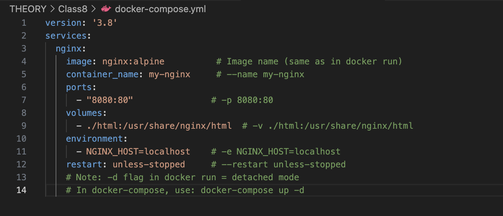

---
### 🔹 Step 2: Starting the Service in Detached Mode
Run the container in the background using the `-d` flag.

**Command executed:**
```bash
docker compose up -d
```
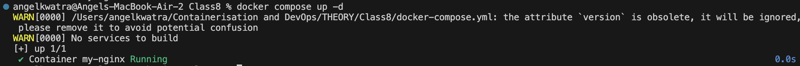

---
### 🔹 Step 3: Verifying the Running Container
Check if the Nginx container is successfully running.

**Command executed:**
```bash
docker ps
```
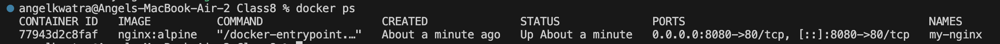

---
### 🔹 Step 4: Stopping and Removing the Service
Stop the container and remove the associated resources defined in the compose file.

**Command executed:**
```bash
docker compose down
docker ps
```
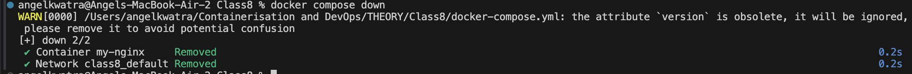

---
### 🔹 Step 5: Starting the Service in Attached Mode
Run the container in the foreground to directly see the standard output of the service.

**Command executed:**
```bash
docker compose up
```


---
### 🔹 Step 6: Cleaning up Attached Container
Stop and remove the container again.

**Command executed:**
```bash
docker compose down
docker ps
```
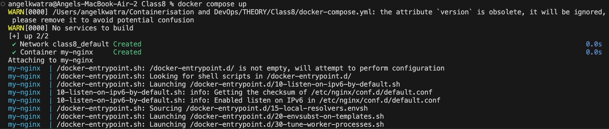

---
### 🔹 Step 7: Viewing Live Logs
Start the container again and view live logs from the Nginx service.

**Command executed:**
```bash
docker compose logs -f
```
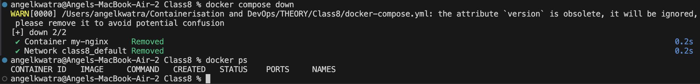

---
### 🔹 Step 8: Accessing the Web Server
Access the web server using a browser. Since there is no index file in the mounted directory, it returns a 403 Forbidden.

**Action:**
Accessed `localhost:8080` in the web browser.
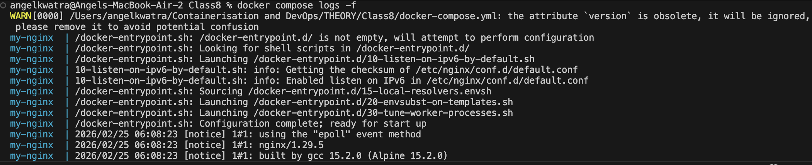

---
### 🔹 Step 9: Viewing Request Logs
Check the terminal to see the incoming requests logged by the Nginx container.

**Action:**
Observe the logs generated by accessing the web server.
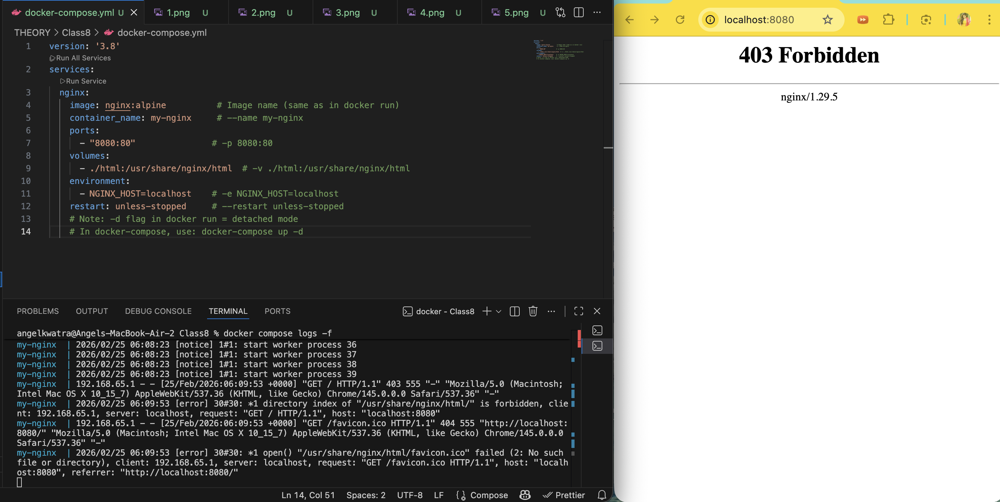

---
### 🔹 Step 10: Listing Compose Services
List the containers specifically managed by Docker Compose for this project.

**Command executed:**
```bash
docker compose ps
```
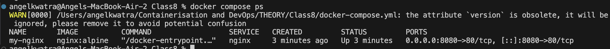


---
### Part 2: Multi-Container Setup (WordPress & MySQL)

### 🔹 Step 1: Creating the docker-compose.yml File
Define a multi-container application with WordPress and MySQL, including networks and volumes.

**File contents:**
```yaml
version: '3.8'

services:
  mysql:
    image: mysql:8.0
    container_name: mysql_class8
    environment:
      MYSQL_ROOT_PASSWORD: secret
      MYSQL_DATABASE: wordpress
      MYSQL_USER: wpuser
      MYSQL_PASSWORD: wppass
    volumes:
      - mysql_data:/var/lib/mysql
    networks:
      - wordpress-network

  wordpress:
    image: wordpress:latest
    container_name: wordpress
    ports:
      - "8080:80"
    environment:
      WORDPRESS_DB_HOST: mysql
      WORDPRESS_DB_USER: wpuser
      WORDPRESS_DB_PASSWORD: wppass
      WORDPRESS_DB_NAME: wordpress
    volumes:
      - wp_content:/var/www/html/wp-content
    depends_on:
      - mysql
    networks:
      - wordpress-network

volumes:
  mysql_data:
  wp_content:

networks:
  wordpress-network:
```
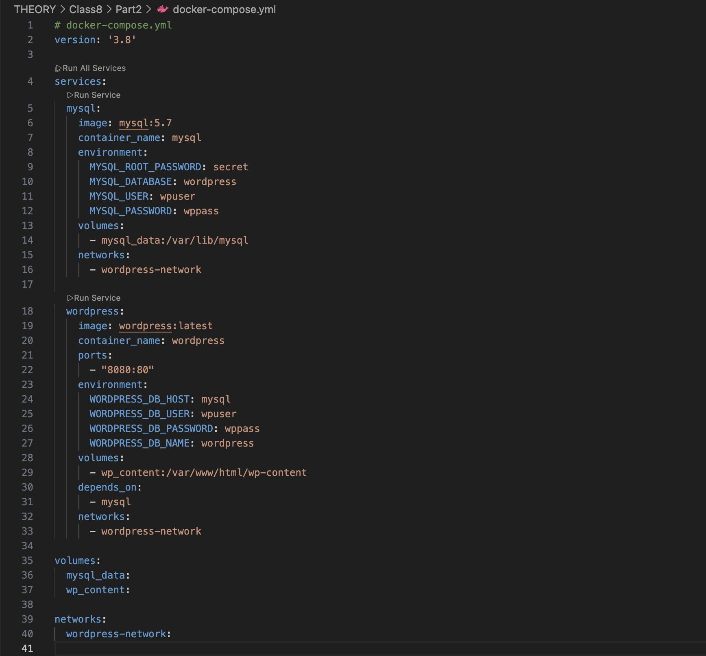

---
### 🔹 Step 2: Verifying the Services
After running `docker compose up -d`, verify that both WordPress and MySQL containers are running.

**Command executed:**
```bash
docker ps
```
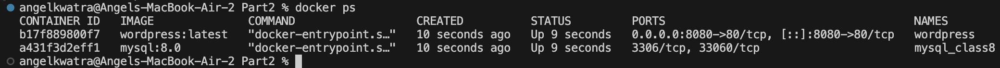

---
### 🔹 Step 3: Accessing the WordPress Installation
Access the WordPress frontend in the web browser to start the web installation steps.

**Action:**
Accessed `localhost:8080/wp-admin/install.php` in the web browser.
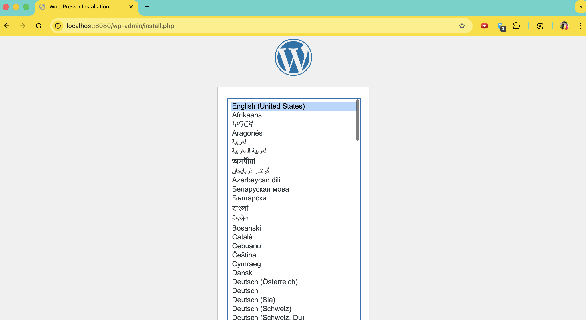

---
### 🔹 Step 4: Listing Docker Compose Volumes
Check the persistent volumes that were created for the database and web content.

**Command executed:**
```bash
docker compose volumes
```
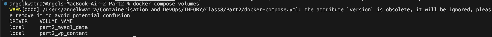


---
## Result
- Successfully created and managed single-container setups using `.yml` configuration.
- Handled lifecycle operations (`up`, `down`, `logs`, `ps`) with Docker Compose.
- Successfully deployed a fully functional multi-container application combining a web application (WordPress) and a database layer (MySQL), configured to communicate over an internal network with persistent storage.
