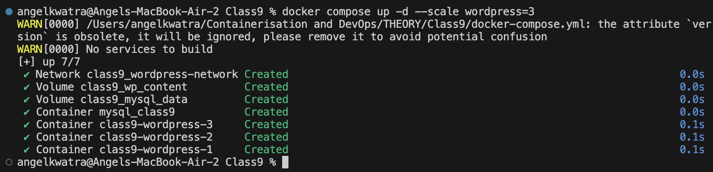
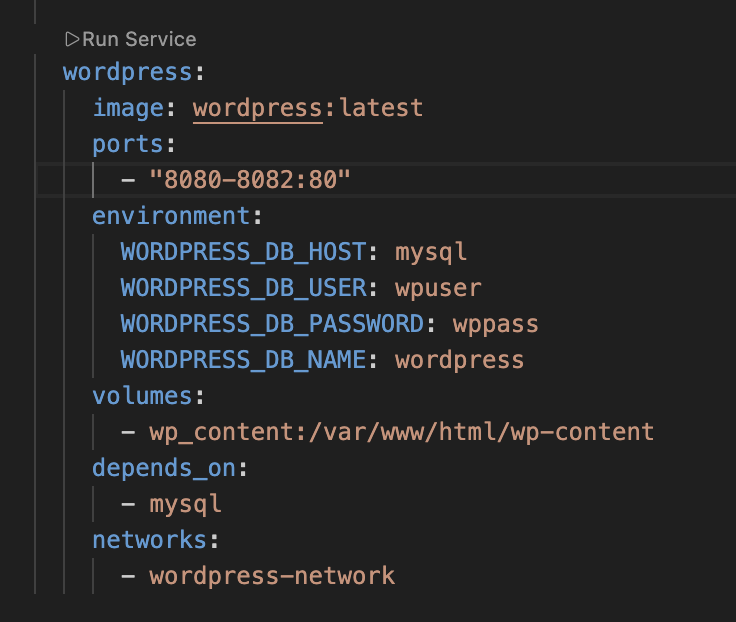
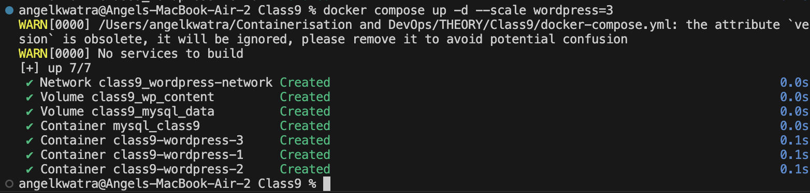
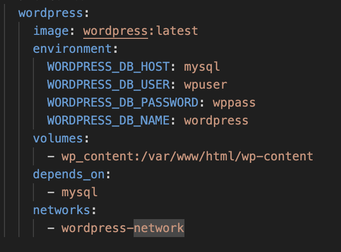
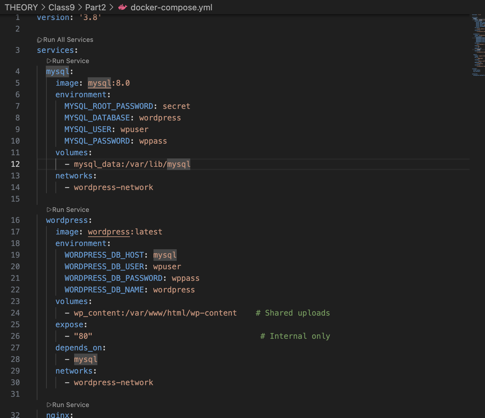
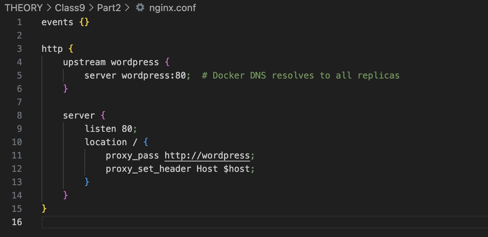
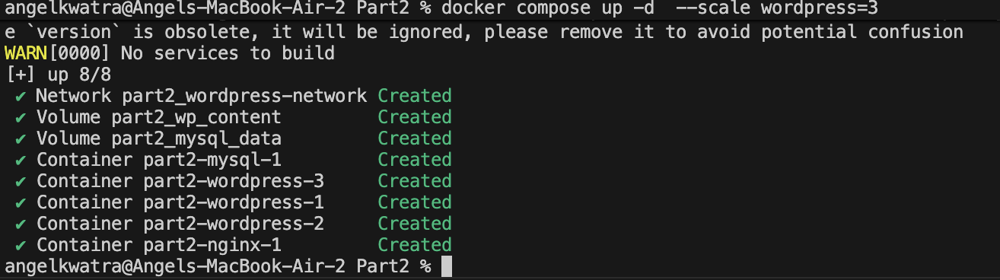
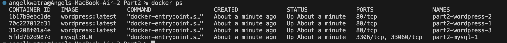

# Class 9 -- Docker Compose Web Apps (NGINX Proxy)

## Objective

- **Scaling Containers**: Learn how to scale services using Docker Compose.
- **Port Conflict Resolution**: Understand how to handle port conflicts when scaling using port ranges.
- **NGINX Load Balancer**: Apply Docker Compose in constructing proxied web applications. Combine the power of multiple containers alongside an NGINX proxy load-balancer to distribute traffic.

---

## Environment Used

- **OS**: macOS (Apple Silicon)
- **Tool**: Docker Desktop
- **Shell**: zsh

---

## Experiment Execution with Screenshots

### Part 1: Scaling Services and Handling Port Conflicts

This part explores setting up a standard web composition with Docker Compose, and scaling it. When scaling containers that publish a port to the host, we must avoid port collisions. 

### 🔹 Step 1: Scaling Up the WordPress Service
Start the composition and scale the `wordpress` service to 3 replicas using the `--scale` flag.

**Command executed:**
```bash
docker compose up -d --scale wordpress=3
```


---
### 🔹 Step 2: Defining Port Ranges in docker-compose.yml
To avoid port conflicts when multiple WordPress containers try to bind to the host, define a port range in the `docker-compose.yml` file. Here, the host will allocate ports from `8080` to `8082` for the 3 replicas.

**File configuration:**
```yaml
    ports:
      - "8080-8082:80"
```


---
### 🔹 Step 3: Verifying the Scaled Containers
Wait for all services (including the 3 WordPress replicas, MySQL, etc.) to report their creation and start status.



---
### 🔹 Step 4: Removing Static Ports (Prep for Proxy)
As a precursor to loading balancing with NGINX, we modify the `docker-compose.yml` to remove direct port mappings (`ports`) for WordPress, relying purely on Docker's internal network to route traffic.

**Action:**
Observe the `docker-compose.yml` where `ports` have been removed from the `wordpress` service.


---

### Part 2: Load Balancing with NGINX Proxy

Instead of exposing multiple ports for our scaled application, we can use an NGINX container as a single entry point (reverse proxy) to balance traffic across the WordPress replicas.

### 🔹 Step 1: Defining the NGINX Proxy Composition
Examine the `docker-compose.yml` for Part 2. The `nginx` service publishes port `8080:80` to the host, while the `wordpress` service merely uses `expose: - "80"` to declare it receives traffic on the internal network.

**Action:**
View the configuration of `nginx` and `wordpress` services.


---
### 🔹 Step 2: Configuring the NGINX Upstream
Examine the custom `nginx.conf` file mounted into the NGINX container. It defines an `upstream wordpress { server wordpress:80; }` block. Because Docker Compose networks feature built-in DNS resolution, `wordpress` will automatically resolve to the IP addresses of all running replicas.

**Action:**
View the `nginx.conf` file configuration.


---
### 🔹 Step 3: Starting the Proxied Composition
Run the composition from Part 2, again scaling the `wordpress` service to 3 replicas. NGINX will be deployed alongside.

**Command executed:**
```bash
docker compose up -d --scale wordpress=3
```


---
### 🔹 Step 4: Verifying the Network and Containers
Check the running containers and observe that only NGINX (omitted in this part's ps view, but running) holds host port mappings. The 3 WordPress replicas simply show `80/tcp` indicating they are listening internally.

**Command executed:**
```bash
docker ps
```



---

## Result

- Demonstrated resolving port conflicts when scaling out containers by shifting from static ports to port ranges.
- Successfully orchestrated multiple backend WordPress containers and unified them under a single host port.
- Configured and deployed an embedded NGINX reverse-proxy acting as a load balancer over an internal Docker network leveraging native DNS resolution.
