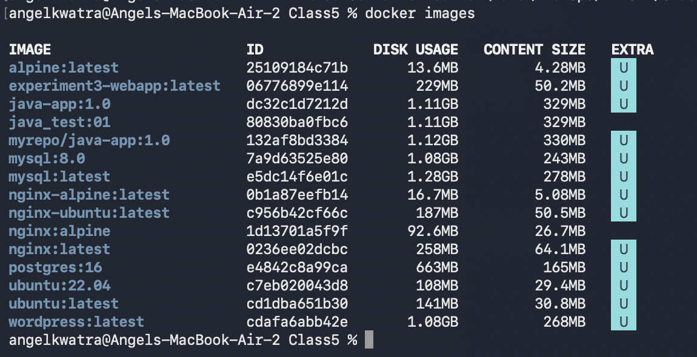
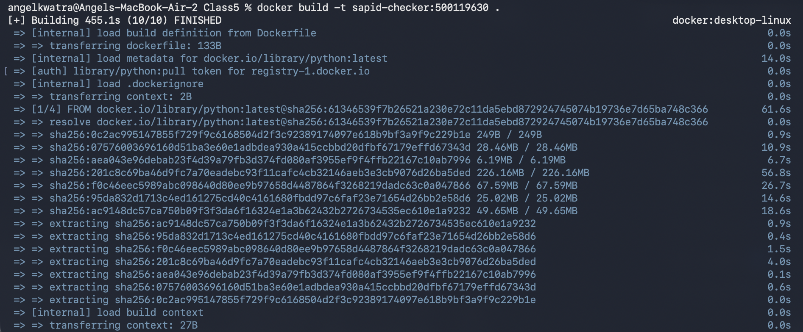
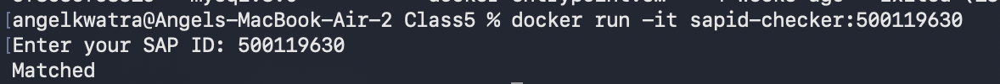
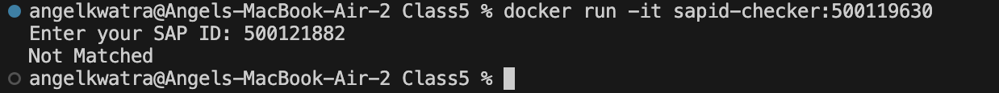

# Class Task -- Python SAP ID Application Containerization

## Objective

- Create a python script that prompts verification rules.
- Dockerize the Python application using an interactive input image.

---

## Environment Used

- **OS**: macOS (Apple Silicon)
- **Tool**: Docker Desktop
- **Shell**: zsh

---

## Experiment Execution with Screenshots

### 🔹 Step 1: Creating the Application and Dockerfile
First, check the existing Docker environment before building the new image. 
A simple Python script `app.py` asks for an SAP ID and verifies it against the hardcoded stored value (`500119630`). A `Dockerfile` is prepared to containerize this script, which installs `numpy` and runs the application.

**Python Code (`app.py`):**
```python
import numpy as np  

stored_sapid = "500119630"
user_sapid = input("Enter your SAP ID: ")

if user_sapid == stored_sapid:
    print("Matched")
else:
    print("Not Matched")
```

**Dockerfile:**
```dockerfile
FROM python

WORKDIR /home/app
COPY ./app.py .

RUN pip install numpy

CMD ["python", "app.py"]
```

**Command executed:**
```bash
docker images
```


---
### 🔹 Step 2: Building the Custom Application Image
Build the Docker image from the `Dockerfile` in the current directory, tagging it as `sapid-checker:500119630`.

**Command executed:**
```bash
docker build -t sapid-checker:500119630 .
```


---
### 🔹 Step 3: Running the Container (Matched Case)
Run the newly created `sapid-checker:500119630` image. Because the Python script requires user input (`input()` function), the container must be run in interactive mode using the `-it` flags (interactive and tty).

**Command executed:**
```bash
docker run -it sapid-checker:500119630
```
*(User inputs their SAP ID `500119630`, resulting in a successful verification: `Matched`.)*



---
### 🔹 Step 4: Running the Container (Not Matched Case)
Run the container interactively again to test a failing case. 

**Command executed:**
```bash
docker run -it sapid-checker:500119630
```
*(User inputs a different SAP ID `500121882`, resulting in a failed verification: `Not Matched`.)*



---

## Result

- Built a custom Python interaction container verifying an internal ID.
- Demonstrated how to carefully test an application requiring manual, interactive inputs via Docker (`-it`).
- Successfully managed dependencies with a `pip install` instruction in the Dockerfile.
